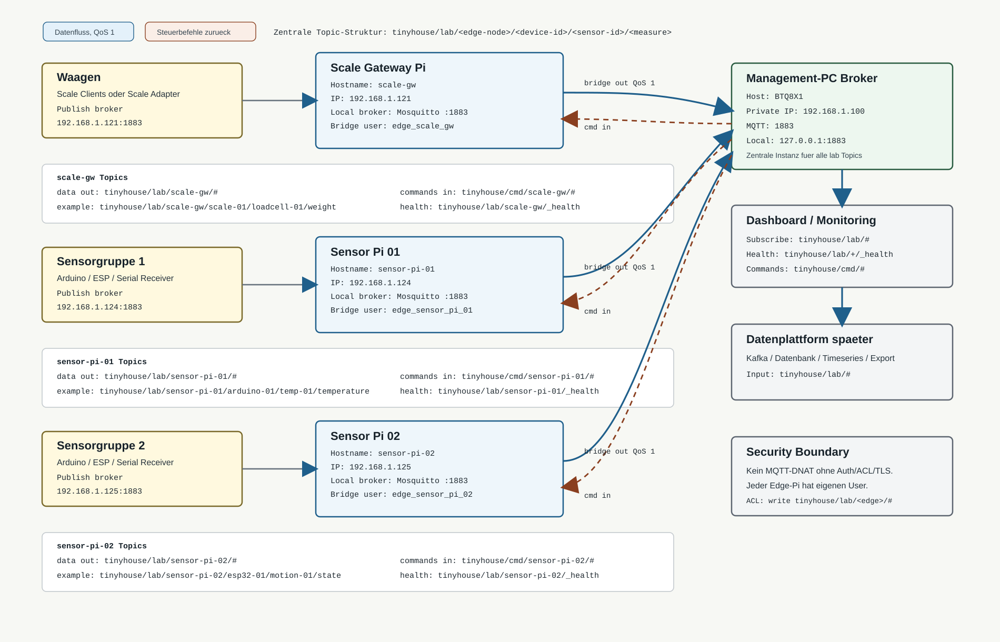

# MQTT-Architektur und Ablaufplan

Status: Entwurf fuer TinyHouse-IoT  
Ziel: Waagen und weitere Sensor-Raspberry-Pis senden Daten ueber lokale Edge-Broker an einen zentralen MQTT-Broker auf dem Management-PC.



## 1. Zielbild

Der Management-PC wird die zentrale MQTT-Instanz. Jeder Raspberry Pi darf lokal einen eigenen MQTT-Broker betreiben, aber dieser lokale Broker ist nur Edge-Eingang, Buffer und Bridge. Die zentrale Instanz auf dem Management-PC ist die Stelle fuer Dashboard, Logging, Monitoring, spaetere Datenbank/Kafka-Anbindung und zentrale Steuerbefehle.

Best-Practice-Entscheidung:

1. Edge-Pis nehmen lokale Sensordaten an.
2. Edge-Pis normalisieren Payloads und Topics.
3. Edge-Pis bridgen nur definierte Topics zum Management-PC.
4. Der Management-PC speichert, beobachtet und verteilt zentrale Steuerbefehle.
5. Es gibt keine freie Broker-Mesh-Struktur zwischen allen Pis.

## 2. Vorgeschlagene Rollen

| Rolle | Vorgeschlagener Host | IP / Endpoint | Aufgabe |
| --- | --- | --- | --- |
| Zentraler Broker | Management-PC `BTQ8X1` | `192.168.1.100:1883` im TinyHouse-Netz, zusaetzlich lokal `127.0.0.1:1883` | Zentrale MQTT-Instanz, Dashboard, Monitoring, spaetere Persistenz |
| Scale Gateway | `PI-SCALE-GW`, Kandidat `EMQX001` | `192.168.1.121:1883` | Nimmt MQTT-Daten der Waagen an und bridged sie zum Management-PC |
| Sensor Pi 01 | `SENSOR-PI-01`, Kandidat `EMQX004` | `192.168.1.124:1883` | Nimmt Sensordaten von Arduino/ESP/Serial entgegen und bridged sie zum Management-PC |
| Sensor Pi 02 | `SENSOR-PI-02`, Kandidat `EMQX005` | `192.168.1.125:1883` | Nimmt Sensordaten von Arduino/ESP/Serial entgegen und bridged sie zum Management-PC |
| Optionaler Testbroker | `EMQX003` | `192.168.1.123:1883`, Dashboard `18083` | Nur verwenden, wenn EMQX bewusst als zentrale Alternative getestet wird |

Offen zu bestaetigen:

1. Ob `192.168.1.100` wirklich dauerhaft die private Adresse des Management-PCs ist.
2. Ob `EMQX001`, `EMQX004` und `EMQX005` die richtigen drei Edge-Pis sind.
3. Ob Mosquitto oder EMQX auf dem Management-PC als zentraler Broker genutzt werden soll.

## 3. Topic-Konvention

Alle zentral sichtbaren Topics beginnen mit `tinyhouse/lab`.

```text
tinyhouse/lab/<edge-node>/<device-id>/<sensor-id>/<measure>
tinyhouse/lab/<edge-node>/<device-id>/_status
tinyhouse/lab/<edge-node>/_health
tinyhouse/cmd/<edge-node>/<device-id>/<command>
```

Beispiele:

| Datenquelle | Topic |
| --- | --- |
| Waage 01 Gewicht | `tinyhouse/lab/scale-gw/scale-01/loadcell-01/weight` |
| Waage 01 Status | `tinyhouse/lab/scale-gw/scale-01/_status` |
| Scale Gateway Health | `tinyhouse/lab/scale-gw/_health` |
| Sensor Pi 01 Temperatur | `tinyhouse/lab/sensor-pi-01/arduino-01/temp-01/temperature` |
| Sensor Pi 01 Drucksensor | `tinyhouse/lab/sensor-pi-01/arduino-01/pressure-01/pressure` |
| Sensor Pi 02 Bewegung | `tinyhouse/lab/sensor-pi-02/esp32-01/motion-01/state` |
| Zentraler Tare-Befehl fuer Waage 01 | `tinyhouse/cmd/scale-gw/scale-01/tare` |

## 4. Payload-Konvention

Messwerte sollen als JSON gesendet werden. Das erleichtert spaetere Verarbeitung, Logging und Validierung.

```json
{
  "timestamp": "2026-06-21T08:00:00Z",
  "site": "tinyhouse-lab",
  "edge_node": "scale-gw",
  "device_id": "scale-01",
  "sensor_id": "loadcell-01",
  "measure": "weight",
  "value": 1.234,
  "unit": "kg",
  "quality": "ok",
  "sequence": 42
}
```

Pflichtfelder:

1. `timestamp`: ISO-8601 in UTC.
2. `edge_node`: Name des sendenden Edge-Pis.
3. `device_id`: Geraet, z.B. `scale-01` oder `arduino-01`.
4. `sensor_id`: Sensor am Geraet.
5. `measure`: Messgroesse, z.B. `weight`, `temperature`, `pressure`, `state`.
6. `value`: Messwert.
7. `unit`: Einheit oder `none`.
8. `quality`: `ok`, `raw`, `calibration_required`, `error`, `stale`.

## 5. MQTT-Best-Practice fuer dieses Setup

1. Der Management-PC ist der zentrale Broker und die zentrale Integrationsstelle.
2. Edge-Pis laufen als lokale Broker plus Bridge, nicht als gleichberechtigte zentrale Broker.
3. Jede Datenquelle publiziert zuerst lokal auf ihrem Edge-Pi.
4. Jede Bridge publiziert nur erlaubte Topics weiter.
5. Messdaten verwenden QoS 1, damit sie bei kurzen Verbindungsproblemen nicht verloren gehen.
6. Health Topics werden retained publiziert, damit der letzte Zustand sofort sichtbar ist.
7. Steuerbefehle werden getrennt unter `tinyhouse/cmd/...` gefuehrt.
8. Keine Passwoerter in Code, Dashboard-Config oder Markdown ablegen.
9. Zeit muss auf allen Pis per NTP synchron sein.
10. Pro Edge-Pi gibt es einen eigenen MQTT-Benutzer und eine eigene ACL.

## 6. Ablaufplan

### Phase 0: Architekturentscheidungen bestaetigen

1. Management-PC als zentrale MQTT-Instanz bestaetigen.
2. Private Management-PC-IP bestaetigen, bevorzugt `192.168.1.100`.
3. Drei Edge-Pis festlegen:
   - ein Pi fuer Waagen,
   - ein Pi fuer Sensorgruppe 1,
   - ein Pi fuer Sensorgruppe 2.
4. Entscheiden, ob zentral Mosquitto oder EMQX verwendet wird.
5. Entscheiden, ob Edge-Pis Mosquitto verwenden. Empfehlung: Mosquitto auf Edge-Pis.
6. Topic-Konvention und Payload-Konvention final freigeben.
7. Sicherheitsmodell festlegen: Benutzer/Passwoerter jetzt, TLS spaeter oder sofort.

### Phase 1: Ansible-Dateien verwenden

Die technische Einrichtung der Edge-Pis soll ueber diese Dateien laufen:

| Datei | Zweck |
| --- | --- |
| `modules/administration/lab-ansible/mqtt-edge-inventory.example.ini` | Vorlage fuer Pi-Liste, IPs, SSH-Zugang, MQTT-User und Bridge-Secrets |
| `modules/administration/lab-ansible/mqtt-edge-setup.yml` | Playbook fuer Mosquitto, ACLs, Bridge zum Management-PC und Health-Publisher |

Arbeitsweise:

```bash
cd modules/administration/lab-ansible
cp mqtt-edge-inventory.example.ini mqtt-edge-inventory.ini
```

Danach in `mqtt-edge-inventory.ini` die echten Werte setzen:

1. `mqtt_central_host`, bevorzugt `192.168.1.100`.
2. `mqtt_central_port`, normalerweise `1883`.
3. `scale_gw` mit SSH-Endpunkt, Hostname, privater IP und MQTT-Zugangsdaten.
4. `sensor_pi_01` mit SSH-Endpunkt, Hostname, privater IP und MQTT-Zugangsdaten.
5. `sensor_pi_02` mit SSH-Endpunkt, Hostname, privater IP und MQTT-Zugangsdaten.
6. `mqtt_local_username` und `mqtt_local_password` fuer lokale Sensor-/Waagen-Clients.
7. `mqtt_bridge_remote_username` und `mqtt_bridge_remote_password` fuer die Verbindung zum Management-PC Broker.

Wichtig: Echte Passwoerter nicht committen. Die produktive INI sollte verschluesselt werden:

```bash
ansible-vault encrypt mqtt-edge-inventory.ini
```

### Phase 2: Netzwerk und Management-PC vorbereiten

1. DHCP-Reservierungen oder statische IPs fuer alle beteiligten Hosts setzen.
2. Management-PC ins private TinyHouse-Netz bringen.
3. Sicherstellen, dass der zentrale Broker auf dem Management-PC unter `192.168.1.100:1883` erreichbar ist.
4. Router-Firewall pruefen: Edge-Pis duerfen zum Management-PC auf `1883`; externe DNAT-Freigabe fuer MQTT ist nicht notwendig.
5. DNS oder lokale Hostnames setzen:
   - `mqtt-central`
   - `scale-gw`
   - `sensor-pi-01`
   - `sensor-pi-02`

Erreichbarkeit testen:

```bash
ping 192.168.1.100
ping 192.168.1.121
ping 192.168.1.124
ping 192.168.1.125
```

Vom jeweiligen Edge-Pi zum Management-PC sollte TCP-Port `1883` erreichbar sein. Wenn `nc` installiert ist:

```bash
nc -vz 192.168.1.100 1883
```

### Phase 3: Zentralen Broker vorbereiten

Der Management-PC ist aktuell eine Windows-basierte zentrale Instanz. Deshalb verwaltet das Playbook den Management-PC standardmaessig nicht direkt, sondern nutzt ihn als Zielbroker. In der Inventory-Vorlage steht dafuer:

```ini
[mqtt_central]
management_pc ansible_connection=local mqtt_manage_central_broker=false
```

Der zentrale Broker muss vor dem Ansible-Lauf vorbereitet sein:

1. Mosquitto oder EMQX auf dem Management-PC bereitstellen.
2. Listener auf `192.168.1.100:1883` aktivieren.
3. Persistence und Logging aktivieren.
4. Die Bridge-User aus `mqtt-edge-inventory.ini` auf dem zentralen Broker anlegen:
   - `edge_scale_gw`
   - `edge_sensor_pi_01`
   - `edge_sensor_pi_02`
5. ACLs auf dem zentralen Broker setzen.

Zentrale ACL-Struktur:

```text
user edge_scale_gw
topic write tinyhouse/lab/scale-gw/#
topic read tinyhouse/cmd/scale-gw/#

user edge_sensor_pi_01
topic write tinyhouse/lab/sensor-pi-01/#
topic read tinyhouse/cmd/sensor-pi-01/#

user edge_sensor_pi_02
topic write tinyhouse/lab/sensor-pi-02/#
topic read tinyhouse/cmd/sensor-pi-02/#
```

Falls der zentrale Broker spaeter auf Linux laeuft, kann das gleiche Playbook ihn optional mitverwalten. Dann in der Inventory setzen:

```ini
mqtt_manage_central_broker=true
```

### Phase 4: Ansible Syntax pruefen und Playbook ausfuehren

Syntax pruefen:

```bash
cd modules/administration/lab-ansible
ansible-playbook --syntax-check -i mqtt-edge-inventory.ini mqtt-edge-setup.yml
```

Playbook ausfuehren:

```bash
ansible-playbook -i mqtt-edge-inventory.ini mqtt-edge-setup.yml --ask-vault-pass
```

Das Playbook richtet auf jedem Edge-Pi ein:

1. Hostname gemaess Inventory.
2. Mosquitto als lokalen Edge-Broker.
3. Lokalen Listener auf `0.0.0.0:1883`.
4. `allow_anonymous false`.
5. Lokalen MQTT-User fuer Waagen/Sensor-Clients.
6. Lokale ACLs fuer `tinyhouse/lab/<edge-node>/#`.
7. Bridge zum Management-PC Broker.
8. Rueckkanal fuer Commands unter `tinyhouse/cmd/<edge-node>/#`.
9. Python/Paho Health-Publisher als systemd-Service.
10. Retained Health Topic unter `tinyhouse/lab/<edge-node>/_health`.

### Phase 5: Ansible-Ergebnis pruefen

Auf den Edge-Pis pruefen:

```bash
systemctl status mosquitto
systemctl status tinyhouse-mqtt-health.service
```

Vom Management-PC oder vom Dashboard-Host aus abonnieren:

```bash
mosquitto_sub -h 192.168.1.100 -p 1883 -t 'tinyhouse/lab/#' -v
```

Erwartete Health Topics:

```text
tinyhouse/lab/scale-gw/_health
tinyhouse/lab/sensor-pi-01/_health
tinyhouse/lab/sensor-pi-02/_health
```

Lokalen Publish-Test pro Edge-Pi ausfuehren. Beispiel auf `scale-gw`:

```bash
mosquitto_pub \
  -h 127.0.0.1 \
  -p 1883 \
  -u scale_writer \
  -P '<local-password-from-vault>' \
  -q 1 \
  -t 'tinyhouse/lab/scale-gw/scale-01/loadcell-01/weight' \
  -m '{"timestamp":"2026-06-21T08:00:00Z","edge_node":"scale-gw","device_id":"scale-01","sensor_id":"loadcell-01","measure":"weight","value":1.234,"unit":"kg","quality":"ok"}'
```

Die Nachricht muss danach auf dem Management-PC unter demselben Topic sichtbar sein.

### Phase 6: Waagen integrieren

1. Jede Waage bekommt eine eindeutige ID:
   - `scale-01`
   - `scale-02`
   - weitere nach Bedarf.
2. Jede Waage sendet Gewicht an:

```text
tinyhouse/lab/scale-gw/<scale-id>/loadcell-01/weight
```

3. Jede Waage sendet Status an:

```text
tinyhouse/lab/scale-gw/<scale-id>/_status
```

4. Payload mit Pflichtfeldern pruefen.
5. Tare-/Kalibrierprozedur definieren.
6. Test mit bekanntem Gewicht durchfuehren.
7. Fehlerfall testen: Waage offline, Edge-Pi online, Management-PC online.
8. Fehlerfall testen: Waage online, Edge-Pi online, Management-PC offline. Danach Management-PC starten und Bridge-Nachlieferung pruefen.

Die Waagen duerfen nur an den lokalen Broker des Scale Gateways senden:

```text
Broker: 192.168.1.121:1883
Topic:  tinyhouse/lab/scale-gw/<scale-id>/...
```

### Phase 7: Sensor Pi 01 und Sensor Pi 02 integrieren

Die Broker- und Bridge-Einrichtung ist durch Ansible erledigt. Danach bleiben pro Sensor-Pi diese Arbeitsschritte:

1. Sensor-Hardware anschliessen.
2. Firmware-Version dokumentieren.
3. Serial-to-MQTT-Receiver als systemd-Service installieren.
4. Receiver so konfigurieren, dass er lokal auf `127.0.0.1:1883` publiziert.
5. MQTT-User aus `mqtt-edge-inventory.ini` verwenden.
6. Testtopic fuer Sensor Pi 01 publizieren:

```text
tinyhouse/lab/sensor-pi-01/arduino-01/test-01/value
```

7. Testtopic fuer Sensor Pi 02 publizieren:

```text
tinyhouse/lab/sensor-pi-02/esp32-01/test-01/value
```

8. Zentrale Sichtbarkeit auf Management-PC pruefen.

### Phase 8: Zentrale Steuerbefehle vorbereiten

1. Steuerbefehle nur unter `tinyhouse/cmd/...` erlauben.
2. Fuer Waagen mindestens definieren:
   - `tare`
   - `calibrate`
   - `set_interval`
   - `restart`
3. Beispiel fuer Tare:

```text
Topic: tinyhouse/cmd/scale-gw/scale-01/tare
Payload: {"request_id":"tare-20260621-001","issued_by":"operator","timestamp":"2026-06-21T08:00:00Z"}
```

4. Edge-Software muss Befehle validieren.
5. Jeder Befehl erzeugt ein Ack-Topic:

```text
tinyhouse/lab/scale-gw/scale-01/_ack
```

6. Ack-Payload:

```json
{
  "request_id": "tare-20260621-001",
  "status": "accepted",
  "timestamp": "2026-06-21T08:00:01Z"
}
```

Die Bridge-Rueckkanaele fuer diese Command-Topics werden durch das Ansible-Playbook eingerichtet:

```text
tinyhouse/cmd/scale-gw/#
tinyhouse/cmd/sensor-pi-01/#
tinyhouse/cmd/sensor-pi-02/#
```

### Phase 9: Monitoring und Dashboard

1. Dashboard auf Management-PC gegen zentralen Broker konfigurieren.
2. Dashboard abonniert:

```text
tinyhouse/lab/#
```

3. Health Topics retained setzen:

```text
tinyhouse/lab/scale-gw/_health
tinyhouse/lab/sensor-pi-01/_health
tinyhouse/lab/sensor-pi-02/_health
```

4. Health Payload:

```json
{
  "timestamp": "2026-06-21T08:00:00Z",
  "edge_node": "scale-gw",
  "status": "online",
  "broker": "mosquitto",
  "version": "2.x",
  "uptime_seconds": 3600
}
```

5. Alerts definieren:
   - Edge-Pi offline.
   - Bridge disconnected.
   - Keine Sensordaten seit X Minuten.
   - Payload-Schema ungueltig.
   - Waage braucht Kalibrierung.

Die Health Publisher werden durch `mqtt-edge-setup.yml` als `tinyhouse-mqtt-health.service` installiert.

### Phase 10: Security-Hardening

1. `allow_anonymous false` auf allen Edge-Brokern ist Aufgabe des Ansible-Playbooks.
2. Pro Edge-Pi separaten Benutzer verwenden. Diese User stehen in `mqtt-edge-inventory.ini`.
3. Pro Waage oder Sensorgeraet separaten Benutzer verwenden, wenn Firmware das unterstuetzt.
4. ACLs auf minimale Topic-Rechte beschraenken. Die Grund-ACLs werden durch Ansible geschrieben.
5. Secrets in Passwortmanager oder Ansible Vault ablegen.
6. MQTT nicht per DNAT aus dem Uni-Netz freigeben, solange kein klares Sicherheitsmodell existiert.
7. TLS planen:
   - kurzfristig optional intern ohne TLS,
   - mittelfristig TLS fuer Broker-Bridge,
   - langfristig Client-Zertifikate fuer produktive Sensoren.
8. `mqtt-edge-inventory.ini` nicht unverschluesselt committen.
9. Broker-Konfigurationen sichern.

### Phase 11: Abnahmetest

1. Management-PC Broker laeuft und ist von allen Edge-Pis erreichbar.
2. Scale Gateway publiziert `tinyhouse/lab/scale-gw/_health`.
3. Waage 01 publiziert Gewicht zentral sichtbar unter `tinyhouse/lab/scale-gw/scale-01/loadcell-01/weight`.
4. Sensor Pi 01 publiziert zentral sichtbar unter `tinyhouse/lab/sensor-pi-01/#`.
5. Sensor Pi 02 publiziert zentral sichtbar unter `tinyhouse/lab/sensor-pi-02/#`.
6. Management-PC Neustart getestet.
7. Edge-Pi Neustart getestet.
8. Management-PC kurz offline getestet; Bridge liefert danach wieder Daten.
9. Dashboard zeigt Health und Messwerte.
10. ACL-Test: Edge-Pi kann nicht in fremde Topic-Bereiche schreiben.
11. Steuerbefehl `tare` wird vom Management-PC bis zur Waage geleitet und mit Ack bestaetigt.

## 7. Minimaler Implementierungsauftrag

1. Management-PC Broker finalisieren und zentrale MQTT-User/ACLs anlegen.
2. `mqtt-edge-inventory.example.ini` nach `mqtt-edge-inventory.ini` kopieren.
3. Drei Edge-Pis in `mqtt-edge-inventory.ini` final eintragen.
4. Echte MQTT-Secrets setzen und Inventory mit Ansible Vault verschluesseln.
5. `mqtt-edge-setup.yml` ausfuehren.
6. Health Topics auf dem Management-PC pruefen.
7. Waagen auf `192.168.1.121:1883` umstellen.
8. Sensor-Receiver auf Sensor Pi 01 und Sensor Pi 02 installieren.
9. Topic-/Payload-Konvention in Sensorcode uebernehmen.
10. Dashboard auf zentrale Topics umstellen.


