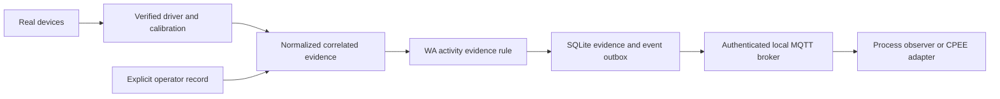

# TinyHouse workareas

**Feasible with limitations.** This folder provides four build plans, runnable local evidence APIs, card-derived event rules, durable event storage/MQTT delivery, a real Nano USB capture path, and the documented energy calculations. It does **not** establish that the physical stations are commissioned. Unknown hardware protocols and WA3's missing approved test procedure are recorded below instead of being replaced with simulated drivers.

| Workarea | Wiring image | Build and connections | Implementation and events | Entry point |
| --- | --- | --- | --- | --- |
| WA1: Print / base quality | [SVG](WA1/wiring.svg) | [BUILD.md](WA1/BUILD.md) | [README.md](WA1/README.md) | [main.py](WA1/main.py) |
| WA2: Kit preparation | [SVG](WA2/wiring.svg) | [BUILD.md](WA2/BUILD.md) | [README.md](WA2/README.md) | [main.py](WA2/main.py) |
| WA3: Assembly / test | [SVG](WA3/wiring.svg) | [BUILD.md](WA3/BUILD.md) | [README.md](WA3/README.md) | [main.py](WA3/main.py) |
| WA4: Control / lid | [SVG](WA4/wiring.svg) | [BUILD.md](WA4/BUILD.md) | [README.md](WA4/README.md), [ENERGY.md](WA4/ENERGY.md) | [main.py](WA4/main.py) |

The SVGs show the tables, hardware, printed fixtures, cable routes, implementation status and MQTT topics. They are schematic arrangements; dashed amber routes require interface verification. Physical fit and commissioning remain subject to each build plan.

All files in `concepts/` were reviewed, including all four workarea cards and all nine image-only floorplan pages. [SOURCES.md](SOURCES.md) records coverage and source conflicts. Cards determine the physical WA assignment and activity names. `WA1` through `WA4` are physical locations; the older `ST-00` etc. identifiers describe logical process stages.

## Run the software

Use Python 3.11 or newer. Run commands from the **repository root**, not from a WA directory. The existing repository-root `main.py` is unrelated CAD work and is preserved. `Workareas/main.py` is this application's default entry point; each WA also has its own configuration-only entry point.

```bash
python3.11 -m venv /tmp/tinyhouse-workareas
/tmp/tinyhouse-workareas/bin/python -m pip install -r Workareas/requirements.txt
/tmp/tinyhouse-workareas/bin/python -m Workareas.WA1.main
```

Use `Workareas.WA2.main`, `Workareas.WA3.main`, or `Workareas.WA4.main` on the other edges. Ports are 8411, 8412, 8413, and 8414 respectively, so four instances can also run on one development machine. `python -m Workareas.main` starts WA1. No command-line options are implemented.

Each `main.py` constructs a `StationConfig`. Set its `SOURCE_IDS` to the logical adapter identifiers you assign and document in the asset register. The supplied `wa1-printer` etc. names are **role names, not discovered devices or verified connections**. Inputs with an unassigned source are rejected. Adapter authentication represents a trusted local acquisition boundary; the API does not authenticate the physical origin of a measurement independently.

Startup creates `Workareas/WA*/local/api.token` with a random secret and `events.sqlite3` for evidence, rejected records, events, idempotency and delivery state. These local files are ignored by Git. The API listens only on `127.0.0.1`; use a local adapter or an authenticated reverse proxy/site VPN for remote access. Do not expose Python's development HTTP server directly to a public network.

```bash
curl --fail-with-body http://127.0.0.1:8411/health \
  -H "Authorization: Bearer $(cat Workareas/WA1/local/api.token)"
```

Submit a **real normalized evidence bundle** using the [event contract](EVENTS.md):

```bash
curl --fail-with-body http://127.0.0.1:8411/v1/events \
  -H "Authorization: Bearer $(cat Workareas/WA1/local/api.token)" \
  -H 'Content-Type: application/json' \
  --data-binary @/path/to/actual-correlated-evidence.json
```

The path above is an operator-supplied input, not an included demonstration or fallback dataset. The API returns a process event only when the evidence rule passes. Unknown, stale, disconnected, missing or conflicting evidence returns HTTP 422 with `state: unknown`. Valid finite JSON rejections remain in the local `rejected` table with the received payload and reason and produce an explicit diagnostic event. Malformed/nonfinite JSON and HTTP framing are rejected before domain storage. Actual machine faults are submitted as `transition: failed`; a missing sensor is never manufactured into a machine fault or successful completion.

## Acquisition and abstraction boundary



The API evaluates a complete observation bundle; it is **not** a raw MQTT subscriber or automatic camera classifier. A station adapter accumulates current evidence for one activity attempt and submits it when evaluating that activity. See [EVENTS.md](EVENTS.md) for exact fields and [SERIAL.md](SERIAL.md) for raw Nano capture. The serial path preserves P1/P2 voltages and resistance; calibrated state segmentation must precede an `assembly` record. An arbitrary threshold has not been substituted for calibration or the concept's held-out validation.

Sources for the printer, controller, cameras, thermal sensor, meters, scales and test jig must normalize their **verified** device protocols into the role records. Existing acquisition code is linked in each BUILD plan. Those older scripts are not certified activity detectors, and this folder does not pretend they already supply this new API.

## Candidate and authoritative events

Default startup is **candidate mode**, as required before empirical validation. Passing a software rule does not prove the classifier achieved the concept's accuracy target.

| Mode | Topic | Gate |
| --- | --- | --- |
| Candidate | `tinyhouse/bayreuth/candidate/<WA>/<activity-slug>` | Structurally valid, fresh, corroborated evidence |
| Authoritative | `tinyhouse/bayreuth/activity/<WA>/<activity-slug>` | Same rules plus an approved station commissioning record |

Configure a `Commissioning` dataclass in the station's `main.py` only after completing [COMMISSIONING.md](COMMISSIONING.md). The runtime checks a real report file exists, approver, macro-F1 ≥ 0.90, message availability ≥ 0.99, clock offset ≤ 250 ms, complete mandatory lifecycle coverage, zero false completions, and safety/privacy approval. These fields record commissioning evidence; they cannot independently prove that an entered empirical result is truthful. Keep the report, data and approval under the site's governance.

`max_age_seconds=30` is a conservative **software commissioning default**, not a measured sensor specification. Set it and `minimum_confidence` from the accepted source cadence and validation report. The clock tolerance cannot be widened beyond the concept's 250 ms. Records retain both their original source times and edge ingestion time.

## MQTT and persistence

Without `BrokerConfig`, events remain in the real local outbox; no remote delivery is claimed. To publish, construct `BrokerConfig(host=..., username=..., password_file=..., ca_file=..., port=8883)` using the accepted broker and credentials and pass it to `StationConfig`. Do not infer that `EMQX003` or a documented IP is already commissioned. Configure station-scoped ACLs, TLS certificate verification and backups before use.

Delivery uses Paho, QoS 1 and `retain=False`. Only a broker PUBACK marks an event delivered; reconnect/restart retains pending events. A crash after PUBACK but before its local commit may replay the same event, so consumers deduplicate by `event_id`. Events/evidence remain in SQLite after acknowledgment; define archive, storage capacity and retention before long experiments. SQLite is local durability, not an off-device backup.

The existing `esp32/+/sensor`, `tinyhouse/scale/#`, canonical device topics and SAGE `events/<sensor_id>` are not renamed. Their ingestion adapters still need real units, source identities and calibration. This implementation publishes only local process events; it neither bridges raw MQTT off-site nor sends `Share outcome` to Munich. That activity records the approved disclosure gateway's actual acknowledgment and matching minimized-payload digest.

## CPEE integration plan

Reuse [the existing Ruby gateway](../cpee_orchestration/README.md); do not create another child-instance supervisor. This implementation's boundary is observation/events, not machine commands or an executable end-to-end workflow. The existing five child definitions and station-specific asynchronous observer/callback adapters are still absent. To integrate:

1. Author each real CPEE child fragment with logical command and observation endpoints kept separate.
2. Before physical work, bind run/order/operation/job IDs and obtain a fresh start authorization. WA1 must wait for WA4's permit; the existing parent model's parallel start alone does not enforce that dependency.
3. Have the observer wait for an **authoritative**, matching station/activity/lifecycle/operation event, then complete the supplied CPEE callback. Persist callback correlation, delivery state, timeout and retry handling; a candidate never resumes an authoritative completion.
4. Join accepted base and matching accepted lid before kit/assembly; enforce fresh passing test/calibration and explicit approval at WA3. Local fallback requires a new energy budget.
5. Repair the source's incomplete local `Produce locally` path before claiming that fallback executes end to end. Test all exception paths against real engines.

These are remaining integration tasks, not installed callbacks. Machine motion, printer heat, guard/E-stop, electrical protection and BMS controls remain local and independent.

## Verification and remaining inputs

```bash
/tmp/tinyhouse-workareas/bin/python -m pip install -r Workareas/requirements-dev.txt
/tmp/tinyhouse-workareas/bin/python -m unittest discover -s Workareas/tests -v
/tmp/tinyhouse-workareas/bin/python -m mypy --strict --explicit-package-bases Workareas
/tmp/tinyhouse-workareas/bin/python -m ruff check Workareas
/tmp/tinyhouse-workareas/bin/python -m compileall -q Workareas
```

The suite uses synthetic observations solely as **test fixtures**. Rule tests, HTTP socket tests, and mocked MQTT tests establish different claims; none proves live sensors, a real authenticated broker, classifier F1, safe machine operation or CPEE completion. See [VERIFICATION.md](VERIFICATION.md) for commands actually executed and limitations.

Deployment still needs actual device models/protocols and asset assignment; meter and weighing/thermal carrier selection; calibration and privacy masks; inverter/BMS units/register maps and forecasts; measured print energy and approved reserve; the complete WA3 DUT pinout, electrical limits and test/calibration procedure; and witnessed safety/integration acceptance. Per-station BUILD plans give the order for resolving them. Missing evidence is a hold point, never permission to create a successful substitute.
