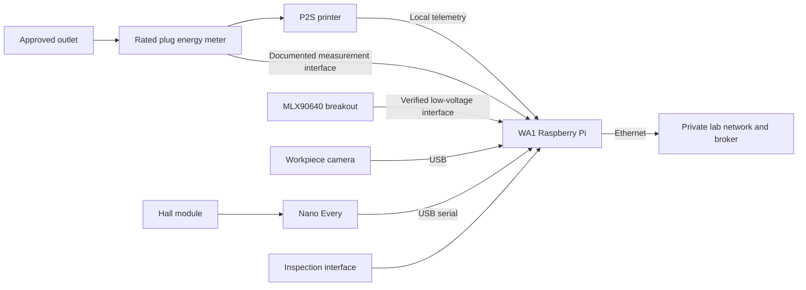

# WA1 — Print / Base Quality: build and wiring

**Feasible with limitations.** This is a build plan, not a record of commissioned hardware. The printer identity and interface, plug energy meter, thermal breakout, camera, and installation still require acceptance. Software cannot replace those checks. The source is [work-area card 1](../../concepts/tinyhouse-workarea-cards.pdf), extended by the [laboratory concept](../../concepts/tinyhouse-bayreuth-laboratory-concept.md).

## Position and parts

Use T4, nominally 127 × 70 cm, at `x = 80..207 cm`, `y = 0..70 cm` in the concept coordinate system. This assignment is a design inference pending the measured survey. Retain the nominal 95 cm central aisle and keep the complete `x = 493..700 cm` rear bay free of tables and stored material. Printer door, material system, purge, maintenance, cable and ventilation clearances must fit separately from its bare footprint. Obtain the table's load rating before placing the printer.

| Part | Quantity | Action before use |
| --- | --- | --- |
| P2S printer | 1 | Record actual model, serial, firmware, network address, LAN interface and supported telemetry fields. |
| Plug-level energy meter | 1 | Acquire a rated, calibrated unit with a documented local measurement interface and cumulative energy counter. The concept selects no model. |
| MLX90640 thermal array | 1 | Identify the actual breakout, supply/logic requirements and interface; two arrays are inventory-listed, not commissioned. |
| Workpiece camera | 1 | Assign an IMX335 USB camera or XIAO ESP32S3 Sense, record its asset ID and approve a workpiece-only view. |
| Raspberry Pi edge package | 1 | Assign an asset, adequate approved power supply or compatible PoE hardware, Ethernet port and storage. |
| Nano Every + Keyestudio Hall Magnetic module + retained tool magnet | 1 each | Monitor one designated rack slot; identify and electrically check the actual sensor first. |
| Inspection interface | 1 | Use explicit quality, review, release and reprint decisions bound to the current component and work order. |

Reuse the existing [printed fixture catalog](../../assets/3D/Workareas/README.md): `wa1_inspection_tray` ×1, `wa1_tool_rack` ×1, `wa1_sensor_bridge_bracket` ×1, plus this station's share of camera hood ×1, Pi sled ×1, cable clips ×3 and label holders ×2. Check the manifest and actual files before fabrication. These are research fixtures, not printer supports, guards or mains enclosures. The [seven-position rack adapter](../../assets/3D/Workareas/wa1_tool_rack_sensor_adapter) is an additional option; its seven bays do not establish seven working sensors. Seven-slot coverage needs seven modules, additional verified input capacity and cross-talk checks; only five complete kits are listed.

## Connection plan

Make all extra-low-voltage connections with the boards unpowered. Label both ends with station, asset and channel ID. Keep mains, machine wiring and sensor wiring separate.

| From | To | Connection and verification |
| --- | --- | --- |
| Approved outlet | Meter input; meter output to printer plug | Use intact rated plug-and-socket equipment. Have the installation's load budget and protection accepted; do not construct a mains circuit in a printed enclosure. |
| Printer network interface | Private TinyHouse network | Use its supported LAN method. Assign the printer's actual address; `192.168.1.100` in the old script is a default, not an asset assignment. |
| Pi Ethernet | Assigned switch port on the private network | Record port, address, clock source and chosen broker. Do not create an external MQTT bridge. |
| IMX335 USB lead | Pi USB | Verify it enumerates as the expected video device; pin the device by stable identity rather than camera index alone. |
| XIAO alternative | Pi USB data cable | The existing Sense firmware is a serial JPEG camera, not a UVC webcam; use its SCAM receiver at 921600 baud. |
| Hall `+`/`V` | Nano Every `+5V` | Manufacturer's Hall example uses a 5 V supply. Verify labels on the actual PCB before connecting. |
| Hall `-`/`G` | Nano Every `GND` | Common sensor reference; retain strain relief. |
| Hall `S` | Nano Every `D3` | Proposed station channel matching the manufacturer's example input number. Verify input mode and observed polarity in the deployed firmware. |
| Nano USB | Pi USB | Use USB serial and a stable `/dev/serial/by-id/…` path. Do not replace this with the unfinished direct RX/TX connection. |
| MLX90640 breakout | Pi-side sensor interface | **Connection held:** the breakout model and its regulator/pull-up arrangement are not recorded. Obtain its manufacturer pinout, establish supply and I/O voltage compatibility, then record the bus, pins, address and driver. Do not apply Nano 5 V logic to a Pi GPIO. |
| Meter data interface | Pi | **Connection held:** model, protocol, credentials and counter units are unknown. Record these after acquisition; do not infer a meter protocol. |

The Hall pin plan is based on [Keyestudio Project 12](https://docs.keyestudio.com/projects/KS0487/en/latest/ks0487.html#project-12-hall-magnetic) and the [official Nano Every pinout](https://docs.arduino.cc/resources/pinouts/ABX00028-full-pinout.pdf). This is a proposed allocation, not a measurement of installed wiring. A three-wire digital sensor alone cannot distinguish every open cable, short or stuck output from a valid tool state. USB/liveness loss must become `unknown`; claim cable-fault detection only after supervised hardware and fault tests establish it. Tool absence proves removal only, never inspection completion or operator identity.

## Assembly and bring-up

1. Release the laboratory concept's HP-01/02 layout, electrical, ventilation and fire hold points. Place the printer, cooled-part tray and sensor bracket; check door travel and sensor temperatures during an accepted trial.
2. Fit the Pi sled and route Ethernet and sensor cables without obstructing vents. Print a fixture only after checking physical dimensions, fasteners and the selected equipment stack.
3. Fit the Hall module behind the designated slot, attach the magnet securely and test every allowed tool resting orientation. Record presence polarity, operating distance, debounce settings and sensor ID. Test adjacent tools and nearby metal before accepting the installation.
4. Record all device identities, configure synchronized clocks and test authenticated broker access plus local buffering. Assign distinct USB devices; the camera and Nano cannot share a serial port.
5. Commission printer, meter, thermal and camera adapters separately. The repository's [Bambu MQTT script](../../modules/administration/scripts/bambu_printer_mqtt.py) can inspect real local printer reports; it is not itself a correlated process-event adapter. Subscribe to the exact installed printer's report topic and establish a trusted TLS configuration. Do not use its optional publish/request features for research observation.
6. For a XIAO camera, reuse the [existing USB firmware and receiver](<../../extensions/Scotty - ROBOT ARM/Xiao_ESP32S3_Sense/README.md>). Approve mask, lighting and local retention before capture. Existing Lego/color detectors do not validate base presence or quality.
7. Start capture before a controlled print. Bind work order, authorization, schedule, configuration, design revision, material, print-job ID and component ID. Take a meter baseline at the defined job boundary. Record the same counter's final reading and reject resets, missing samples or incompatible units; do not call a power estimate measured job energy.
8. Observe authoritative job start/end/fault, heating/cooling and workpiece availability. Inspect only after cooling; record an explicit quality decision. A reprint goes through renewed energy authorization and a new print job. A reviewed release is a separate explicit decision.

## Acceptance evidence

- [ ] Identity register, approved placement, ventilation/fire checks and table rating recorded.
- [ ] Real job start, completion, fault and disconnect/reconnect observations tied to the correct job; no completion inferred from power alone.
- [ ] Measured job energy with units, meter/calibration ID, start/end counters and timestamps; counter reset is rejected.
- [ ] Thermal/camera evidence corroborates the printer; disagreement is retained as an evidence conflict.
- [ ] Tool present, removed, returned and unknown/liveness-loss records; disconnect and stuck-state limits documented without claiming unsupported diagnosis.
- [ ] Explicit inspection, review, reprint and release records preserve the branch actually taken.
- [ ] Buffer/replay test preserves event identity and timestamps after a broker interruption.

The completed station record needs authorization ID, print-job ID, component ID, measured energy, printer result, inspection decision, tool-slot state/health and evidence timestamps. HP-04, HP-09, HP-10 and HP-11 remain open until these physical tests are witnessed. No live WA1 hardware verification has been performed by creating this plan.
