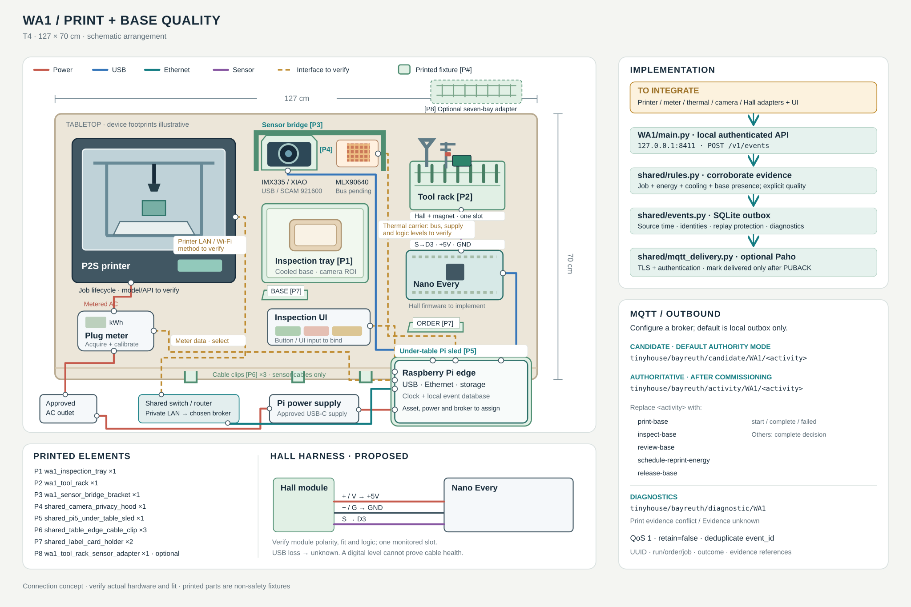

# WA1 implementation — Print / base quality

Start with [BUILD.md](BUILD.md) for parts, fixtures, proposed Hall/Nano wiring and unresolved meter/thermal connections. This station combines printing and base quality; base inspection is not assigned to WA4.

[Open the hardware, wiring and MQTT diagram](wiring.svg).



## Run

From the repository root, using the environment installed by the [shared setup](../README.md):

```bash
/tmp/tinyhouse-workareas/bin/python -m Workareas.WA1.main
```

[main.py](main.py) starts the authenticated local evidence API on port 8411 and persists state under `WA1/local/`. It contains the source-role assignments and constructs the configuration. The default is candidate mode with local storage; configure the commissioned broker and approval record before authoritative MQTT publication.

## Implementation sequence

1. Verify real printer lifecycle reports, job ID and fault schema using the read-only acquisition path referenced in BUILD. A job's identity must remain the same across start/end reports. Write a normalizer against that actual firmware schema; this repository does not yet establish it.
2. Add the selected meter's actual local interface. Capture job-boundary counter readings, calibrated kWh, counter reset/disconnect handling and a reference to the raw trace. Bind thermal episodes and camera presence to that same print/component using validated detectors.
3. Have the print adapter request a fresh scheduled-start authorization using [WA4's energy helper](../WA4/ENERGY.md). Record permit, schedule, work order, configuration/revision, job and component before submitting `Print base/start`. Events never command printer heaters or bypass interlocks.
4. Submit correlated normalized evidence to `/v1/events` as it becomes sufficient for each lifecycle. `Print base/complete` requires printer-completed + measured job energy + same-job cooling + component camera presence. A printer-reported fault uses `/failed`; contradictory completion evidence returns unknown and creates a diagnostic.
5. Bind the inspection UI/button to the active component and work order. Submit the versioned inspection and explicit operator decision. Rejection goes through `Review base`: reprint requires a new job/component and re-evaluated energy; release requires an explicit release reason.
6. Commission Hall firmware on the proposed D3 channel separately. Preserve present/absent/unknown and edge health as observation; tool absence cannot complete inspection. The existing P1/P2 pressure sketch is not Hall firmware. No Hall driver is claimed installed by this folder.

## Process events

| Card activity | Supported lifecycle | Decisive evidence |
| --- | --- | --- |
| Print base | start, complete, failed | Actual job lifecycle; fresh authorization at start; meter/thermal/camera corroboration at completion |
| Inspect base | complete | Versioned inspection and matching accepted/rejected operator decision |
| Review base | complete | Explicit reprint/release decision |
| Schedule reprint energy | complete | New correlated scheduler record with reprint purpose |
| Release base | complete | Inspection record, explicit release and reason |

See [EVENTS.md](../EVENTS.md) for exact JSON fields. For example the authoritative completion topic is `tinyhouse/bayreuth/activity/WA1/print-base`, with `transition: complete`. Before commissioning it uses the separate candidate topic. `Print evidence conflict` is a diagnostic, never a completion.

**Implemented software:** event/evidence rules, API, durable outbox, MQTT, source/freshness/replay checks and energy-calculation helpers. **Still required:** actual printer/meter/thermal/camera/Hall normalizers, calibrated detectors, physical acceptance, operator-interface binding and CPEE observer integration. The source concepts do not supply the missing device contracts. Keep their acquisition and implementation tasks open in the build record.
