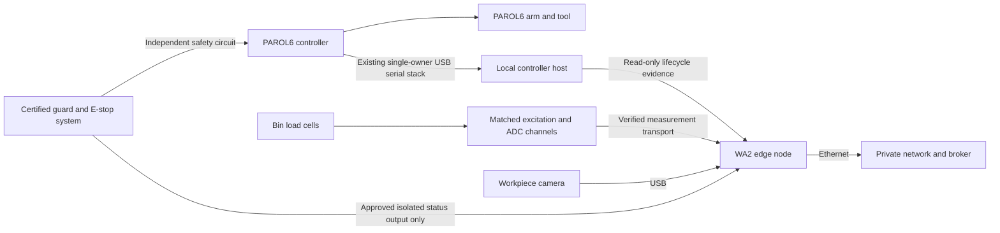

# WA2 — Kit Preparation: build and wiring

**Feasible with limitations.** The build path is defined, but safe powered robot operation and calibrated bin sensing remain blocked by unaccepted hardware and missing device details. Source: [work-area card 2](../../concepts/tinyhouse-workarea-cards.pdf) and the [laboratory concept](../../concepts/tinyhouse-bayreuth-laboratory-concept.md).

## Position and parts

Use T2, nominally 80 × 120 cm, at `x = 0..80 cm`, `y = 50..170 cm`. The drawn reach centre `(40,110) cm` and radius `40 cm` are placement aids, not a safety envelope. The installed tool, payload and all swept volumes must be covered by the competent robot-cell assessment. Verify the table rating, rated mount and fasteners. No printed fixture may support the robot or perform guarding or emergency-stop functions. Preserve the nominal 95 cm aisle and the table-free rear bay at `x = 493..700 cm`.

| Part | Quantity | Action before use |
| --- | --- | --- |
| PAROL6 arm, tool and controller | 1 system | Record hardware/firmware, mount, payload, controller transport and validated program version. |
| Independent guard, interlocks, E-stop and reset hardware | 1 accepted system | Acquire/validate through competent cell integration before applying robot power. |
| Component bins and measuring channels | One per approved component type | Confirm approved kit bill of materials; four printed bins are a prototype fixture quantity, not an approved electronics BOM. |
| Load cells and compatible excitation/ADC electronics | One channel per bin | Identify model, wire function, capacity, amplifier, sample protocol, calibration and achievable resolution. |
| Prepared-kit camera | 1 | Assign IMX335 USB or XIAO Sense; mount outside the safeguarded envelope with a workpiece-only view. |
| Raspberry Pi edge package | 1 | Install outside the reach/guard envelope; assign power, Ethernet, clock source and storage. |

Reuse [existing fixtures](../../assets/3D/Workareas/README.md): `wa2_component_bin` ×4, `wa2_bin_locator` ×4, `wa2_kit_tray` ×1 with removable ESD-safe liner, camera hood ×1, Pi sled ×1, cable clips ×3 and label holders ×2. Verify platform holes and actual cell geometry before printing/drilling. Ordinary PETG is not assumed ESD-safe. Verify bin and kit dimensions against the real parts.

## Connection plan

| From | To | Connection and verification |
| --- | --- | --- |
| Robot supply/controller/arm/tool | Manufacturer-designated connections | Follow the identified hardware revision's assembly and power instructions. Do not guess motor, tool or safety connector pins. |
| Guard/E-stop/interlocks | Independent accepted safety circuit | A competent integrator establishes and validates the circuit, reset and stop behavior. Research software cannot energize, bypass or reset it. |
| Safety auxiliary status, if available | Approved isolated acquisition input | Read-only observation. Record voltage, isolation and semantics; never wire an unspecified industrial output straight to a Pi/Nano input. |
| Controller USB | Existing local controller host | One process owns the serial port. Record the real device path; the Mac path in Scotty configuration is not a TinyHouse asset assignment. |
| Controller-host network | Pi/private network | Consume confirmed real-hardware lifecycle and fault evidence. Keep machine commands local. A simulator/dry-run status is never production evidence. |
| Load-cell excitation/signal wires | Matching amplifier/ADC | **Connection held:** no cell or ADC model, wiring color convention or protocol is recorded. Identify E+/E−/S+/S− from the actual manufacturer documentation, not wire colors. Record amplifier supply and logic limits before connecting it. |
| ADC/scale output | Pi or approved ESP/Nano acquisition path | **Connection held:** inventory notes mention ESP scale boards but no commissioned per-bin protocol. Use the actual documented measurement transport after identification. Do not assume HX711 hardware is present. |
| IMX335 camera | Pi USB | Confirm enumeration and stable device identity. |
| XIAO camera alternative | Pi USB | Reuse the existing serial JPEG firmware/SCAM receiver at 921600 baud; it is not UVC. |
| Pi Ethernet | Assigned private switch port | Record broker and clock configuration; test buffering before motion capture. |

## Assembly and bring-up

1. Release HP-01/02 and HP-05: survey, electrical acceptance, rated mounting, complete risk assessment, guard, interlocks, E-stop, reset and controller fault/recovery tests. Homing itself is powered motion and requires the accepted safe procedure.
2. Install the bin platforms so each intended cell carries its bin correctly; prevent neighboring bins, cable strain or tray edges from bypassing the measuring point. Fit labels identifying bin, component type, revision and sensor channel.
3. Establish the approved electronics BOM and expected removal count per bin. With real parts and reference masses, record empty/tare, normal load range, drift, settling time, smallest relevant part mass and acceptance tolerance. Confirm the selected cells resolve the actual component changes; a 30 kg capacity rating alone establishes no useful small-part resolution.
4. Calibrate camera view and fixed workpiece regions. Validate empty/present states and occlusion without recording adjacent operators. Camera evidence corroborates parts; it does not prove item identity.
5. Reuse the [PAROL6 controller implementation](<../../extensions/Scotty - ROBOT ARM/parol6>) and [Scotty configuration](<../../extensions/Scotty - ROBOT ARM/scotty/config.py>) for the identified real controller. Do not open a second reader on its serial port. The existing viewer/simulator and dry-run client remain separate from production evidence.
6. Bind work order, accepted base and lid, robot-job ID, kit identity, program revision, bin identities and expected contents. The BPMN permits WA2 only after both accepted enclosure parts join at Parts ready.
7. Start sensor and controller capture before motion; home using the accepted procedure with nobody inside the guarded area. Execute the validated local program. Keep job start/end, controller result and fault state distinct from bin measurements.
8. Emit kit completion only when the same robot job succeeds **and every expected bin delta matches**, with kit/workpiece-presence evidence. A job acknowledgement, an idle status or a camera detection by itself is insufficient.

## Acceptance evidence

- [ ] Independent safety/mounting acceptance and real hardware asset/program identities recorded.
- [ ] Start, success, fault, stop, disconnect and recovery captured under one robot-job identity.
- [ ] Every bin is calibrated and has an expected delta/count, tolerance and settling rule derived from measurements.
- [ ] Success with a missing/wrong bin delta remains incomplete; matching bins with controller failure remains incomplete.
- [ ] Camera occlusion, stale sensor data and invalid calibration create uncertainty rather than kit-ready.
- [ ] Explicit prepared-kit identity is linked to work order, robot job and enclosure identities.
- [ ] Broker interruption and restart preserve event identity and evidence without manufacturing a second completion.

The station's complete record requires robot-job ID, controller lifecycle, fault state, expected bin deltas, kit identity and workpiece-presence evidence. No robot, sensor, mount or safety installation has been commissioned by creating this plan. Exact bin ADC wiring and executable pick positions remain unavailable until the selected hardware, BOM and physical calibration are recorded.
