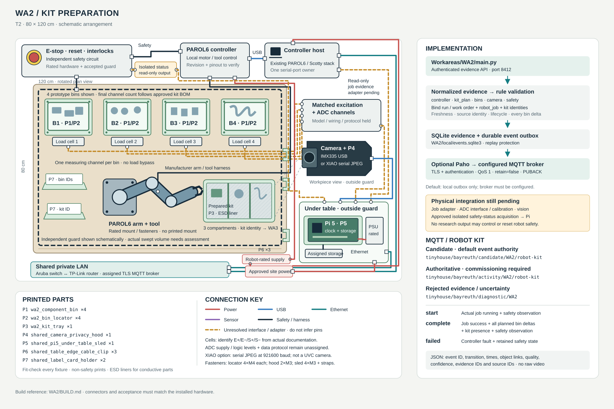

# WA2 implementation — Kit preparation

[BUILD.md](BUILD.md) defines robot/control separation, bins, camera, mount/guard checks and the parts to acquire. Do not energize motion from a research MQTT topic.

[Open the hardware, wiring and MQTT diagram](wiring.svg).



## Run

```bash
/tmp/tinyhouse-workareas/bin/python -m Workareas.WA2.main
```

Run from the repository root after [shared setup](../README.md). [main.py](main.py) starts the authenticated evidence API on port 8412, stores data under `WA2/local/`, and declares controller/kit-plan/bin/camera/safety source roles. It starts in candidate mode.

## Implementation sequence

1. Complete the independent robot installation, guard/E-stop and safe-reset acceptance. Use the existing PAROL6 controller stack referenced in BUILD for real control. Its command result is not yet a verified kit-job lifecycle adapter; establish job-level start/success/fault semantics against the installed controller.
2. Identify every weighing channel and its actual interface. Attach each bin mechanically without load bypass, tare it and measure per-component weight variation. Derive expected removal and allowed tolerance from the approved kit bill of materials and calibration, not an arbitrary default threshold.
3. Produce a versioned `kit_plan` containing kit ID, bin count, component IDs, expected gram removals and per-bin tolerances. The four printed prototype bins do not impose a software limit; expand only after real channels/fixtures are accepted.
4. Before motion, bind the run, work order, robot job and kit. Capture starting bin baselines. Submit `Robot kit/start` only on that controller job's actual start with independently observed guard/E-stop readiness.
5. After success, calculate each calibrated bin removal against its baseline and verify prepared-kit camera presence. Submit `Robot kit/complete` only with controller success, all expected deltas, kit presence and safety observation. The service compares every expected delta numerically and rejects mismatch/missing evidence.
6. On an actual controller fault, submit `Robot kit/failed` with the controller fault code. A visible tray or changed weight cannot override it. Use a new job/operation ID for a real retried kit attempt, preserving the work order and its history.

| Card activity | Lifecycle | Required evidence |
| --- | --- | --- |
| Robot kit | start | Correlated controller running + independent safety observation |
| Robot kit | complete | Controller success + versioned expected kit + measured bin deltas + camera presence + safety observation |
| Robot kit | failed | Correlated controller fault code; observed safety state retained |

The authoritative event topic is `tinyhouse/bayreuth/activity/WA2/robot-kit`; candidate mode uses `candidate` in place of `activity`. Full fields and object links are in [EVENTS.md](../EVENTS.md).

**Implemented software:** numerical multi-bin evidence comparison, identity/lifecycle checks, authenticated API and durable event delivery. **Still required:** commissioned controller job adapter, actual load-cell/ADC interfaces and calibration, kit-presence classifier, physical safety acceptance and CPEE observer. No synthetic motion, success reply or invented weighing driver is supplied as a working station.
