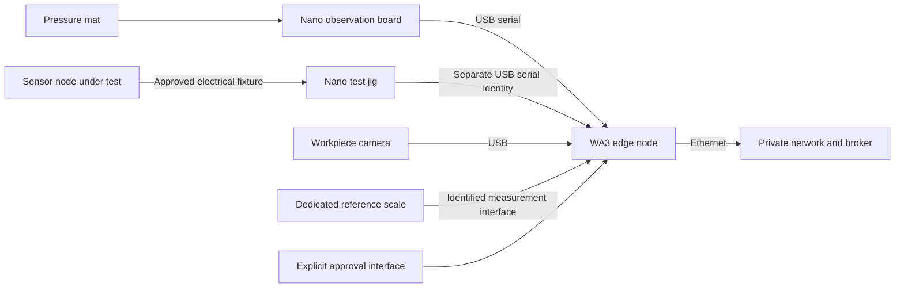

# WA3 — Assembly / Test: build and wiring

**Feasible with limitations.** Assembly observation can be wired from the documented Nano sensor path. The actual sensor-node test jig is **blocked**: the concepts provide no device-under-test schematic/pinout, electrical limits, complete test sequence, calibration method or pass/fail limits. A pressure reading or serial loopback cannot stand in for this required test. Source: [work-area card 3](../../concepts/tinyhouse-workarea-cards.pdf) and the [laboratory concept](../../concepts/tinyhouse-bayreuth-laboratory-concept.md).

## Position and parts

Use T3: the 120 × 55 cm test wing at `x = 90..210 cm`, `y = 165..220 cm`, and 65 × 70 cm assembly wing at `x = 210..275 cm`, `y = 150..220 cm`. Verify actual dimensions, table rating and approved ESD arrangements. Keep the nominal central aisle clear and no equipment/storage in the rear `x = 493..700 cm` bay.

| Part | Quantity | Action before use |
| --- | --- | --- |
| Thin-film pressure mat | 1 assembly | Record zoning, sensor model/count, divider values, mounting and calibrated interpretation. Inventory lists twenty sensors; the existing sketch reads two. |
| Nano Every for observation | 1 proposed allocation | Use the documented USB serial path and existing two-channel pressure sketch after verifying the wiring below. |
| Nano serial test jig | 1 separate jig | Build only from the approved DUT electrical interface and versioned full test/calibration procedure. Reserve a separate USB identity so observation cannot masquerade as a test result. |
| Workpiece camera | 1 | Assign verified IMX335 USB or XIAO Sense with a workpiece-only view. |
| Reference scale and certified references | 1 dedicated set | Verify model, interface, tare, units, accuracy and calibration; do not double-assign WA4's scale. |
| Raspberry Pi edge package | 1 | Assign power, Ethernet, storage, clock and USB identities. |
| Explicit approval interface | 1 | Bind approval to product, latest complete passing test/calibration record and approver decision. |

Reuse [existing fixtures](../../assets/3D/Workareas/README.md): `wa3_component_staging_tray` ×1, `wa3_nano_test_jig_enclosure` ×1, `wa3_reference_weight_caddy` ×1, plus camera hood ×1, Pi sled ×1, cable clips ×3 and label holders ×2. Fit the carrier against the enclosure's provisional 58 × 36 mm post pattern. Use validated ESD-safe material/liners where required; ordinary printed PETG is not an ESD control. The caddy's four pocket sizes require a fit check against actual certified reference weights.

## Connection plan

The two-channel circuit below is the circuit implied by the checked-in [SAGE pressure sketch](../../extensions/sage/arduino/sensor_sketch/sensor_sketch.ino), not a newly calibrated mat design. Verify the actual thin-film sensor's ratings before powering it. The sketch assumes a 5.0 V ADC reference and 510 kΩ fixed resistors; measure these and change the versioned firmware/configuration together if the approved hardware differs.

| From | To | Connection and interpretation |
| --- | --- | --- |
| Nano `+5V` | One lead of each compatible resistive pressure sensor | Two independent dividers; verify sensor current/voltage rating and actual supply. |
| Pressure sensor 1 other lead | Nano `A0`, and one end of its fixed 510 kΩ resistor | Divider junction; channel prefix `P1`. |
| Pressure sensor 2 other lead | Nano `A1`, and one end of its fixed 510 kΩ resistor | Divider junction; channel prefix `P2`. |
| Each resistor's other end | Nano `GND` | This is the lower divider leg required by the existing formula. |
| Observation Nano USB | Pi USB | Existing protocol: 9600 baud, one `ID,VOUT,RC` CSV line per sensor; sketch delay 500 ms. `VOUT` is volts and `RC` is kΩ; `-1` means invalid resistance. |
| Test-jig Nano USB | A distinct Pi USB device | USB is the supported host link. Reserve a stable device ID; do not share the observation serial port or substitute unfinished direct RX/TX. |
| Test-jig DUT pins | Sensor-node test points | **Connection held:** the DUT pinout, power source, isolation, voltage/current limits and complete test procedure are missing. No DUT pin numbers or stimulus values are invented here. |
| IMX335 camera | Pi USB | Verify real device identity and stable path. |
| XIAO alternative | Pi USB | Use [existing XIAO firmware/receiver](<../../extensions/Scotty - ROBOT ARM/Xiao_ESP32S3_Sense/README.md>) for serial JPEG/SCAM at 921600 baud. |
| Reference-scale data port | Pi-compatible interface | **Connection held:** select/identify the dedicated WA3 scale, manufacturer protocol and calibration data. |
| Pi Ethernet | Assigned private switch port | Authenticate to the chosen broker; synchronize the host clock and test local buffering. |

The [official Nano Every pinout](https://docs.arduino.cc/resources/pinouts/ABX00028-full-pinout.pdf) identifies the named power and analog pins. There is no connection from Nano 5 V I/O to Pi GPIO in this plan. Do not infer calibrated force/weight from `RC`; a versioned characterization is required. At high source impedance, verify ADC settling and channel cross-talk empirically before accepting the mat.

## Assembly and bring-up

1. Release HP-01/02 and establish the approved ESD work area. Keep identity-preserving base/lid/kit staging separate from the test fixture. Record product, work-order, size and revision links before assembly.
2. Build and label the observation dividers, protect leads against flexing and install the mat without unintended preload. Upload the checked-in pressure sketch to the actual selected board; record board package/compiler and firmware version.
3. Tare/characterize each mat zone and the dedicated reference scale. Record response to no part, each expected placement, hand pressure, removal, drift and overload. Define thresholds, hysteresis and stable time from this evidence; no universal thresholds are supplied by the concepts.
4. Commission camera masking/retention and the pressure receiver. Use the new [Nano USB acquisition instructions](../SERIAL.md) to run the checked-in two-channel firmware against a configured physical device. Preserve edge receipt timing and invalid readings: this firmware has no source timestamp. The [SAGE receiver](../../extensions/sage/sensor_node/sensors/serial_reader.py) documents the earlier CSV integration. Neither receiver is an approved DUT test procedure, a calibrated pressure classifier or a direct process-event producer.
5. Obtain the approved DUT schematic/pinout and procedure with all required stimuli, measurements, units, references, calibration calculation, limits, timeout behavior, failure conditions and procedure version. Build the Nano jig to those exact requirements, including electrical protection. Until then, the test hardware and automatic test/calibration execution remain blocked.
6. Validate the complete jig with a known-good DUT and deliberately failing cases derived from that procedure. Capture each measured result, reference identity and calibration output. A successful communications check alone must never produce test-passed.
7. Start capture before the first part enters the mat. Preserve assembly start/end and component links. Run the complete approved test/calibration sequence. On failure, record Resolve failure, Rework sensor and a new retest attempt without deleting the failed record.
8. Record final measured weight and explicit human approval only after the latest required test/calibration attempt passes. An old pass must not survive subsequent rework or failure as the basis for approval.

## Acceptance evidence

- [ ] Actual component, product, work-order, size and design-revision links recorded.
- [ ] Mat placement/removal, camera occlusion and stale/disconnected sensor cases validated; sensor activity alone does not prove finished assembly.
- [ ] Dedicated scale tare, units, reference identities, calibration and final product weight recorded.
- [ ] Versioned real jig procedure executed completely, including negative and timeout cases.
- [ ] Failure → resolution → rework → retest history preserved with separate attempt identities.
- [ ] Approval refused for incomplete, failed, stale or superseded test records; a valid pass still requires explicit human approval.
- [ ] USB disconnect/reconnect and broker interruption recover without fabricating test results or duplicating approval.

The required final record contains product/component links, assembly start/end, test record, calibration record, rework history, final weight and approval. HP-06 cannot be released by software unit tests. The physical jig, scientific test/calibration method and live station behavior remain unverified; the missing procedure must be supplied before an executable DUT test can be completed.
