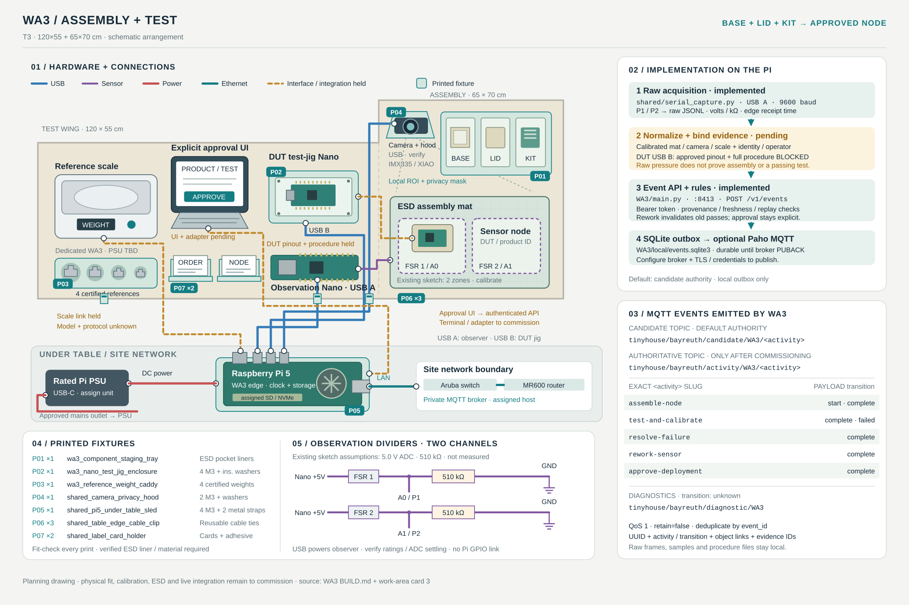

# WA3 implementation — Assembly / test

[BUILD.md](BUILD.md) distinguishes the real P1/P2 observation circuit from the separate DUT test jig. The full DUT pinout and approved test/calibration procedure are missing; a pressure threshold cannot substitute for a valid sensor-node test.

[Open the hardware, wiring and MQTT diagram](wiring.svg).



## Run

```bash
/tmp/tinyhouse-workareas/bin/python -m Workareas.WA3.main
```

Run from the repository root after [shared setup](../README.md). [main.py](main.py) serves port 8413, stores data under `WA3/local/`, and declares independent identity/assembly/camera/test/calibration/scale/operator roles. Defaults are candidate mode and local outbox.

To get real pressure readout immediately after wiring and flashing the existing firmware, follow [SERIAL.md](../SERIAL.md). The new serial collector reads the deployed 9600-baud P1/P2 protocol, logs malformed/disconnected/timeout states and appends raw JSONL. Select the actual `/dev/serial/by-id/…` device. It reports volts/resistance and edge timestamps, not assembly completion or a test pass.

## Implementation sequence

1. Assign base, lid, kit and product IDs; scan/enter their actual size and revision against the order. Assemble only matching components. Establish ESD work surface and the approved workpiece-only camera region.
2. Tare and calibrate pressure/tray observations and final reference scale. Record the expected assembly part-state pattern and its version, then validate first-transfer and completion recognition on held-out sessions. No such classifier is fabricated here.
3. Submit `Assemble node/start` on the first confirmed transfer with matching identity and camera evidence. Submit completion only after the calibrated pattern and explicit human `assembled` confirmation.
4. Build the DUT test jig only from the approved schematic, electrical limits, procedure, references and tolerances. Its real serial test adapter must produce separate immutable test and calibration records with the same product/procedure, record URI, result and calibration reference. Preserve raw measurements and computations at those references.
5. Submit `Test and calibrate/complete` only when both actual results pass and the calibrated scale reports stable positive final weight. Submit `/failed` for a real failed test/calibration; represent unexecuted stages as `not_run`, never pass.
6. A failure requires `Resolve failure` and documented `Rework sensor`, then a new test/operation identity. Approval requires the latest same-run/order/product passing record, unchanged procedure and calibration reference, and an explicit operator approval after the pass. The runtime refuses an old pass after rework and a pass borrowed from another order.

| Card activity | Lifecycle | Decisive evidence |
| --- | --- | --- |
| Assemble node | start, complete | Matching components, calibrated state pattern, workpiece camera; explicit completion |
| Test and calibrate | complete, failed | Actual versioned test/calibration procedure results and final weight on success |
| Resolve failure | complete | Explicit rework decision with reason/record |
| Rework sensor | complete | Explicit reworked record |
| Approve deployment | complete | Latest valid passing history + matching immutable records + weight + explicit approval |

Full JSON requirements are in [EVENTS.md](../EVENTS.md). Activity topics use exact label slugs, e.g. `tinyhouse/bayreuth/activity/WA3/approve-deployment`; uncommissioned output stays on candidate topics.

**Implemented software:** actual Nano raw capture, assembly/test/approval evidence checks, rework invalidation, authenticated API and durable delivery. **Blocked hardware-specific work:** DUT firmware/test execution and scientific calibration, pending the pinout, approved complete procedure and references. Camera/scale normalizers, calibrated assembly detector, physical acceptance and CPEE observer also remain to commission.
