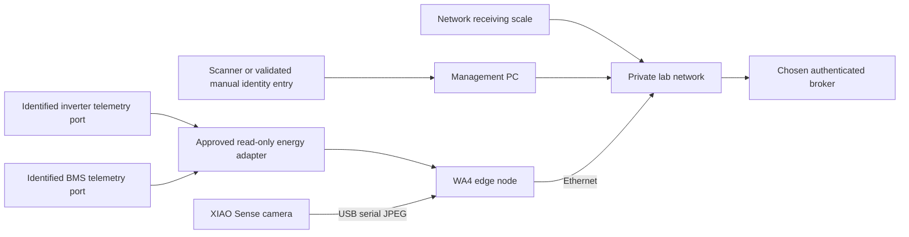

# WA4 — Control / Lid: build and wiring

**Feasible with limitations.** Control and receiving evidence can be implemented, but live energy scheduling and scale acquisition require device interfaces absent from the concepts. The direct local and rejected-commitment fallback routes also remain incomplete in the source BPMN. Source: [work-area card 4](../../concepts/tinyhouse-workarea-cards.pdf), [laboratory concept](../../concepts/tinyhouse-bayreuth-laboratory-concept.md) and [MQTT documentation](../../docs/mqtt/index.md).

## Position and parts

Use T1, nominally 70 × 46 cm, at `x = 210..280 cm`, `y = 0..46 cm`. Keep receiving close to the entrance without obstructing its swing or the central aisle. Use the existing wall display where suitable; the small table must still accommodate the scale/tray and identity/decision interface. Preserve the no-table/no-storage rear bay at `x = 493..700 cm`.

| Part | Quantity | Action before use |
| --- | --- | --- |
| Management PC | 1 | Retain the documented `BTQ8X1` installation, but reconfirm current connectivity and role. |
| Raspberry Pi edge package and selected serving broker | 1 station package | Assign an actual Pi and one broker endpoint; reconcile competing Mosquitto/EMQX listeners before deployment. |
| Read-only inverter/BMS adapter | 1 approved system | Identify inverter and BMS models, firmware, supported communication ports, protocol/register map, units, freshness and usable-energy policy. |
| Receiving network scale | 1 | Recheck the documented candidate address `192.168.1.106`; identify protocol, credentials, units, tare and calibration. |
| XIAO ESP32S3 Sense workpiece camera | 1 | Verify the actual board/camera and workpiece-only region. |
| Identifier input | 1 | The card allows scanner or manual entry. The detailed concept calls for acquiring a 2D scanner, with validated manual entry as its fallback. Preserve that distinction. |
| Explicit receiving/disclosure decision interface | 1 | Keep decisions tied to shipment, component, work order and policy versions. |

Reuse [existing fixtures](../../assets/3D/Workareas/README.md): `wa4_receiving_tray` ×1, `wa4_barcode_scanner_stand` ×1 when a scanner is selected, `wa4_button_console` ×1 if physical buttons are selected, plus camera hood ×1, Pi sled ×1, cable clips ×3 and label holders ×2. The receiving tray's usable region is nominally 232 × 172 mm; verify the real scale platform and largest lid. The console is for three extra-low-voltage 22 mm buttons only; never mains or safety circuits.

## Connection plan

| From | To | Connection and verification |
| --- | --- | --- |
| Management PC | Private TinyHouse network | Use approved Ethernet or Wi-Fi. The prior inspection found PC Wi-Fi disconnected, so university-side access alone does not establish scale reachability. |
| Pi Ethernet | Assigned private switch port | Record asset/address, power path, broker endpoint and clock source. Do not presume a documented IP is still current. |
| Receiving scale | Supported private network connection | Verify current address and measurement service. The known address establishes no HTTP, Modbus or MQTT protocol. |
| XIAO USB-C | Pi USB data port | Reuse the [existing Sense firmware/receiver](<../../extensions/Scotty - ROBOT ARM/Xiao_ESP32S3_Sense/README.md>): SCAM JPEG packets over serial at 921600 baud. Record the stable device ID. |
| Selected 2D scanner | Management PC supported input interface | If a USB HID scanner is selected, validate its keyboard layout, terminator and structured ID format. No scanner model is established by the inventory. |
| Optional decision buttons | Selected low-voltage input interface | **Connection held:** button type/interface and firmware are not selected. A button press is not accepted without active shipment/work-order context and debouncing. A UI is the card-authorized alternative. |
| Inverter/BMS communication connector | Approved adapter | **Connection held:** no exact model, connector pinout, electrical standard or register map is supplied. Do not guess RJ45 pinouts or connect a possible RS-485/CAN/industrial signal to Pi GPIO. Never tap PV, battery or mains conductors as a telemetry substitute. |
| Energy adapter output | Pi/private network | Use only documented read-only measurements. Record timestamps, units, freshness, quality, adapter version and calibration/reference basis. |

The floorplan lists a Growatt 5 kW inverter and a 48 V, 4.8 kWh, 100 Ah LiFePO4 battery; these descriptions do not identify communication hardware or usable energy. Rated capacity cannot replace a current energy snapshot. Source hardware installation and protection remain independent of the research software.

## Assembly and bring-up

1. Release site layout/electrical hold points. Mount Pi/camera fixtures, route cables and fit the receiving tray without touching the scale housing or bypassing the sensing platform. Establish camera masking, local retention and access rules before recording.
2. Select and document the actual station Pi and serving broker. The source records Mosquitto on several Pis, EMQX on `192.168.1.123`, and only loopback Mosquitto on the management PC; these are observations from an earlier inspection, not automatic assignments. Configure users and topic ACLs, and keep external MQTT bridges disabled.
3. Synchronize clocks and verify authenticated connection, broker outage, local persistence, restart and replay. Confirm clock/freshness faults remain visible rather than being silently converted into current data.
4. Identify and commission the scale: empty platform, installed receiving tray, tare, reference masses, units, repeatability, settling and disconnect. The source's roughly 130 g untared reading is historical evidence, not a tare constant. Do not share a single physical scale with WA3 while claiming independent simultaneous measurements.
5. Validate shipment ID, component/lid ID, expected size and design revision capture. Test malformed, duplicate and wrong-revision entries. Vision corroborates presence/size; identity capture and the expected shipment record are primary.
6. Obtain and validate the approved inverter/BMS read-only interface and complete scheduling inputs. Record measured job-energy profiles, conversion assumptions, usable battery limits and protected reserve policy. Test stale, missing, wrong-unit and disconnected readings before enabling schedules.
7. Register run/work order, topology and due window. Create a schedule only from a current complete energy snapshot, preserving energy-schedule and policy versions. Request the matching lid and record Munich's commitment before parallel base production/lid work.
8. Receive the identified lid and capture weight/presence evidence. Record explicit acceptance, replacement-required or manual review. A replacement returns to waiting for a new dispatch; receiving an object alone is not delivery acceptance.
9. After WA3 approval, record Apply disclosure and only then share the permitted minimized outcome. Keep raw video and energy telemetry local by default. Do not send machine commands across the collaboration boundary.

## Scheduling and process constraints

The exact source energy gates use kWh:

- Large: `availableRenewableEnergyKWh >= largeContainerEnergyKWh + reserveEnergyKWh`.
- Standard: `availableRenewableEnergyKWh >= standardContainerEnergyKWh + reserveEnergyKWh` and `< largeContainerEnergyKWh + reserveEnergyKWh`.
- Otherwise wait for the next solar window and read fresh energy state.
- Reprint: `availableRenewableEnergyKWh >= reprintEnergyKWh + reserveEnergyKWh`; otherwise wait and reschedule.

These gates do not define a new optimizer or justify invented cost/forecast data. Preserve the approved policy's method and record its version. The five cross-site contracts are lid request, commitment decision, lid dispatch, delivery decision and minimized outcome; the detailed fields and routing remain in the concept/BPMN.

**Source blocker:** `Task_ProduceLocally` has no outgoing sequence flow. Direct local production and rejected-commitment fallback must not be represented as an executable completed route. HP-13 requires a revised, validated source BPMN; station software must not silently add the missing route.

## Acceptance evidence

- [ ] Actual PC/Pi/broker/network identities, authenticated ACLs and synchronized clock evidence recorded.
- [ ] Full energy snapshot contains approved units, source time, quality and all required inputs; stale/incomplete data cannot authorize production.
- [ ] Boundary tests preserve reserve: exact standard threshold, exact large threshold, below minimum and fresh rescheduling after wait.
- [ ] Scale tare/calibration and received/removed transitions recorded with shipment/component identities.
- [ ] Correct identity with absent/conflicting presence evidence and wrong revision/size do not auto-accept delivery.
- [ ] Explicit accept, replace and manual-review decisions plus replacement dispatch loop demonstrated.
- [ ] Disclosure decision/policy version precedes shared outcome; raw video/energy remain local by default.
- [ ] End-to-end distributed dry run includes energy wait, commitment, parallel branches, replacement, reprint, calibration rework and completion; local route remains blocked until repaired in the source.

The required record contains run/work-order IDs, energy snapshot, schedule/policy versions, lid identity, delivery decision, disclosure decision and outcome. HP-03, HP-07, HP-09, HP-10, HP-12 and HP-13 require physical or cross-system evidence that this file does not provide. Live energy/scale acquisition and the incomplete local route remain unverified or blocked as described.
