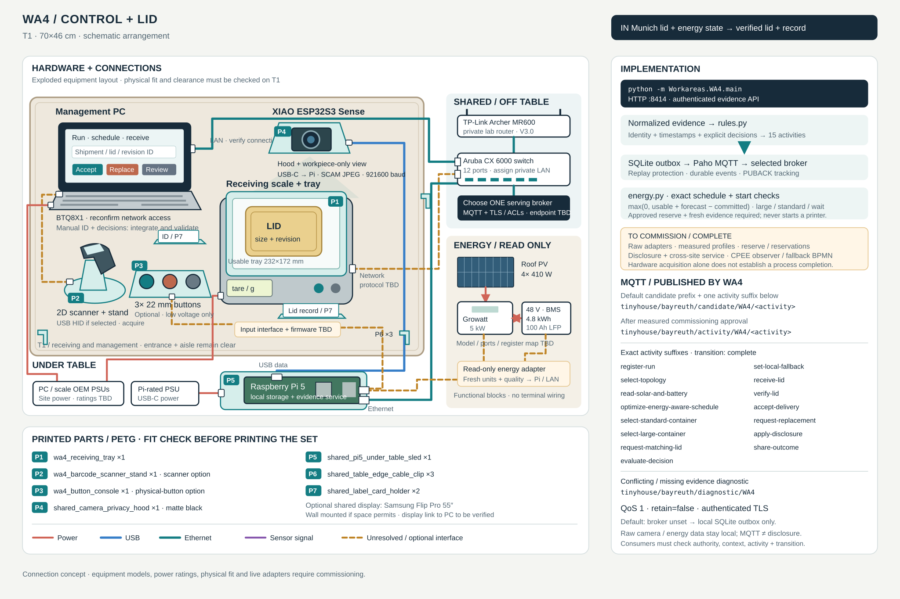

# WA4 implementation — Control / lid

[BUILD.md](BUILD.md) covers the compact management/receiving table, scale, XIAO camera, identifier entry, network and inverter/BMS hold points. The exact energy algorithms and callable Python interfaces are in [ENERGY.md](ENERGY.md).

[Open the hardware, wiring and MQTT diagram](wiring.svg).



## Run

```bash
/tmp/tinyhouse-workareas/bin/python -m Workareas.WA4.main
```

Run from the repository root after [shared setup](../README.md). [main.py](main.py) serves port 8414 and stores evidence/events under `WA4/local/`. Its named sources are logical management/acquisition roles, not verified hardware addresses. Default output is candidate mode.

## Implementation sequence

1. Establish fresh read-only inverter/BMS acquisition only after obtaining the exact model/firmware/interface/register map, units and usable-energy limits. A nominal 4.8 kWh battery rating multiplied by state of charge is not a verified usable renewable budget. Supply a separately identified forecast covering each candidate interval.
2. Register run/order/revision and due window, then record a versioned topology decision. Load measured standard/large energy profiles, approved reserve and loss-model references into `EnergyPolicy`; the library has no invented deployment values.
3. Call `evaluate_schedule` with real typed snapshots/candidates/projections. It applies the documented `max(0, usable + forecast - committed)` formula, large-first/standard/wait ordering, and lexicographic window objectives. Persist its full returned decision and normalize the schedule summary for the event API. This calculation is implemented; data acquisition/forecasting and transactional shared energy reservations are external prerequisites.
4. Wait/re-evaluate when ineligible. Before an actual job starts, call `authorize_print` on a new fresh snapshot; for a reprint call `authorize_reprint` with a new schedule/job identity and its measured estimate. Deliver the real permit to the local print adapter. These helpers return evidence and never drive a printer.
5. Request a matching size/revision lid through the actual collaboration service and record its request receipt/commitment decision. A rejection selects local fallback and requires a new energy schedule for the additional local lid work. The descriptive local BPMN branch still needs completion before end-to-end execution is claimed.
6. Tare receiving scale, observe a stable positive lid transition, capture shipment/lid identity and verify size/revision. Record rejected inspection for a genuinely wrong lid, then request replacement. Acceptance requires matching identity and explicit accepted inspection/operator decision.
7. Produce a minimized outcome using the approved disclosure gateway. Record the policy and exact payload digest, send through the real collaboration service, and submit `Share outcome` only after its acknowledgment references the same digest. Publishing local MQTT events is not remote disclosure.

## Process events

| Stage | Exact card activities |
| --- | --- |
| Registration | Register run; Select topology |
| Energy | Read solar and battery; Optimize energy-aware schedule; Select standard container; Select large container |
| Commitment | Request matching lid; Evaluate decision; Set local fallback |
| Receiving | Receive lid; Verify lid; Accept delivery; Request replacement |
| Outcome | Apply disclosure; Share outcome |

All accept `transition: complete` for their actual decision/observation record. Use [EVENTS.md](../EVENTS.md) for fields, object links and evidence roles. The `outcome` field preserves the normalized decision (including schedule wait or rejected inspection), so a completed decision activity is distinguishable from successful production. Topics use the shared authority/candidate separation.

**Implemented software:** exact energy calculations/start checks and all 15 card activity rules, API, durable outbox and authenticated MQTT. **Still required:** real inverter/BMS/forecast/scale/camera/identity/management adapters, approved energy measurements/reserve, transactionally serialized reservations, actual cross-site delivery/disclosure service, executable local fallback and CPEE observer integration. No default broker assignment or remote outcome success is assumed.
