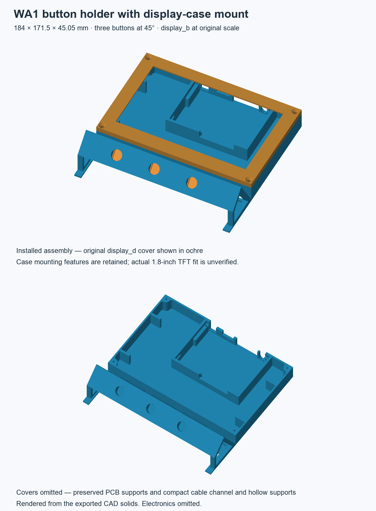

# Compact WA1 button and display holder

The holder removes unused floor, shortens and hollows the side braces, moves the display **18 mm closer** and lowers the button face **6 mm**. Button gaps decrease from 12 to **10.5 mm**. The original PCB mounts, three-button row at **45°**, display enclosure at **100% scale**, and matching cover interfaces remain intact.

**Feasible with limitations:** CAD and sliced files are digitally verified. Physical fit, strength and compatibility of the selected enclosure with the actual TFT module remain unverified.



| Measurement | Previous | Compact |
| --- | --- | --- |
| Body envelope | 196 × 196 × 51.05 mm | **184 × 171.5 × 45.05 mm** |
| Solid CAD volume | 220,475 mm³ | **125,828 mm³**, 43% less |
| Sliced body estimate | 10 h 36 min 29 s | **7 h 25 min 02 s**, 30% less |
| Body PLA including supports/brim | 226.16 g | **152.00 g**, 33% less |
| Four covers, separate job | — | **1 h 53 min 24 s / 37.62 g** |

Printing the body and all four covers totals **9 h 18 min 26 s / 189.62 g**. Reuse matching existing covers if available. Estimates come from AnycubicSlicerNext. The body comparison uses the same print profile.

## Files and printing

- [Body G-code](prints/wa1_button_holder_kobra3_PLA_04.gcode) and [sliced body project](prints/wa1_button_holder_kobra3_PLA_04.3mf).
- [Four-cover G-code](prints/wa1_button_holder_covers_kobra3_PLA_04.gcode) and [sliced cover project](prints/wa1_button_holder_covers_kobra3_PLA_04.3mf).
- [Print settings, toolpath preview and limitations](prints/README.md).
- [Body STL](wa1_button_holder.stl), [geometry-only 3MF](wa1_button_holder.3mf), [STEP](wa1_button_holder.step) and [FreeCAD assembly](wa1_button_holder.FCStd).
- [Three button-cover STL](wa1_button_holder_back_covers_3.stl) / [3MF](wa1_button_holder_back_covers_3.3mf).
- [Display-cover STL](wa1_button_holder_display_cover.stl) / [3MF](wa1_button_holder_display_cover.3mf).
- [Measured geometry and hashes](geometry-audit.json) / [sliced geometry and toolpath audit](prints/toolpath-audit.json).

The body is one connected solid, floor down. The native assembly includes four installed covers; its features are editable solids without a live parametric feature tree. Geometry-only 3MF files contain no sliced job. Electronics are omitted.

## Mounting and cable access

The complete [`button.stl`](../../Sensoren/button.stl) bays are rigidly transformed at **44.5 mm pitch**. Their original **34 × 24 × 14 mm** envelopes, PCB guides, apertures and connector notches are unchanged. The original [`button_d.stl`](../../Sensoren/button_d.stl) covers retain **69.68689 mm³** nominal snap-rim overlap. Tests check that the stand adds no interference at installed and sampled rear withdrawal positions.

Each connector retains a tested **10 × 6 × 6 mm** external keep-out. The shared open channel provides a nominal **170 × 13 × 8 mm** wiring region (tested with 0.1 mm edge allowances). Its rim is 3 mm above the 2 mm floor; the channel and **12 mm wide central outlet are open above**, allowing wires above the rim. The display starts 6 mm beyond the rim. The open floor between channel and display permits downward cable exit.

The complete user-selected [`display_b.stl`](../../Sensoren/display_b.stl) remains **119.5 × 184 × 20 mm**, with its 2 mm floor, all PCB supports and ports. It occupies x = 0…184, y = 52…171.5 mm, open face up, long connector side rearward. The original [`display_d.stl`](../../Sensoren/display_d.stl) shares the rigid placement; source body/cover overlap is zero, and sampled vertical removal remains unobstructed. No rear margin blocks the low connector opening.

Fit boards using their original interfaces, connect cables through the preserved notches, route the harness through the open channel and install matching covers. Exact plugs, cable bends, TFT compatibility, SD-card access and display fastener thread/length have not been measured. The user confirmed the existing display case as reference; it has not been scaled to a guessed module size.

## Regeneration and verification

CAD modules referenced by root `main.py` were absent when this task began. The focused generator was restored for this holder; `main.py` only constructs configuration and starts export. Other fixtures and reference files are preserved.

```bash
PYTHONPATH="/Applications/FreeCAD.app/Contents/Resources/lib:${PWD}" /Applications/FreeCAD.app/Contents/Resources/bin/python main.py
PYTHONPATH="/Applications/FreeCAD.app/Contents/Resources/lib:${PWD}" /Applications/FreeCAD.app/Contents/Resources/bin/python -m unittest discover -s tests -v
```

The compact-envelope test failed against the old 196 mm body before redesign. It caught an intermediate volume above its 130,000 mm³ limit before further floor removal. The sliced-job test failed against the old 196 mm project before replacement.

| Requirement | Status | Implementation evidence | Verification evidence |
| --- | --- | --- | --- |
| Remove space and move components closer | Implemented exactly | `ButtonHolderConfig`, `side_braces`, `cable_trough` | Native export: 184 × 171.5 × 45.05 mm; 125,828 mm³; compact test passes |
| Three direct PCB mounts at 45° with wiring room | Implemented exactly | `installed_bay`, original cases and open channel | Complete bay comparisons, face/opening measurements, plug keep-outs and channel/outlet void checks |
| Selected display case and service access | Implemented exactly | `installed_display`, original case and cover | Complete case-envelope comparison, sampled cover movement and low rear passage checked |
| PLA/0.4 mm Kobra 3 sliced files | Implemented exactly | Two G-code and sliced 3MF jobs | Saved profiles, mesh identity, embedded G-code equality and explicit motion bounds checked |
| Printed fit and complete cover-tip reproduction | Not verified | Original interfaces and cover mesh preserved | No physical print; cover slice omits two sub-nozzle tip ends |

**Implemented:** compact connected body, matching covers, CAD/STEP, print meshes and two sliced jobs. Body support interfaces remain beneath all three bays. The profile retains 0.2 mm layers, four walls and 25% gyroid; savings come from geometry changes.

**Verification:** FreeCAD `main.py` and `unittest discover -s tests -v`; Ruff `check` / `format --check`; strict mypy with native missing imports ignored; FreeCAD `compileall`; native slicer commands; embedded-mesh/G-code audits; catalog/reference hashes and ZIP/unit checks; preview inspection; `npm run docs:build`; `git diff --check`. Final results appear in the delivery report. Both embedded meshes match STL geometry within 0.0001 mm, allowing reordered facets, without scaling or bed-facing tilt. Explicit motion checks cover **1,023,911 body** and **252,710 cover** coordinates inside 250 × 250 × 260 mm.

Executed results against the final working state:

- The two FreeCAD commands above completed: export succeeded and **20 tests passed** in 69.101 seconds.
- `/private/tmp/tinyhouse-workareas-venv/bin/ruff check cad main.py tests` and `ruff format --check cad main.py tests`: passed; ten files formatted.
- `PYTHONPATH=/private/tmp/wa1-button-inspection/typecheck-tools python3.11 -m mypy --strict --ignore-missing-imports --explicit-package-bases main.py cad tests`: passed, ten files.
- FreeCAD Python `-m compileall -q main.py cad tests`: passed.
- Native Anycubic slicer with the saved machine/process/filament settings, `--arrange 1 --orient 0 --scale 1 --slice 0 --export-settings … --export-3mf … --outputdir …` and the real body/cover STLs: both jobs exited zero. The entire body profile was compared with the previous sliced project and remains unchanged.
- FreeCAD Python `/private/tmp/wa1-button-slicing/audit_geometry.py` and Python 3.11 `audit_toolpaths.py`: passed for both actual jobs. The first facet audit rejected a fresh export's reordered triangles; matching triangle geometry independently of order fixed the audit without changing its 0.0001 mm tolerance. Maximum errors are 0.000003815 mm for body and 0.000000119 mm for covers.
- SHA-256 checks: **76 catalog artifacts**, eight exports and four reference files passed; other 18 fixture records unchanged. Three geometry 3MF archives passed ZIP/unit checks. Local documentation links and function annotation/docstring inspection passed. CAD and actual toolpath previews were visually inspected.
- `npm run docs:build` and `git diff --check`: passed. The changed source search found no placeholders, TODOs, broad exception handlers or added CLI frameworks.

**Deviations:** none from compact CAD or selected-case requirements. The slice omits the final tips of two original cover hood features at sub-nozzle widths; this is a print-fidelity limitation.

**Not verified:** physical printing, actual module/plug fit, elastic retention, stiffness, tabletop stability, cable bends and firmware-internal startup macro motion. Native FreeCAD modules lack type stubs; mypy cannot verify their C++ API types.

**Remaining issues:** cover-tip limitation and two slicer advisories are recorded in the print guide. Hardware fit and support removal require a prototype; no physical success is claimed.

**Changed files:** focused CAD modules; geometry/slice tests; this folder's CAD, meshes, previews, audits and docs; sliced jobs; holder catalog record and catalog README. Four reference meshes and the other 18 fixture records are unchanged.
