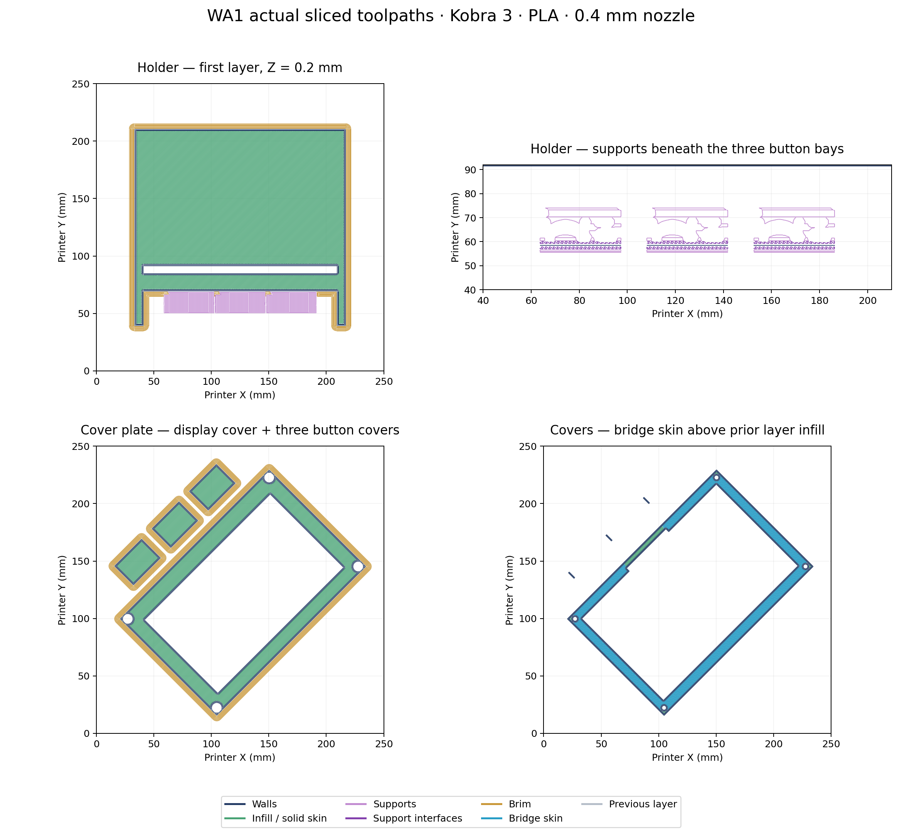

# Kobra 3 compact WA1 print jobs

Prepared with **AnycubicSlicerNext 2.0.0.3**, the original **Anycubic Kobra 3** profile, **PLA**, and a **0.4 mm nozzle**. A conservative **250 × 250 × 260 mm** build volume is saved. PLA brand and build plate were unspecified: jobs use the installed Anycubic PLA profile and textured PEI settings.

| Job | G-code | Sliced project | Estimated time | PLA including brim/support |
| --- | --- | --- | --- | --- |
| One compact body | [G-code](wa1_button_holder_kobra3_PLA_04.gcode) | [3MF](wa1_button_holder_kobra3_PLA_04.3mf) | 7 h 25 min 02 s | 152.00 g |
| Display cover + three button covers | [G-code](wa1_button_holder_covers_kobra3_PLA_04.gcode) | [3MF](wa1_button_holder_covers_kobra3_PLA_04.3mf) | 1 h 53 min 24 s | 37.62 g |

All five pieces total **9 h 18 min 26 s / 189.62 g**. These replace the earlier oversized jobs. Copy the required G-code to printer media; sliced projects allow inspection or re-slicing. No print was sent to the printer.

## Saved settings

| Setting | Value |
| --- | --- |
| Layer / first layer | 0.2 / 0.2 mm |
| Walls | 4 |
| Top / bottom layers | 5 / 5 |
| Infill | 25% gyroid |
| Nozzle | 220°C first layer, 210°C afterward |
| Textured bed | 60°C |
| Supports | Automatic normal/snug, 30° threshold, 0.2 mm top gap, three top interface layers |
| Brim | Outer, 5 mm |
| Scale / bed orientation | 100%; body floor down, button covers flat, display cover front down |

Body supports include interfaces beneath all three button bays. Cover support generation is enabled, but this plate generates bridge/infill paths without separate support extrusions. The cover group rotates 45° only in the bed plane during arrangement; its occupied outline and every explicit move remain inside the bed.

## Digital checks and limitations

The [audit](toolpath-audit.json) records hashes, closed mesh components, rigid placements, estimates, deposited bounds, extrusion roles and explicit motion counts. Embedded/external G-code are byte-identical. The body project has one closed body; the cover project has four closed parts. Every embedded triangle matches source geometry within 0.0001 mm, independent of facet order. Units are millimetres.

Body extrusion spans x = 28.558…221.442, y = 34.808…215.192, z = 0.2…45.0 mm. Cover extrusion spans x = 10.839…239.273, y = 10.727…239.161, z = 0.2…16.6 mm. Checks include explicit startup/shutdown coordinates, but do not simulate firmware's `G9111` startup macro.

**Known cover limitation:** two curved ends of the original display-cover connector hood taper below the 0.4 mm nozzle's reliable extrusion width. The mesh reaches 17.10 mm; the standard job ends at 16.6 mm. Source mesh and main cover interfaces remain intact, but the final sub-nozzle tips are omitted. Their functional effect has not been physically checked. Mesh comparison does not prove every tiny feature will print.

Both projects record `bed_temperature_too_high_than_filament` (60°C bed reaches the PLA profile's 60°C vitrification value) and `not_support_traditional_timelapse` (traditional timelapse is disabled). Native slice commands completed successfully; metadata reports no outside-bed object. Advisories are preserved in the audit.

Physical fit, print time, support removal, strength and firmware startup remain unverified. Actual TFT compatibility with the user-selected large enclosure has not been established. Remove body supports and brim before checking mounting and cover fit.
