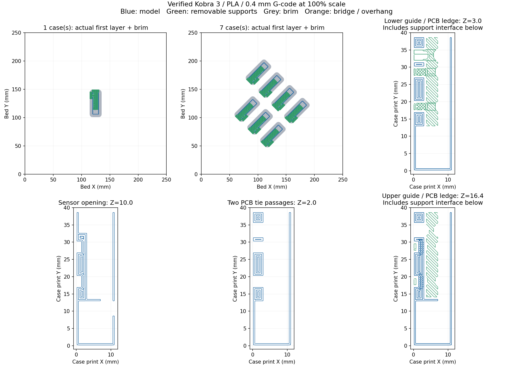

# SE054 case: Kobra 3 print files

**Feasible with limitations:** both requested jobs are sliced from the redesigned SE054 case for the original **Anycubic Kobra 3, PLA, 0.4 mm nozzle**. Digital checks passed; physical printing and fit remain unverified.

| Job | Printer-ready G-code | Editable sliced project | Slicer estimate, normal mode |
| --- | --- | --- | --- |
| One case for testing | [One-case G-code](prints/wa1_hall_case_1_kobra3_PLA_04.gcode) | [One-case 3MF](prints/wa1_hall_case_1_kobra3_PLA_04.3mf) | 16 min 26 sec; 3.49 g PLA |
| Seven cases for the full print | [Seven-case G-code](prints/wa1_hall_case_7_kobra3_PLA_04.gcode) | [Seven-case 3MF](prints/wa1_hall_case_7_kobra3_PLA_04.3mf) | 1 hr 37 min 38 sec; 24.36 g PLA |

Estimates include supports and brim. They are not measured print times. These files contain the small sensor cases that fit into the existing seven-bay adapter.

## Printing

1. Copy the **one-case G-code** to the printer's USB drive and select that file on the Kobra 3, with PLA loaded and a 0.4 mm nozzle installed.
2. After cooling, remove the brim and supports beneath the PCB guides and ledge. Clear the sensor aperture and all tie passages.
3. Check the case in the existing adapter, then check the actual PCB, retaining ties, connector and bent sensing package using the [assembly instructions](README.md#fastening-and-assembly). Check detection with the tool's magnet before committing to the full set.
4. Once the test fits, copy and print the **seven-case G-code**. It prints seven cases together, layer by layer.

Open the sliced 3MF projects in AnycubicSlicerNext to inspect layers or adjust material settings. The geometry-only 3MF files in the parent folder contain no print settings. The [old sleeve draft](draft/README.md) remains superseded.

## Saved settings

| Setting | Value |
| --- | --- |
| Slicer | Official AnycubicSlicerNext 2.0.0.3, macOS arm64 |
| Printer | Anycubic Kobra 3 0.4 nozzle; original model |
| Material | Manufacturer's Anycubic PLA profile; 1.75 mm filament, flow ratio 0.96 |
| Temperatures | Nozzle 220 °C first layer, then 210 °C; bed 60 °C |
| Build plate | Textured PEI profile; actual plate and PLA brand were not specified |
| Scale and orientation | 100%, millimetres; existing open-side-down orientation; automatic XY arrangement only |
| Model layers | 0.2 mm, including first layer; 100 model layers up to Z = 20 mm |
| Independent support layers | Enabled; 150 total model/support layer events for one case, 151 for seven |
| Walls and shells | Arachne; four requested walls; five top and bottom layers; thin 0.8 mm panels resolve to two tracks at the checked sections |
| Infill | 25% gyroid |
| Speeds | First layer 25, outer walls 60, inner walls 80, supports 50, bridges 25 mm/s; cooling may reduce them |
| Supports | Normal automatic, snug; allowed on the model; 0.2 mm top and bottom gaps, 0.35 mm XY clearance, three top interface layers |
| Adhesion | 5 mm outer brim, 0.1 mm separation |
| Compensation | No XY contour/hole or filament shrink rescaling; profile's 0.1 mm first-layer elephant-foot compensation retained |
| Timelapse / colour changes | Disabled; single PLA filament |

The bundled machine profile's 255 mm bed has been restricted to the original Kobra 3's **250 × 250 × 260 mm** volume. Only `printable_area` and `bed_exclude_area` differ from the bundled machine profile. Its start and end templates are identical, including `G9111 bedTemp=60 extruderTemp=220` and the final X250/Y220 park. [Official Kobra 3 specifications](https://de.anycubic.com/products/anycubic-kobra-3), [official slicer download](https://www.anycubic.com/slicerNextDownload).

## Requirement evidence

| Requirement | Status | Implementation evidence | Verification evidence |
| --- | --- | --- | --- |
| One sliced test case | Implemented exactly | One-case G-code and sliced 3MF above | One connected 336-triangle case; matching embedded G-code and MD5 |
| Seven sliced cases | Implemented exactly | Seven-case G-code and sliced 3MF above | Seven connected cases, 2,352 triangles; matching embedded G-code and MD5 |
| Kobra 3, PLA, 0.4 mm nozzle | Implemented exactly | Settings embedded in both projects | Printer, nozzle, filament, temperatures, bed bounds and process values read and asserted |
| Print the redesigned geometry at its original size | Implemented exactly | Current STL meshes embedded in the projects | Every triangle matches its current STL at 0.0001 mm precision; rigid XY placement; each case 11.2 × 38.8 × 20 mm in print axes |
| Preserve openings and support the PCB mount | Implemented exactly | Real model/support toolpaths | 1,600 panel/layer checks, minimum two tracks; 272 sampled aperture/tie checks; lower ledge and both guides have support interfaces for every case; selected layers visually inspected |
| Physical printing and fit | Not verified | One-case test file supplied | No physical print was run; test it before the seven-case job |

## Executed verification

- The pre-slice output-existence assertion failed as expected because neither requested G-code existed. The same assertion passed after both jobs were generated.
- Both CLI slices exited **0**, loading the resolved bundled machine/PLA profiles and the saved process settings with `--arrange 1 --orient 0 --scale 1 --slice 0`. The source files were `wa1_hall_sensor_case.stl` and `wa1_hall_sensor_case_plate_7.stl`. Each command also used `--export-settings`, `--export-3mf` and `--outputdir` in `/private/tmp/wa1-se054-slicing/{1,7}`.
- `python3 /private/tmp/verify_se054_prints.py` passed against the current outputs. It compared STL/3MF facets and component counts, verified unit-scale transforms and settings, checked embedded G-code/MD5, read actual extrusion paths, checked sampled panels/openings/supports, and verified every explicit G0/G1 position inside 250 × 250 × 260 mm, including the end park. CAD-source hashes were unchanged.
- Negative audit checks correctly rejected a scaled transform, relative XY mode and an explicit X251 move. Additional checks found support interfaces beneath the upper guide in all eight cases across the two files.
- `MPLCONFIGDIR=/private/tmp/hall-case-mpl python3 /private/tmp/preview_se054_prints.py` passed. The resulting image above was visually inspected; it draws real extrusion paths.
- The delivered G-code and project hashes match the audited outputs. See [toolpath-audit.json](prints/toolpath-audit.json) for hashes, settings, bounds and counts.
- `PYTHONPATH=/Applications/FreeCAD.app/Contents/Resources/lib:$PWD /Applications/FreeCAD.app/Contents/Resources/bin/python -m unittest discover -s tests -v` passed: all 40 existing case/adapter geometry and export tests.
- `npm run docs:build` and `git diff --check` passed. `git diff --no-index --check /dev/null assets/3D/Workareas/wa1_hall_sensor_case/PRINTING.md` produced no whitespace diagnostics, with exit 1 for the added-file diff. Inline checks passed for local documentation links, delivered SHA-256 values, both 3MF ZIP archives, embedded/external G-code equality, unchanged CAD-source hashes and all 72 catalog artifact hashes.

Initial sandboxed slicer launches aborted in macOS screen-service registration; the approved launch outside that sandbox succeeded. The first project export used an absolute filename that this CLI incorrectly combined with `--outputdir`; using the required basename fixed it. Both final slices and exports completed successfully.

## Deviations, unverified items and remaining issues

**Deviations:** none from the requested quantities, printer, material or nozzle. CAD geometry was not changed by slicing.

**Not verified:** actual adhesion, support removal, printed clearances, tie-head fit, retention, PCB/component fit, bent-package reach and magnetic sensing. The manufacturer PLA/textured-PEI settings require checking against the actual spool and plate. Explicit-motion checks cannot inspect moves implemented internally by the printer's `G9111` firmware macro.

**Remaining issues:** both projects retain the slicer's `bed_temperature_too_high_than_filament` and `not_support_traditional_timelapse` advisories. The saved bed temperature is the manufacturer's 60 °C PLA setting, which equals the profile's 60 °C vitrification value; timelapse is disabled and its G-code is empty. These advisories have not been hidden. The digital checks establish the saved geometry and explicit toolpaths; they do not establish successful physical printing.

**Changed files:** four print files and the audit/preview were added in `prints/`; this guide was added and the case README was updated. Geometry exports and the rack/adapter files were unchanged.
