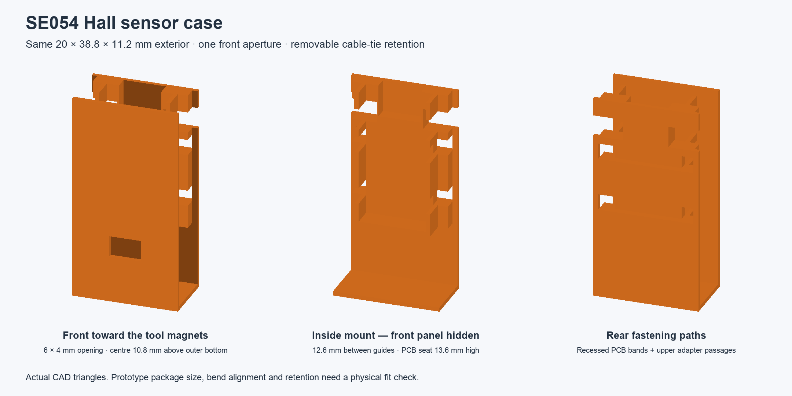
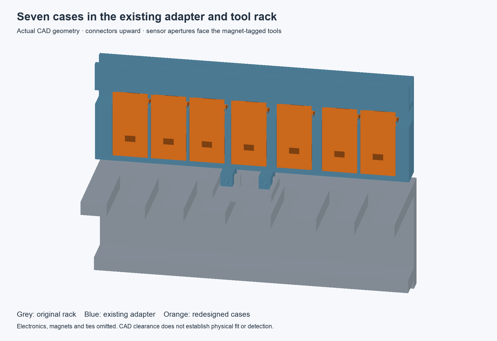

# WA-1 SE054 Hall sensor case

**Feasible with limitations:** this redesign preserves the old case's **20 × 38.8 × 11.2 mm** exterior and fits all seven bays of the existing `wa1_tool_rack_sensor_adapter` in CAD. It mounts the **25 × 12 mm IDUINO SE054 PCB** against the back, with the connector upward and the Hall element bent 90° outward toward the magnet-tagged tools in `wa1_tool_rack`.

The user confirmed the PCB dimensions and approved a guessed sensor centre **10 mm above the inside bottom**. The single front opening is **6 × 4 mm**, centred across the case, or **10.8 mm above the outer bottom** with the existing 0.8 mm floor. Its size is a prototype clearance choice, not a package measurement from the [SE054 datasheet](https://cdn-reichelt.de/documents/datenblatt/A300/SE054.pdf). The PCB stays inside; only the bent sensing package passes through the front.





## Dimensions

All dimensions are millimetres at 100% scale. Installation axes are x across the rack, y upward and z outward toward the tools.

| Feature | Dimension or position |
| --- | --- |
| Exterior, unchanged | 20 wide × 38.8 high × 11.2 deep |
| Front, rear base panel and outer bottom | 0.8 thick |
| Front sensor aperture | 6 wide × 4 high; local x = −3…3, y = 8.8…12.8 |
| Aperture centre | Local y = 10.8; installed y = 85.8 |
| PCB | 12 wide × 25 high; connectors at the top |
| PCB seat | Local y = 13.6; installed y = 88.6 |
| PCB top | Local y = 38.6; installed y = 113.6 |
| Reinforced back mounting surface | Local z = 3.2; installed z = 14.6 |
| Gap from PCB back support to inside front panel | 7.2, shared by PCB, components and retaining bands |
| Lateral PCB guide gap | 12.6; 0.3 clearance per side for the nominal PCB |
| PCB tie centres | Local y = 18.6 and 28.6; installed y = 93.6 and 103.6 |
| Rear tie recesses | 3 high × 1.3 deep, with 2.7-wide side passages |
| Upper adapter tie passages | Local y = 31.5…35.5; open toward the case sides |
| Installed case | y = 75…113.8, z = 11.4…22.6 |
| Existing bay | 20.6 wide × 31 high × 12 deep, open at front and above |
| Existing cable feed | 8 × 8, through the trough floor at y = 115…118 |
| Single-case print envelope | 11.2 × 38.8 × 20, open side down |
| Seven-case plate envelope | 107.2 × 98.8 × 20, before supports or brim |

The raised back pad provides material behind the recessed PCB ties. Its upper central relief preserves the old connector corridor. No PCB mounting-hole pattern or exact PCB thickness is used to fasten the board: the ties adjust to the actual assembly. The tests use a **2 mm-thick reference PCB** to check a specific clearance envelope; this is not a measurement of the sensor. The actual components, plug and sensing-package reach still need checking.

## Fastening and assembly

For seven positions, provide seven SE054 modules, seven three-pin harnesses, **14 nonconductive PCB ties** no wider than 2.5 and no thicker than 1.2, and **14 case-retaining ties** approximately 150 long, no wider than 2.5 and no thicker than **1.0**. The thinner outer ties leave clearance in the 1.2 mm gap between the case top and trough underside. Actual tie heads and bend radii are not included in the clearance models.

1. Print one case first. Remove supports and brim, and deburr the sensor aperture, guide edges and tie passages.
2. With the case outside the adapter, feed two PCB ties through the paired rear side passages. Seat each rear strand in its recessed groove so it does not protrude behind the case.
3. Place the PCB against the raised back pad between the guides, resting its bottom edge on the internal ledge. Keep the connector at the top. Align the outward-bent Hall package with the single front opening. The sides and top are open for assembly; do not force the bent leads through the opening.
4. Close each PCB tie across the PCB's front. Tighten gently on clear areas, avoiding components, solder joints and sensor leads. Put the heads in the free space beside the PCB, and check that neither strands nor heads touch the front panel.
5. Front-load the assembled case into the existing bay. Seat the outer case bottom on the bay floor.
6. Retain the case using the adapter's two existing upper tie slots at x centre ±6. After passing forward through the backplate and the widened case passages, move each strand sideways to approximately x centre ±8.5, outside the PCB. Bring it forward into the space behind the front panel, upward over the case top, then down the outside front face. Below the PCB, move it back toward x centre ±6 before passing beneath the adapter floor and returning up behind the backplate. This lower offset avoids the cassette clamps. Keep the heads at the accessible front, clear of the tool paths.
7. Connect the harness upward through the existing feed opening into the cable trough. Leave service slack. Confirm that the actual plug, ties and leads fit before attaching the adapter to the rack.
8. Check the retained module and magnet-tagged tool together: sensor protrusion, package orientation, magnet polarity, sensing gap, neighbouring-slot responses and repeated tool removal/return. The CAD aperture does not establish magnetic detection or actual package alignment.

## Files and regeneration

- [Single STL](wa1_hall_sensor_case.stl), [geometry-only 3MF](wa1_hall_sensor_case.3mf).
- [Seven-case STL plate](wa1_hall_sensor_case_plate_7.stl), [geometry-only 3MF plate](wa1_hall_sensor_case_plate_7.3mf).
- [FreeCAD case](wa1_hall_sensor_case.FCStd), [STEP](wa1_hall_sensor_case.step), [installed assembly](assembly.FCStd).
- [Kobra 3 PLA / 0.4 mm print files](PRINTING.md): one-case fit test and seven-case full print, each with printer-ready G-code and an editable sliced 3MF project.

Adjust `CaseConfig` in [cad/configuration.py](../../../../cad/configuration.py). `sensor_height_above_floor_mm`, `sensor_hole_width_mm` and `sensor_hole_height_mm` set the prototype aperture. The PCB seat moves with the aperture, and invalid dimensions are rejected before export. PCB tie positions are the two named offsets in [cad/hall_sensor_case.py](../../../../cad/hall_sensor_case.py). The saved FreeCAD solid records all configuration values; these properties do not drive a native feature tree.

The root entry point regenerates **only the cases**, reading the saved adapter and original rack without rewriting them:

```bash
PYTHONPATH=/Applications/FreeCAD.app/Contents/Resources/lib:$PWD /Applications/FreeCAD.app/Contents/Resources/bin/python main.py
PYTHONPATH=/Applications/FreeCAD.app/Contents/Resources/lib:$PWD /Applications/FreeCAD.app/Contents/Resources/bin/python -m unittest discover -s tests -v
```

The previews are actual CAD triangle renders and were refreshed for this revision; the generator does not rebuild the PNGs.

## Printing and verification limits

Import the new STL or geometry-only 3MF in millimetres at **100% scale**. Use supports beneath the projecting PCB ledge and guides as required by the slicer, and a brim for the thin panels. Inspect the aperture bridge and tie channels in the layer preview. The previous sleeve's support-free process and print-time estimate do not apply to this new mount.

The [old draft toolpaths](draft/README.md) are **superseded**: they contain the previous plain sleeve and must not be used to print this redesign. The new [Kobra 3 print files](PRINTING.md) contain this redesigned mount, with supports and a brim, in one-case and seven-case jobs. No print was sent to a printer.

The current automated checks cover one valid closed solid, one front opening, the agreed outer dimensions, aperture adjustment, invalid inputs, all seven saved bays, neighbouring cases, insertion paths, the nominal connector corridor, a reference PCB, full PCB tie loops and full outer case tie routes against the saved adapter/rack, and round trips through FreeCAD/STEP/STL/3MF. Mesh exports contain one or seven closed components as appropriate.

Printed fit, actual PCB/components, tie heads, curved tie paths, retention strength, bent package dimensions/reach, lead strain, connector fit and magnetic detection remain physically unverified. The supplied 10 mm centre is an approved estimate; change it after checking one fit print if needed.

## Executed checks for this revision

All Python commands below used `PYTHONPATH=/Applications/FreeCAD.app/Contents/Resources/lib:$PWD` and `/Applications/FreeCAD.app/Contents/Resources/bin/python` from the repository root.

| Command or check | Result |
| --- | --- |
| `-m unittest discover -s tests -p test_hall_sensor_case.py -v`, before implementation | New aperture, PCB-stop and tie-loop assertions failed against the old sleeve; the new configuration fields were absent |
| `-m unittest discover -s tests -v`, final state | 40 tests passed: 20 case tests and 20 existing adapter tests |
| `main.py` | Generated the seven-format case/plate/assembly set; export round-trip checks passed |
| `-m compileall -q main.py cad tests` | Passed |
| `git diff --check` | Passed; new Python files were also checked by compilation and the annotation/docstring audit |
| `npm run docs:build` | Passed |
| Annotation/docstring syntax audit of `main.py`, three modified CAD modules and the case tests | Passed; this does not establish static type compatibility |
| SHA-256 audit against the current catalog | All 72 listed artifact hashes match; every other part's catalog record is unchanged |
| Comparison with the pre-redesign files | Adapter CAD, mesh, assembly and print artifacts unchanged; only its README was updated |
| Rendered previews | Visually inspected; inside view explicitly hides the front panel |
| Blender headless rendering, including `--factory-startup` | Failed with exit 139 before rendering; final previews instead use a software depth buffer over the actual exported CAD triangles |

`mypy main.py cad tests` and `ruff check main.py cad tests` were not run because neither tool is installed in the available environment. Static type compatibility and lint findings therefore remain unverified. No TODOs, placeholders, simulated integration results or swallowed errors were added to the changed source scope. Intermediate mesh connectivity, connector-clearance and outer-tie-route failures were fixed before the final successful suite.
