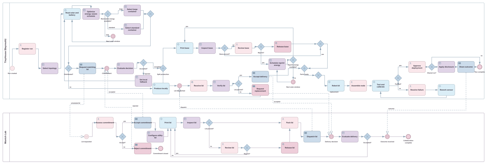
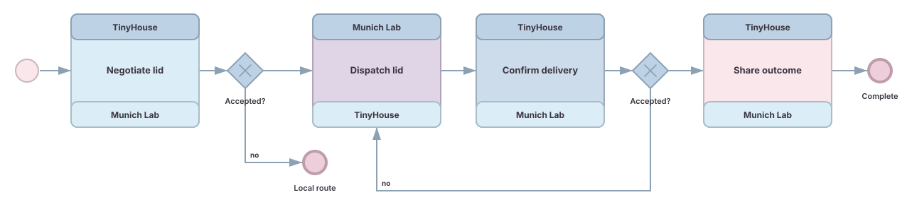
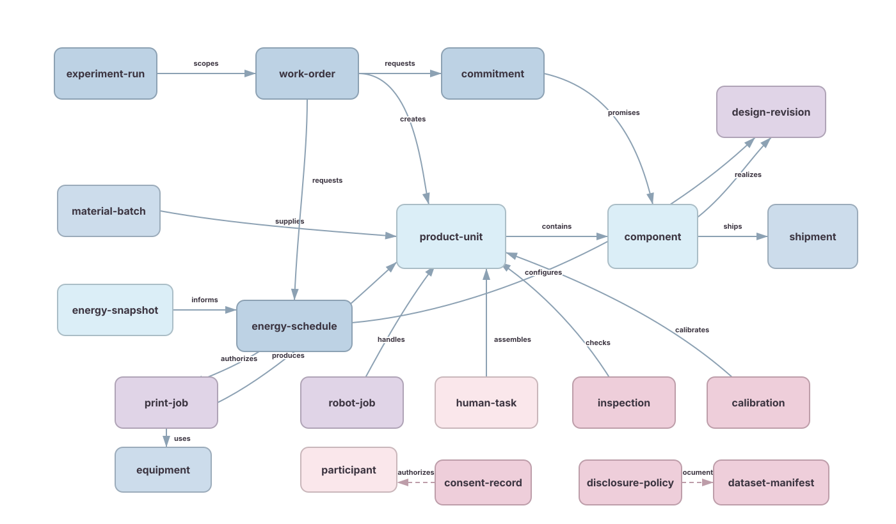
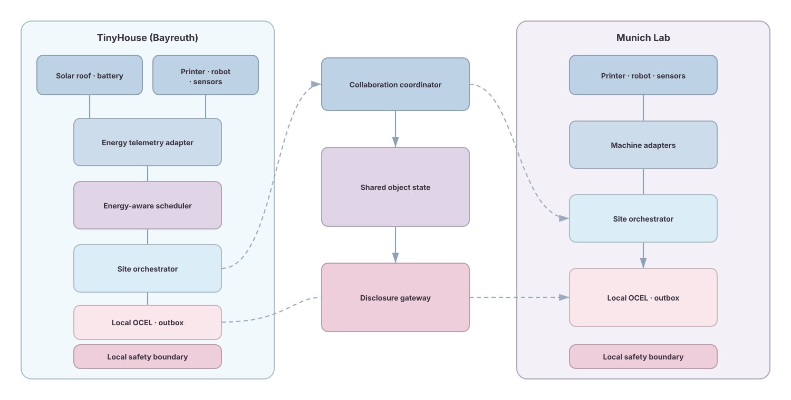
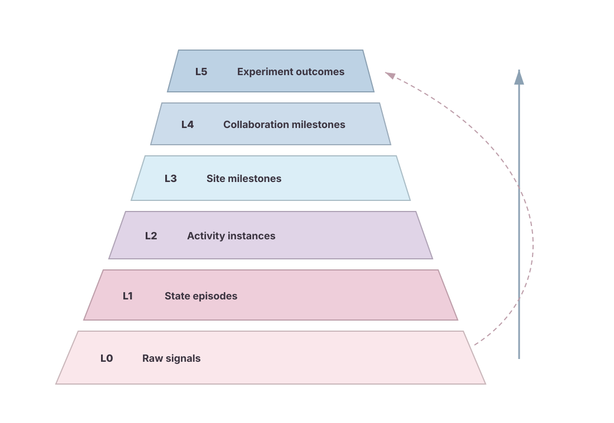
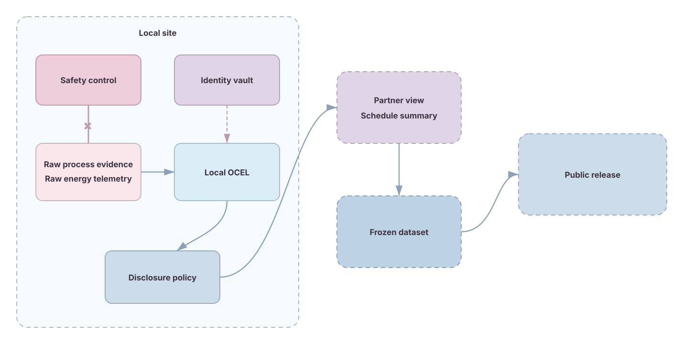

# Sustainable Distributed Process Laboratory

## Goal

The primary operational goal is sustainability. The TinyHouse in Bayreuth and a research laboratory in Munich execute one physical production process. The process uses the TinyHouse solar roof and battery state to decide when Bayreuth may print. The process also uses the renewable-energy budget to select the product configuration.

The primary research goal is a reproducible real-world process laboratory. The laboratory generates distributed and object-centric process data. The process combines local orchestration with a cross-site choreography. The resulting data supports process mining and online monitoring research.

## Demonstrator

The demonstrator produces a configurable sensor node. Bayreuth prints the enclosure base and integrates the electronics. Munich produces a utility lid that matches the selected enclosure configuration. Each site keeps local control of its printer and robot arm.

The product contains the following physical parts.

| Part | Default site | Configuration rule | Evidence |
| --- | --- | --- | --- |
| Enclosure base | TinyHouse in Bayreuth | `large` or `standard` from the energy schedule | Print job telemetry and component inspection |
| Utility lid | Munich laboratory | Must equal the requested base size and design revision | Print job telemetry and component inspection |
| Electronics kit | TinyHouse in Bayreuth | Selected sensor configuration | Kit scan and human confirmation |
| Completed sensor node | TinyHouse in Bayreuth | Base and lid must match | Assembly and calibration events |
| Shipping container | Munich and Bayreuth | Contains one or more accepted lids | Dispatch and receipt scans |

The completed sensor node remains useful after production. The node can monitor a storage bin or another TinyHouse area. The product lifecycle can therefore include deployment and maintenance events.

## Energy-Aware Scheduling Concept

The optimization concept is **renewable-energy-aware production scheduling**. The scheduler creates a production plan from measured energy state and predicted solar supply. The scheduler also couples the Bayreuth container size to the Munich lid configuration. The BPMN model represents the schedule evaluation and the resulting wait or production route.

The scheduler uses the following inputs.

| Input | Unit | Meaning |
| --- | --- | --- |
| Solar power | kW | Current photovoltaic output from the TinyHouse roof |
| Forecast solar energy | kWh | Expected photovoltaic energy within a candidate production window |
| Battery state of charge | % | Current battery charge state |
| Usable battery energy | kWh | Stored energy within battery operating limits before the protected process reserve |
| Committed print energy | kWh | Renewable energy already allocated to accepted print jobs |
| Estimated job energy | kWh | Measured estimate for one printer and configuration |
| Due window | ISO 8601 interval | Earliest and latest allowed production time |
| Resource state | categorical | Printer availability and local safety readiness |

The scheduler computes one renewable-energy budget for each candidate window. The formula is:

```text
availableRenewableEnergyKWh = max(
  0 kWh,
  usableBatteryEnergyKWh
  + forecastSolarEnergyKWhWithinCandidateWindow
  - committedPrintEnergyKWh
)
```

The protected reserve remains unavailable to printing. The variable `reserveEnergyKWh` represents the energy required for protected TinyHouse loads. The reserve value must come from the approved site configuration. The current repository does not provide a verified reserve value.

The configuration policy uses ordered rules. The scheduler evaluates the large option first. The scheduler evaluates the standard option only when the large option is not eligible. The process waits when neither option is eligible.

| Priority | Formal condition | Result |
| --- | --- | --- |
| 1 | `availableRenewableEnergyKWh >= largeContainerEnergyKWh + reserveEnergyKWh` | Select a large base and request a large Munich lid |
| 2 | `availableRenewableEnergyKWh >= standardContainerEnergyKWh + reserveEnergyKWh` and `< largeContainerEnergyKWh + reserveEnergyKWh` | Select a standard base and request a standard Munich lid |
| 3 | Default | Wait until `nextSolarWindowStart` and evaluate a new energy snapshot |

The print adapter enforces a second authorization at the scheduled start. A print may start only when the renewable-energy budget still covers the selected job and reserve. A failed authorization returns the job to the scheduler. A Bayreuth reprint uses the same rule with `reprintEnergyKWh`.

The energy estimates follow one configuration invariant. `largeContainerEnergyKWh` must be greater than `standardContainerEnergyKWh`. The mutually exclusive gateway conditions make the large and standard routes deterministic.

The scheduler treats energy eligibility as a hard constraint. The scheduler then minimizes expected non-renewable energy use among eligible windows. The scheduler next minimizes due-window lateness. The scheduler finally prefers direct solar consumption over battery discharge when the preceding criteria are equal.

The configuration thresholds require measurement. The project must measure `largeContainerEnergyKWh` and `standardContainerEnergyKWh` for the actual printer and material. The project must also measure conversion losses and battery limits. The concept does not invent those values.

## End-to-End Process

The current production activities remain part of the process. The energy scheduler adds decisions before Bayreuth production and before every Bayreuth reprint.

1. A researcher registers an experiment and work order.
2. Bayreuth selects a local or distributed production topology.
3. Bayreuth reads the solar roof and battery state.
4. The scheduler evaluates candidate production windows.
5. The scheduler selects a large or standard container when enough renewable energy is available.
6. The scheduler waits and evaluates again when the renewable-energy budget is insufficient.
7. Bayreuth requests the matching utility lid for a distributed run.
8. Munich evaluates the commitment and applies the requested lid configuration.
9. Bayreuth prints the base while Munich prints the lid.
10. Each site inspects its component and handles review or reprint paths.
11. Munich packs and dispatches the accepted lid.
12. Bayreuth receives the lid and verifies its identity and configuration.
13. The robot prepares the assembly kit.
14. A human assembles the sensor node.
15. Bayreuth tests and calibrates the sensor node.
16. A human approves deployment.
17. Bayreuth shares a minimized outcome for a joint run.

A rejected Munich commitment changes the topology to local fallback. Bayreuth then creates a new energy schedule for the extra local lid print. The process does not start the larger local workload under the earlier distributed energy budget.

## TinyHouse Execution Plan

The TinyHouse plan turns the descriptive process into a commissioning and experiment procedure. The plan covers the Bayreuth activities and the Bayreuth side of each Munich interaction. Munich equipment does not occupy the TinyHouse floorplan.

The proposed layout is an operational concept. The layout is not a construction drawing or a certified safety layout. A measured site survey must confirm every equipment footprint before installation.

### Planning Basis

| Source | Verified planning fact | Planning consequence |
| --- | --- | --- |
| `floorplans.pdf` | The TinyHouse shell is 7.30 m long and 2.50 m wide externally. The plan shows 15 cm wall depth. | The process uses wall stations and preserves a central transfer route. |
| Current TinyHouse photographs | The current installation has one central entrance and an opening on the opposite wall. Desks and an equipment rack already occupy wall areas. | The entrance zone remains free of fixed equipment. A site survey must reconcile the current installation with the scanned plan. |
| TinyHouse specification in `floorplans.pdf` | The roof has four 410 W photovoltaic panels. The specification names a Growatt 5 kW inverter and a 48 V 4.8 kWh 100 Ah lithium iron phosphate battery with a battery management system. | ST-00 needs a verified inverter and battery adapter before energy scheduling can use live data. |
| Hardware inventory in `docs/EDV TinyHouse.xlsx` | The inventory lists one PAROL6 robot arm and one `Bamboo Lab P2S` printer. The inventory also lists Raspberry Pi 5 boards, Arduino Nano boards, ESP32 boards, cameras, pressure sensors, network equipment, and two MLX90640 thermal arrays. | The pilot uses the documented devices but verifies each serial number and operational state before assignment. |
| Sensor documentation | Weight sensors can measure up to 30 kg. A network scale may be reachable at `192.168.1.106`. Two infrared cameras exist but are not implemented. | Scale and camera signals need calibration and reachability checks before experiment use. |
| Infrastructure documentation | `EMQX003` currently serves EMQX. Other reachable Raspberry Pis mainly serve Mosquitto. The Pi receiver for Nano serial data is incomplete. | The pilot must choose one broker and complete the receiver before end-to-end sensor validation. |

### Process Stations


The floorplan uses six stable station identifiers. The figure places the robot at the left end and control infrastructure at the right end. The figure leaves the central entrance and transfer route free.

| Station | Proposed location | Overview activities | Primary equipment | Commissioning constraint |
| --- | --- | --- | --- | --- |
| `ST-00` Control and energy | Right end | Register experiment; select topology; read energy; schedule; request Munich commitment; share outcome | Management PC; edge rack; broker; photovoltaic and battery adapter | The inverter interface and battery interface are unverified. The protected reserve is not defined. |
| `ST-10` Additive manufacturing | Upper-right wall | Print the base; print a fallback lid; inspect print-job completion | Documented P2S printer; printer adapter; energy meter; thermal sensor; workpiece camera | Printer API support and ventilation requirements are unverified. A dedicated energy meter is an acquisition gap. |
| `ST-20` Receiving and inspection | Upper-left wall | Inspect the base; receive the Munich lid; verify identity and configuration; stage replacement | Network scale or load cells; workpiece camera; manual identifier entry | The network scale was not verified during the live inspection. The project has no documented barcode or radio-frequency identification reader. |
| `ST-30` Robot kit preparation | Left end | Prepare the electronics kit | PAROL6; controller adapter; bin load cells; workpiece camera | The robot reach envelope and guard footprint are unverified. Independent guarding and emergency-stop validation are mandatory. |
| `ST-40` Human assembly | Lower-left wall | Assemble the sensor node | Assembly mat; thin-film pressure sensors; Arduino Nano; camera; confirmation button | The camera must exclude faces and unrelated areas. Sensor fusion is not active in the current SAGE pipeline. |
| `ST-50` Test and calibration | Lower-right wall | Test; calibrate; resolve failures; approve deployment; stage the finished node | Nano or serial test jig; reference scale; workpiece camera; approval interface | Test limits and calibration references require a versioned procedure. Human approval remains explicit. |

The material route starts at `ST-10` and `ST-20`. The route continues through `ST-30`, `ST-40`, and `ST-50`. The product returns to `ST-00` only as a process record.

### IoT Observation Layout


The IoT design separates observation from safety control. Research sensors never replace printer interlocks, robot guarding, emergency stops, thermal protection, or battery protection. A missing research signal therefore creates uncertainty instead of changing a safety state.

| Package | Station | Documented hardware | Required acquisition or integration | Primary signals |
| --- | --- | --- | --- | --- |
| `A` Energy | `ST-00` | Photovoltaic system; inverter; battery and battery management system | Supported read-only inverter and battery adapter; synchronized timestamping | Photovoltaic power in kW; battery state of charge in %; usable energy in kWh; freshness; adapter health |
| `B` Printer | `ST-10` | P2S printer; two MLX90640 arrays; ESP32 C6 boards; XIAO ESP32S3 Sense boards; USB cameras | Calibrated plug-level energy meter; verified printer interface; camera mount | Job state; electrical power; cumulative job energy; thermal features; workpiece presence |
| `C` Robot | `ST-30` | PAROL6; two IMX335 USB cameras; pressure and weight sensors | Controller event adapter; guarded camera view; instrumented kit bins | Controller state; robot-job identity; gripper state when available; bin weight changes; workpiece presence |
| `D` Receiving | `ST-20` | Network scale; weight sensors; XIAO cameras; buttons from sensor kits | Local identifier capture; calibrated tare procedure | Weight change; component presence; entered or scanned identifier; inspection decision |
| `E` Assembly | `ST-40` | Twenty thin-film pressure sensors up to 20 kg in the inventory; Nano boards; ESP boards; cameras; buttons | Workpiece-only camera mask; instrumented trays; event-fusion configuration | Tray state; pressure transitions; part presence; start and complete confirmations |
| `F` Test | `ST-50` | Nano boards; displays; keypads; scale and camera candidates | Versioned test jig; reference loads; calibration software | Serial test results; calibration values; finished-node weight; approval decision |
| `G` Edge | All stations | Reachable Raspberry Pis; PoE hardware; managed switch; network rack | Pi role assignment; completed Nano receiver; local storage; time synchronization | Device status; ingestion time; queue state; adapter errors |
| `H` Shared camera | Transfer route | Annke dome camera; one camera is visible in current interior photographs | Privacy mask; local-only retention policy; approved purpose | Zone occupancy and workpiece transfer only |

### Activity Abstraction Rules

The abstraction pipeline uses five evidence levels. Level L0 stores raw readings locally. Level L1 creates calibrated state episodes. Level L2 creates activity candidates. An evidence-fusion step creates authoritative activity events. OCEL 2.0 projection then links each event to the required process objects.

The SAGE implementation can segment readings and map classified transitions to events. The current TinyHouse runtime supports scale inputs on `esp32/+/sensor` and `tinyhouse/scale/#`. The current pipeline does not activate its multi-sensor event generator. Authoritative fusion therefore remains blocked until the fusion path is activated and tested.

| Station | L0 and L1 evidence | L2 activity rule | Required corroboration | Failure behavior |
| --- | --- | --- | --- | --- |
| `ST-00` | Inverter reading; battery reading; scheduler input snapshot; resource state | Emit `Energy snapshot read` from a complete timestamped adapter read. Emit `Schedule evaluated` from the versioned scheduler decision record. Emit `Print authorized` from the print-adapter authorization record. | Every schedule references its input object identifiers and policy version. | Reject stale or incomplete snapshots. Do not infer authorization from printer power. |
| `ST-10` | Printer state; electrical power episode; thermal episode; workpiece presence | Start a print when the printer reports the target job as running. Complete a print when the same job reports completion and the workpiece becomes available. | Job identity is primary. Power and thermal evidence support the machine state. | A disagreement creates `Print evidence conflict`. The process does not auto-complete the job. |
| `ST-20` | Tared weight episode; component presence; identifier capture; inspection input | Receive a lid after one stable positive weight transition and one matching identifier record. Record acceptance only from the inspection decision. | Component size and design revision must match the work order. | A missing or conflicting identity creates `Replacement required` or a manual review task. |
| `ST-30` | Robot controller lifecycle; bin weight transitions; camera presence | Start from the controller job start. Complete after controller success and the expected bin transitions. | The robot-job identity and work-order identity must match. | Controller faults remain faults. Camera evidence never overrides a controller fault. |
| `ST-40` | Assembly-mat pressure; tray weight transitions; workpiece presence; confirmation input | Start on the first confirmed part transfer into the assembly area. Complete after the required part-state pattern and explicit human confirmation. | Base identity and lid identity must match before completion. | Missing evidence creates an uncertain candidate. The system does not guess completion. |
| `ST-50` | Serial test record; calibration record; finished-node weight; approval input | Emit pass or fail from the versioned test procedure. Emit deployment approval only from explicit human approval. | Test procedure version and calibration reference identify the evidence. | A missing test record blocks approval. A failed calibration returns to the documented rework route. |

Every derived state records source time and ingestion time. Every derived state also records confidence, freshness, source identifiers, and the abstraction-policy version. A late event retains its original source time.

### MQTT and Edge Plan

The pilot keeps all process traffic on the TinyHouse network. The pilot does not bridge MQTT to an external broker, Kafka, a cloud service, or an external database. A cross-site process message contains only the contract fields defined by the choreography.

| Purpose | Topic | Policy |
| --- | --- | --- |
| Existing scale ingress | `esp32/+/sensor` and `tinyhouse/scale/#` | Keep during the pilot through a compatibility adapter. |
| Canonical device message | `tinyhouse/bayreuth/<station>/<device>/<category>` | Use `sensor`, `devstatus`, `heartbeat`, or `data` as the category. Preserve `wifi_connencted` at the compatibility boundary until deployed clients are migrated. |
| Existing SAGE candidate event | `events/<sensor_id>` | Treat the event as a candidate until the required evidence rule passes. |
| Authoritative station event | `tinyhouse/bayreuth/activity/<station>/<activity>` | Publish a unique event ID and evidence references with Quality of Service 1. Consumers deduplicate by event ID. Do not retain events. |
| Device state | `tinyhouse/bayreuth/<station>/<device>/devstatus` | Retain the latest state. Use a retained Last Will and Testament status for offline state. |
| Case control | Existing SAGE case-control topic | Carry the experiment-run ID and work-order ID. Do not start a physical device from a research event topic. |

The pilot broker should be `EMQX003` only after the project accepts that temporary role. The current mixed EMQX and Mosquitto state prevents a verified production assignment. The pilot must configure authentication, station-scoped access-control lists, and a broker backup before participant access.

The proposed edge allocation uses reachable nodes. `EMQX004` handles `ST-00` and `ST-10`. `EMQX005` handles `ST-20` and `ST-30`. `EMQX006` handles `ST-40` and `ST-50`. `EMQX001` remains a commissioning spare. The site survey must confirm each physical host before configuration.

The pilot uses USB serial between each Nano and Raspberry Pi. The documentation identifies USB serial as the current installation. The RX/TX replacement remains a separate development task.

### Commissioning Sequence

The commissioning sequence has seven gates. A failed gate stops the affected station. A failed station does not receive a simulated substitute in an experiment run.

1. **Survey the site.** Measure furniture footprints, door swing, transfer width, outlets, network drops, ventilation paths, printer clearance, robot reach, and guard placement. Record the approved floorplan revision.
2. **Inventory the devices.** Record serial number, station, firmware, adapter version, power source, network address, and owner for every device. Confirm the physical identities of the proposed Raspberry Pi nodes.
3. **Commission the safety boundary.** Validate emergency stops, guarding, printer thermal protection, fire response, electrical load, battery protection, and evacuation access independently from the research system.
4. **Commission raw signals.** Calibrate tare and offset values. Record units, sample rates, timestamp ownership, clock offset, valid range, disconnect behavior, and calibration files.
5. **Profile energy.** Measure standard-base energy and large-base energy on the actual printer and material. Measure conversion losses. Obtain the approved protected reserve. Verify that the large estimate exceeds the standard estimate.
6. **Train and validate abstraction.** Record scripted ground-truth sessions for idle, start, complete, reject, rework, disconnect, and conflicting-evidence states. Fit SAGE thresholds on training runs. Evaluate activity rules on separate validation runs.
7. **Approve the integrated dry run.** Execute the complete Bayreuth route with machine motion disabled first. Repeat with physical equipment only after every earlier gate passes.

### Experiment Runbook

The runbook preserves the sequence in the end-to-end process. Each step produces direct evidence before the next dependent step begins.

| Step | Operator or service action | Station | Required evidence |
| --- | --- | --- | --- |
| 1 | Create the experiment run and work order. | `ST-00` | Run ID; work-order ID; design revision; due window; consent and policy references when applicable |
| 2 | Select local or distributed topology. | `ST-00` | Versioned topology decision |
| 3 | Read photovoltaic and battery state. | `ST-00` | Complete fresh energy snapshot with source and ingestion times |
| 4 | Evaluate candidate windows with the stated energy formula and ordered configuration policy. | `ST-00` | Schedule ID; input object IDs; eligible configurations; selected window; policy version |
| 5 | Wait or select the large or standard base. | `ST-00` | Timer event or selected configuration |
| 6 | Request the matching Munich lid for a distributed run. | `ST-00` | Commitment request with size and design revision |
| 7 | Authorize and print the base. | `ST-10` | Start authorization; printer job ID; measured job energy; completion or failure state |
| 8 | Inspect the base and handle review or reprint. | `ST-20` | Inspection ID; decision; defect code; reprint schedule when required |
| 9 | Receive and verify the Munich lid or produce a local fallback lid. | `ST-20` and `ST-10` | Shipment and component IDs or a separately authorized local print job |
| 10 | Prepare the electronics kit. | `ST-30` | Robot-job ID; kit identity; controller result; evidence references |
| 11 | Assemble the sensor node. | `ST-40` | Product-unit ID; component links; human confirmation; evidence references |
| 12 | Test and calibrate the node. | `ST-50` | Test record; calibration record; procedure version; pass or failure state |
| 13 | Approve deployment. | `ST-50` | Explicit human approval linked to the product unit |
| 14 | Share the minimized outcome for a joint run. | `ST-00` | Disclosure-policy decision and collaboration milestone |

### Required Experiment Scenarios

The scenario set exercises every decision and failure path. Each scenario starts from a new experiment-run identity. A retry keeps the work-order identity and receives a new print-job or robot-job identity.

| Scenario | Trigger | Expected route | Required observation |
| --- | --- | --- | --- |
| Distributed success | Munich accepts and renewable energy is sufficient | Parallel Bayreuth base and Munich lid production | Matching configuration; synchronized join; complete OCEL object links |
| Energy wait | Neither configuration satisfies the policy | Wait until the next solar window and evaluate again | No printer start before a valid authorization |
| Standard fallback | Standard is eligible and large is not eligible | Select standard base and standard lid | Ordered rule evaluation and matching lid request |
| Munich rejection | Commitment is rejected | Set local topology and create a new energy schedule | The local lid print does not reuse the distributed energy budget |
| Base reprint | Base inspection fails and reprint is approved | Re-evaluate reprint energy and print a new base | New print-job and component identities |
| Lid replacement | Lid identity or quality check fails | Request replacement and repeat dispatch | Stable commitment identity and new component identity |
| Calibration rework | Calibration fails | Human resolution and documented rework | No deployment approval before a passing test |
| Sensor disconnect | One required sensor stops | Mark evidence as stale or missing | No fabricated event and no silent completion |
| Evidence conflict | Machine state and supporting sensor disagree | Create manual review | Conflict event with both evidence references |
| Cross-site interruption | Munich link is unavailable | Continue only locally authorized work | Late events retain source time and ingestion time |

### Acceptance Criteria

The pilot acceptance criteria separate process correctness from classifier quality. Machine and human lifecycle records must cover 100% of mandatory start, complete, accept, reject, and approval events in each accepted run. No negative scenario may produce a false completion or false deployment approval.

The abstraction target is a macro-averaged F1 score of at least 0.90 on held-out scripted validation runs for each station activity set. A station that misses the target may emit candidate events but may not emit authoritative activity events. The final report must include the confusion matrix and the count of unmatched ground-truth events.

The data-quality target is at least 99% expected-message availability during each measured activity interval. The clock-offset target is at most 250 ms between edge nodes during a run. Every authoritative event must link to its run, work order, station, and required physical or execution objects.

The privacy gate requires approved camera regions and a documented retention period. Raw video remains local by default. A manual frame sample must show no faces or unrelated work areas before camera-derived events enter an experiment dataset.

The sustainability gate requires measured printer energy values and an approved protected reserve. The experiment must not interpret scheduler results until `standardContainerEnergyKWh`, `largeContainerEnergyKWh`, conversion losses, battery limits, and `reserveEnergyKWh` have verified values.

### Known Blockers

| Blocker | Affected result | Required resolution |
| --- | --- | --- |
| No verified inverter or battery interface | Live energy snapshots and renewable-energy authorization | Identify the supported read-only interface and validate units and timestamps. |
| No approved reserve or measured print energy | Large and standard configuration thresholds | Run the energy profiling gate and approve the site reserve. |
| Incomplete Pi serial receiver | Nano sensor ingestion | Implement and validate the receiver against the documented USB serial path. |
| Inactive SAGE multi-sensor fusion | Authoritative fused activity events | Activate the existing fusion path or implement an explicit station fusion service. Validate conflict handling. |
| Mixed MQTT broker state and anonymous Mosquitto access | Reproducible and controlled event transport | Accept the pilot broker role and configure authentication and access-control lists. |
| Unverified printer and robot APIs | Direct machine lifecycle evidence | Validate supported local adapters and failure behavior. |
| Unverified robot footprint and safety boundary | Physical `ST-30` operation | Complete the site survey and independent safety review. |
| Undefined camera governance | Camera-derived evidence | Approve regions, retention, access, and disclosure rules. |

## BPMN Orchestration

The orchestration model contains both private site processes. Human work uses user and manual tasks. Machine work uses service tasks. Policy decisions use business rule tasks. Exclusive gateways use formal conditions and default routes.



The figure reflects the current `distributed-orchestration.bpmn` flow. The distributed branch continues through synchronized production and final assembly. The current local branch stops after `Produce locally` because that task has no outgoing sequence flow.

The Bayreuth energy loop reads the solar and battery state. The loop calculates the schedule and selects the product size. The default path waits for `nextSolarWindowStart`. A timer event then triggers a new energy evaluation.

The distributed route contains one matched parallel region. Base production and remote lid delivery run concurrently. The accepted base and accepted lid synchronize before assembly. Existing quality and calibration loops remain available.

The editable source is [distributed-orchestration.bpmn](bpmn/distributed-orchestration.bpmn). The stored Diagram Interchange coordinates define the rendered layout. Both participant swimlanes use white backgrounds.

## BPMN Choreography

The choreography model contains only cross-site contracts. The first interaction transmits the scheduled lid specification. The specification includes the selected size and design revision. Munich returns a commitment decision before production begins.



| Interaction | Initiator | Required content | Result |
| --- | --- | --- | --- |
| Request scheduled lid configuration | TinyHouse in Bayreuth | Work order ID, energy schedule ID, size, design revision, and due window | Accepted or rejected commitment |
| Dispatch lid | Munich laboratory | Shipment ID, component ID, size, and design revision | Lid becomes in transit |
| Confirm delivery | TinyHouse in Bayreuth | Accepted or replacement-required decision | Delivery closes or Munich reprints |
| Share outcome | TinyHouse in Bayreuth | Privacy-minimized completion and sustainability measures | Collaboration completes |

The replacement route returns to the dispatch interaction. A replacement creates a new print-job identity and component identity. The work-order identity and commitment identity remain stable.

The editable source is [distributed-choreography.bpmn](bpmn/distributed-choreography.bpmn). The two BPMN sources use the same five message contract names.

## Gateway Conditions

Every exclusive split reads a versioned decision result. Every decision emits a `Decision evaluated` event before the selected flow fires.

| Gateway | Positive condition | Default route |
| --- | --- | --- |
| Renewable energy available? | Large condition or standard condition from the energy policy | Wait for the next solar window |
| Distributed? | `topology = 'distributed'` | Local production |
| Commitment accepted? | `commitmentStatus = 'accepted'` | Set local fallback and reschedule energy |
| Base passed? | `baseQuality = 'accepted'` | Human review |
| Base reprint? | `baseDisposition = 'reprint'` | Human release |
| Reprint energy available? | `availableRenewableEnergyKWh >= reprintEnergyKWh + reserveEnergyKWh` | Wait for the next solar window |
| Lid passed? | `lidQuality = 'accepted'` | Request replacement |
| Calibration passed? | `calibrationStatus = 'passed'` | Human resolution and rework |
| Shared run? | `collaborationStatus = 'active'` | Complete without remote outcome |

The BPMN models are descriptive. Both processes use `isExecutable="false"`. The actual printer APIs and robot APIs remain unverified.

## Object-Centric Research Model

The canonical research log follows OCEL 2.0 concepts. Events link to several typed objects through explicit qualifiers. The model avoids forcing every event into one case identifier.

| Object group | Main object types |
| --- | --- |
| Control | Experiment run, work order, commitment, and incident |
| Sustainability | Energy snapshot and energy schedule |
| Physical | Product unit, component, and material batch |
| Execution | Print job, robot job, and human task |
| Quality | Inspection and calibration |
| Logistics | Shipment |
| Resources | Equipment, station, and participant |
| Information | Design revision, data asset, and dataset manifest |
| Governance | Consent record and disclosure policy |

The energy snapshot records source time and ingestion time. The energy schedule records input object identifiers and policy version. The schedule also records eligible configurations and the selected production window. Every print job references the schedule that authorized the job.



The [example OCEL 2.0 log](example-ocel20.json) shows one large split-production run. The example includes the energy snapshot and schedule that authorize the Bayreuth print. The Munich lid uses the same configuration value.

## Federated Architecture

Machine control remains local to each laboratory. The Bayreuth energy adapter reads the solar roof and battery interface. The site scheduler produces energy permits and product configurations. The site orchestrator executes only locally authorized tasks.

Each site keeps an append-only event outbox. Local work can continue during a cross-site interruption when the local schedule and safety policy allow the work. Late events retain occurrence time and ingestion time.

The cross-site coordinator exchanges commitments and milestones. The coordinator never sends direct robot motion or printer heater commands. An approved disclosure gateway filters every shared event.



## Monitoring

The monitoring pipeline separates process events from high-volume telemetry. Raw solar and battery samples remain local evidence. Higher levels represent energy windows and schedule decisions. Collaboration views receive only the summary required for lid production and research.

| Level | Meaning | Energy-aware example |
| --- | --- | --- |
| L0 | Raw signal | Solar power or battery state of charge |
| L1 | State episode | Renewable-energy window available |
| L2 | Activity instance | Schedule evaluated or print authorized |
| L3 | Site milestone | Container configuration fixed |
| L4 | Collaboration milestone | Matching lid committed |
| L5 | Experiment outcome | Product completed with measured renewable-energy share |



Every derived state records confidence and freshness. Every derived state also records source time and policy version. A missing event must remain visible as uncertainty.

## Privacy and Safety

Raw energy telemetry remains at the TinyHouse by default. Munich receives the selected configuration and due window. Munich does not need the complete battery history or household load profile. A shared research view may include aggregated renewable-energy measures under the approved disclosure policy.

Human events use a role or study pseudonym in the shared view. Direct identity remains in a separate local identity vault. Raw video remains local by default. Workpiece cameras should exclude faces and unrelated areas.

Safety functions remain local and independent from research orchestration. No experiment may disable emergency stops or guards. No schedule may override thermal limits or manufacturer safety checks. The protected battery reserve also remains a local hard constraint.


