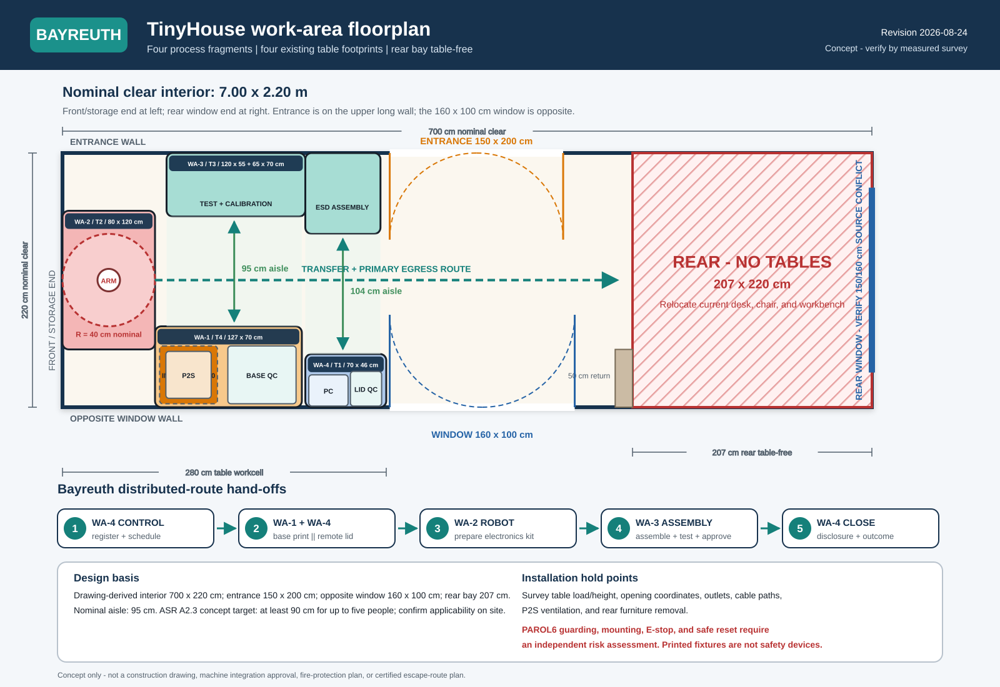

# Bayreuth TinyHouse laboratory concept

**Revision:** 2026-08-24  
**Scope:** Bayreuth TinyHouse and the Bayreuth side of the Munich boundary only.  
**Concept status:** Feasible for the distributed route after the commissioning hold points below. The direct local topology remains blocked by an incomplete source BPMN route.

The concept places all four card-derived work areas inside the nominal 7.00 x 2.20 m clear interior, preserves a 95 cm nominal central aisle, and keeps the complete rear 207 x 220 cm bay free of tables. It is an operational concept, not a construction drawing or certified machine-safety layout.

> **Binding rear-zone requirement:** No table, mobile bench, chair used as a work surface, stored component, or printer/robot support may enter `x = 493..700 cm`. Existing rear furniture must be relocated before commissioning.

## Floorplan, coordinate system, and table placement

Coordinates are centimetres in the nominal clear interior. The origin `(0, 0)` is the front/storage corner on the long wall opposite the entrance; `x` increases toward the rear window end and `y` increases toward the entrance wall.

- Clear interior: `700 x 220 cm`.
- Rear table-free zone: `x = 493..700`, `y = 0..220 cm`.
- Structural return: `15 x 50 cm` at `x = 478..493 cm`; its thickness is an explicit planning assumption.
- Nominal narrowest encoded aisle: `95 cm`; a measured survey and applicable access requirements control the installed width.
- WA-2 robot placement aid: reach centre `(40, 110) cm`, nominal radius `40 cm`. This is not a safety envelope.

### Openings

| Opening | Wall | Along-wall range (cm) | W x H (cm) | Inward envelope (cm) |
| --- | --- | --- | --- | --- |
| Main entrance | north | 283..433 | 150 x 200 | 75 |
| Opposite casement window | south | 283..443 | 160 x 100 | 80 |
| Rear short-wall window - source width conflict | east | 30..190 | 160 x 100 | 80 |

### Existing tables assigned to work areas

| Work area | Table | Footprint segment | x range (cm) | y range (cm) | W x D (cm) | Placement rationale |
| --- | --- | --- | --- | --- | --- | --- |
| WA-1 | T4 | T4 printer table | 80..207 | 0..70 | 127 x 70 | The 70 cm depth and 127 cm length hold the P2S installation envelope and a separate base-inspection zone. |
| WA-2 | T2 | T2 robot table | 0..80 | 50..170 | 80 x 120 | End-cell orientation contains the documented 40 cm nominal PAROL6 reach over the tabletop; the certified guard envelope remains a hold point. |
| WA-3 | T3 | T3 test wing | 90..210 | 165..220 | 120 x 55 | The stepped surface separates the deep ESD assembly area from the long test/calibration area while preserving the aisle. |
| WA-3 | T3 | T3 assembly wing | 210..275 | 150..220 | 65 x 70 | The stepped surface separates the deep ESD assembly area from the long test/calibration area while preserving the aisle. |
| WA-4 | T1 | T1 control and receiving table | 210..280 | 0..46 | 70 x 46 | The compact multi-visit station is nearest the entrance and directly opposite the assembly hand-off. |

The four table dimensions come from `concepts/tables.png` and `concepts/resources/tables.drawio`. **Mapping caveat:** The source table drawing does not bind tables to work areas. This assignment is a design inference based on the relative equipment and work-surface needs.

## Primary manufacturer and safety references

| ID | Primary source | Publisher | Published fact or requirement | Evidence class | Use in this concept |
| --- | --- | --- | --- | --- | --- |
| PS-01 | [P2S specification sheet](https://store.bblcdn.com/s7/default/2d1a01cd2dca425eb071ccc28c26c9fa/spec.pdf) | Bambu Lab | Manufacturer physical dimensions are 392 x 406 x 478 mm; net mass is 14.9 kg. | Manufacturer-published physical envelope; site asset not yet verified | Confirms that the 127 x 70 cm WA-1 tabletop can contain the bare printer footprint in plan. Measure the actual unit and separately allow door, spool or AMS, purge, cable, ventilation, maintenance, and fire-control clearances. |
| PS-02 | [PAROL6 robot specifications](https://source-robotics.github.io/PAROL-docs/page2_2/) | Source Robotics | Reach is 400 mm with the standard gripper. | Manufacturer-published kinematic reach; not a safeguarded envelope | Supports the 40 cm placement circle only. A changed gripper or base changes the kinematics, and a risk assessment must establish the complete hazard and guard envelope. |
| PS-03 | [Raspberry Pi 5 mechanical drawing](https://datasheets.raspberrypi.com/rpi5/raspberry-pi-5-mechanical-drawing.pdf) | Raspberry Pi Ltd | The drawing shows an 85 x 56 mm board and states that dimensions are approximate, for reference, and subject to manufacturing tolerances. | Official reference drawing; selected edge-node stack not yet fit-verified | Provides starting geometry for the Pi sled. Physically fit the selected case, cooler, PoE hardware, NVMe carrier, connectors, and cable bend radii before printing. |
| PS-04 | [ASR A2.3 Fluchtwege und Notausgänge](https://www.baua.de/DE/Angebote/Regelwerk/ASR/ASR-A2-3.html) | BAuA / Ausschuss für Arbeitsstätten | The technical rule governs the provision and operation of escape routes and emergency exits; the March 2022 edition was amended in November 2024. | Official workplace-safety rule; no project-specific compliance finding | The encoded 95 cm aisle is a concept result, not an ASR compliance statement. Determine the applicable clear route width, doors, occupancy, and evacuation plan on site. |
| PS-05 | [DGUV Information 209-074: Industrieroboter](https://publikationen.dguv.de/regelwerk/dguv-informationen/270/industrieroboter) | Deutsche Gesetzliche Unfallversicherung | The guidance addresses hazards and safety measures for planning, acceptance, monitoring, and operation of industrial robot systems, including safeguarding. | Official safety guidance; no PAROL6 cell acceptance | Provide a competent risk assessment and independent guard, interlock, emergency-stop, and safe-reset functions. Research cameras and load cells remain read-only evidence. |
| PS-06 | [KS0487 Hall Magnetic module documentation](https://docs.keyestudio.com/projects/KS0487/en/latest/ks0487.html) | Keyestudio | Project 12 specifies a digital on/off Hall magnetic module with detection up to 3 cm and a nominal 30 x 20 mm module envelope. | Manufacturer-published module specification; kit stock and installed module are not yet physically verified | Controls the provisional WA-1 sensor-cassette envelope for one designated tool slot. Measure the actual PCB, Hall-element position, connector and magnet distance before fabrication. |

**Dimension status:** `392 x 406 x 478 mm`, `400 mm`, `85 x 56 mm`, and the Keyestudio module's `30 x 20 mm` are source-published equipment dimensions, not measurements of the specific TinyHouse assets. The `700 x 220 cm` room and source-dimensioned openings are nominal drawing values. Table coordinates, the 15 cm structural-return thickness, opening swing envelopes, and table-to-work-area mapping are concept assumptions. A measured survey, physical equipment fit check, and competent safety assessment control installation.

## Four Bayreuth work areas

### WA-1 — Print / Base Quality

**Assigned table:** `T4`, 127 x 70 cm.  
**Work-area-card source:** `concepts/tinyhouse-workarea-cards.pdf`, page 1.  
**Inputs:** print job, material.  
**Outputs:** accepted base.  
**BPMN responsibilities:** Print base (`Task_PrintBase`), Inspect base (`Task_InspectBase`), Review base (`Task_ReviewBase`), Schedule reprint energy (`Task_ScheduleReprint`), Release base (`Task_ReleaseBase`).  
**Required evidence:** authorization ID, print-job ID, component ID, measured energy, printer result, inspection decision, tool-slot state and sensor health, evidence timestamps.

| ID | Hardware | Qty | Status | Purpose | Required action | Commissioning note | Evidence |
| --- | --- | --- | --- | --- | --- | --- | --- |
| wa1-p2s-printer | P2S 3D printer and local telemetry | 1 unit | verify | Print the enclosure base and provide authoritative job lifecycle data. | Confirm identity, fit, interface, calibration, and live operation before assignment. | Verify the exact model, API, serial number, operational state, service clearance, ventilation, and fire controls before assignment. | `concepts/tinyhouse-workarea-cards.pdf` — page 1, WA-1 hardware and event capture `docs/EDV TinyHouse.xlsx` — Tabelle1!A48:C48 |
| wa1-plug-energy-meter | Calibrated plug-level energy meter | 1 unit | acquire | Measure printer power and cumulative energy for each print job. | Procure an approved device or system and complete acceptance testing before use. | No dedicated plug-level energy meter is listed in the workbook. | `concepts/tinyhouse-workarea-cards.pdf` — page 1, WA-1 hardware and event capture |
| wa1-thermal-array | MLX90640 thermal array | 1 unit | verify | Observe printer heating and cooling without replacing machine interlocks. | Confirm identity, fit, interface, calibration, and live operation before assignment. | Assign one of the two listed arrays only after an operational check. | `concepts/tinyhouse-workarea-cards.pdf` — page 1, WA-1 hardware and event capture `docs/EDV TinyHouse.xlsx` — Tabelle1!A49:C49 |
| wa1-workpiece-camera | XIAO ESP32S3 Sense or IMX335 workpiece camera | 1 unit | verify | Observe base presence and removal in a workpiece-only camera region. | Confirm identity, fit, interface, calibration, and live operation before assignment. | Approve the privacy mask and retention policy before capture. | `concepts/tinyhouse-workarea-cards.pdf` — page 1, WA-1 hardware and event capture `docs/EDV TinyHouse.xlsx` — Tabelle1!A19:C19 `docs/EDV TinyHouse.xlsx` — Tabelle1!A51:C51 |
| wa1-tool-presence-sensor | Keyestudio Hall Magnetic tool-presence sensor and Nano input | 1 monitored slot | verify | Observe whether the designated process-tool slot is present, absent, or unknown without controlling any machine or safety function. | Confirm identity, fit, interface, calibration, and live operation before assignment. | Verify the physical module, magnet tag, 5 V and logic compatibility, slot mapping, debounce, disconnect and stuck-state behavior. Slot absence is not evidence of tool use, correct work, or operator identity. Seven-slot coverage needs seven modules and verified additional input capacity; only five complete kits are inventory-listed. | `docs/EDV TinyHouse.xlsx` — Tabelle1!A2:C2 `docs/public/images/sensors/overview.png` — module grid, Hall magnetic sensor `https://docs.keyestudio.com/projects/KS0487/en/latest/ks0487.html` — Project 12: Hall Magnetic |
| wa1-inspection-interface | Inspection button or user interface | 1 station interface | configure | Record base-quality, release, and reprint decisions explicitly. | Install the integration, version its configuration, and validate normal, disconnect, and recovery behavior. | A physical button or tablet UI may be selected during commissioning. | `concepts/tinyhouse-workarea-cards.pdf` — page 1, WA-1 hardware and event capture `docs/EDV TinyHouse.xlsx` — Tabelle1!A11:C12 `docs/EDV TinyHouse.xlsx` — Tabelle1!A23:C23 |
| wa1-edge-node | Raspberry Pi edge-node package | 1 package | assign | Host printer and sensor adapters, timestamps, MQTT, and local buffering. | Select one documented unit and record its serial number, power path, network role, and work-area owner. | Assign one physically identified Pi and record its power and network path. | `concepts/tinyhouse-workarea-cards.pdf` — page 1, WA-1 hardware and event capture `docs/EDV TinyHouse.xlsx` — Tabelle1!A28:C35 |

### WA-2 — Kit Preparation

**Assigned table:** `T2`, 80 x 120 cm.  
**Work-area-card source:** `concepts/tinyhouse-workarea-cards.pdf`, page 2.  
**Inputs:** electronics bins.  
**Outputs:** prepared kit.  
**BPMN responsibilities:** Robot kit (`Task_RobotKit`).  
**Required evidence:** robot-job ID, controller lifecycle, fault state, expected bin deltas, kit identity, workpiece-presence evidence.

| ID | Hardware | Qty | Status | Purpose | Required action | Commissioning note | Evidence |
| --- | --- | --- | --- | --- | --- | --- | --- |
| wa2-parol6 | PAROL6 robot arm and controller | 1 system | verify | Prepare the electronics kit and expose robot-job lifecycle data. | Confirm identity, fit, interface, calibration, and live operation before assignment. | Verify controller, base fasteners, table load, reach envelope, serial connection, homing, and fault behavior before powered operation. | `concepts/tinyhouse-workarea-cards.pdf` — page 2, WA-2 hardware and event capture `docs/EDV TinyHouse.xlsx` — Tabelle1!A45:C45 |
| wa2-instrumented-bins | Instrumented component-bin load-cell set | 1 set | configure | Detect expected component removals and prepared-kit completion. | Install the integration, version its configuration, and validate normal, disconnect, and recovery behavior. | The final bin count follows the approved electronics bill of materials. | `concepts/tinyhouse-workarea-cards.pdf` — page 2, WA-2 hardware and event capture `docs/sensors/index.md` — lines 9-17 |
| wa2-workpiece-camera | IMX335 or XIAO workpiece camera | 1 unit | verify | Observe component-bin, pickup, and prepared-kit presence. | Confirm identity, fit, interface, calibration, and live operation before assignment. | Mount outside the robot reach and exclude the operator area. | `concepts/tinyhouse-workarea-cards.pdf` — page 2, WA-2 hardware and event capture `docs/EDV TinyHouse.xlsx` — Tabelle1!A19:C19 and A51:C51 |
| wa2-guard-estop | Independent robot guard and emergency-stop system | 1 system | acquire | Provide an independent safety boundary for powered robot motion. | Procure an approved device or system and complete acceptance testing before use. | Use certified safety hardware. Research sensing receives read-only state and must never implement or override the safety function. | `concepts/tinyhouse-workarea-cards.pdf` — page 2, WA-2 hardware and event capture `concepts/Overview.md` — lines 120-125 and 133 |
| wa2-controller-adapter | PAROL6 controller event adapter | 1 adapter | configure | Bind controller lifecycle and fault records to the robot-job identity. | Install the integration, version its configuration, and validate normal, disconnect, and recovery behavior. | Validate disconnect, fault, stop, and recovery behavior. | `concepts/tinyhouse-workarea-cards.pdf` — page 2, WA-2 start procedure `README.md` — lines 55-60 |
| wa2-edge-node | Raspberry Pi edge-node package | 1 package | assign | Host controller and sensor adapters, synchronized time, and local buffering. | Select one documented unit and record its serial number, power path, network role, and work-area owner. | Install outside the robot reach and guarded operating envelope. | `concepts/tinyhouse-workarea-cards.pdf` — page 2, WA-2 hardware and event capture `docs/EDV TinyHouse.xlsx` — Tabelle1!A28:C35 |

### WA-3 — Assembly / Test

**Assigned table:** `T3`, 120 x 55 + 65 x 70 cm.  
**Work-area-card source:** `concepts/tinyhouse-workarea-cards.pdf`, page 3.  
**Inputs:** base, lid, kit.  
**Outputs:** approved sensor node.  
**BPMN responsibilities:** Assemble node (`Task_AssembleNode`), Test and calibrate (`Task_Calibrate`), Resolve failure (`Task_ResolveCalibration`), Rework sensor (`Task_ReworkSensor`), Approve deployment (`Task_ApproveDeployment`).  
**Required evidence:** product and component links, assembly start/end, test record, calibration record, rework history, final weight, approval.

| ID | Hardware | Qty | Status | Purpose | Required action | Commissioning note | Evidence |
| --- | --- | --- | --- | --- | --- | --- | --- |
| wa3-pressure-mat | Thin-film pressure mat | 1 mat | configure | Observe assembly start and component placement transitions. | Install the integration, version its configuration, and validate normal, disconnect, and recovery behavior. | Document sensor count, zoning, calibration, and strain relief in the mat design. | `concepts/tinyhouse-workarea-cards.pdf` — page 3, WA-3 hardware and event capture `docs/EDV TinyHouse.xlsx` — Tabelle1!A41:C41 |
| wa3-workpiece-camera | Workpiece camera | 1 unit | verify | Observe assembly state while excluding faces and adjacent stations. | Confirm identity, fit, interface, calibration, and live operation before assignment. | Approve a workpiece-only region and retention policy before use. | `concepts/tinyhouse-workarea-cards.pdf` — page 3, WA-3 hardware and event capture `docs/EDV TinyHouse.xlsx` — Tabelle1!A19:C19 and A51:C51 |
| wa3-nano-test-jig | Arduino Nano serial test jig | 1 jig | configure | Execute the versioned sensor-node test and calibration procedure. | Install the integration, version its configuration, and validate normal, disconnect, and recovery behavior. | Build and validate the jig; do not substitute the unfinished RX/TX path. | `concepts/tinyhouse-workarea-cards.pdf` — page 3, WA-3 hardware and event capture `docs/EDV TinyHouse.xlsx` — Tabelle1!A3:C3 `docs/sensors/index.md` — lines 19-27 |
| wa3-reference-scale | Reference scale and calibration references | 1 set | verify | Record completed-node weight and support versioned calibration checks. | Confirm identity, fit, interface, calibration, and live operation before assignment. | Do not assume the WA-4 network scale can serve both stations. Acquire a second scale if no dedicated WA-3 unit is physically verified. | `concepts/tinyhouse-workarea-cards.pdf` — page 3, WA-3 hardware and event capture `docs/sensors/index.md` — lines 13-15 and 25-27 |
| wa3-approval-interface | Approval button or user interface | 1 station interface | configure | Record explicit deployment approval after a passing test record. | Install the integration, version its configuration, and validate normal, disconnect, and recovery behavior. | Approval must remain an explicit human action. | `concepts/tinyhouse-workarea-cards.pdf` — page 3, WA-3 hardware and event capture `docs/EDV TinyHouse.xlsx` — Tabelle1!A11:C12 and A23:C23 |
| wa3-edge-node | Raspberry Pi edge-node package | 1 package | assign | Host the serial receiver, evidence fusion, timestamps, and local buffer. | Select one documented unit and record its serial number, power path, network role, and work-area owner. | The documented Pi serial receiver remains incomplete and must be commissioned. | `concepts/tinyhouse-workarea-cards.pdf` — page 3, WA-3 hardware and event capture `docs/EDV TinyHouse.xlsx` — Tabelle1!A28:C35 |

### WA-4 — Control / Lid

**Assigned table:** `T1`, 70 x 46 cm.  
**Work-area-card source:** `concepts/tinyhouse-workarea-cards.pdf`, page 4.  
**Inputs:** Munich lid, energy state.  
**Outputs:** verified lid, process record.  
**BPMN responsibilities:** Register run (`Task_RegisterRun`), Select topology (`Task_SelectTopology`), Read solar and battery (`Task_ReadEnergyState`), Optimize energy-aware schedule (`Task_ScheduleProduction`), Select standard container (`Task_SetStandardConfiguration`), Select large container (`Task_SetLargeConfiguration`), Request matching lid (`Task_RequestLid`), Evaluate decision (`Task_EvaluateCommitment`), Set local fallback (`Task_SetLocalFallback`), Receive lid (`Task_ReceiveLid`), Verify lid (`Task_VerifyLid`), Accept delivery (`Task_AcceptDelivery`), Request replacement (`Task_RequestReplacement`), Apply disclosure (`Task_ApplyDisclosure`), Share outcome (`Task_ShareOutcome`).  
**Required evidence:** run and work-order IDs, energy snapshot, schedule and policy versions, lid identity, delivery decision, disclosure decision, outcome.

| ID | Hardware | Qty | Status | Purpose | Required action | Commissioning note | Evidence |
| --- | --- | --- | --- | --- | --- | --- | --- |
| wa4-management-pc | Management PC | 1 system | verified-existing | Operate run registration, scheduling, delivery, and outcome logging. | Retain the verified installation, assign an asset identity, and reconfirm its condition during commissioning. | Retain network access while relocating the workstation to the selected table. | `concepts/tinyhouse-workarea-cards.pdf` — page 4, WA-4 hardware and event capture `docs/infrastructure/management-pc.md` — lines 1-7 |
| wa4-inverter-bms-adapter | Read-only inverter and BMS adapter | 1 adapter | acquire | Provide fresh, unit-qualified photovoltaic and battery snapshots. | Procure an approved device or system and complete acceptance testing before use. | Validate units, timestamps, freshness, disconnect behavior, and read-only access. | `concepts/tinyhouse-workarea-cards.pdf` — page 4, WA-4 hardware and event capture `concepts/Overview.md` — lines 103-110 and 118-120 |
| wa4-network-scale | Network scale | 1 unit | verify | Observe lid receipt and removal after tare. | Confirm identity, fit, interface, calibration, and live operation before assignment. | Verify reachability, protocol, credentials, tare, units, and calibration. | `concepts/tinyhouse-workarea-cards.pdf` — page 4, WA-4 hardware and event capture `docs/sensors/index.md` — lines 13-15 and 25-27 |
| wa4-workpiece-camera | XIAO workpiece camera | 1 unit | verify | Observe lid presence and size cues in the receiving region. | Confirm identity, fit, interface, calibration, and live operation before assignment. | Use identity capture as primary evidence; vision only corroborates it. | `concepts/tinyhouse-workarea-cards.pdf` — page 4, WA-4 hardware and event capture `docs/EDV TinyHouse.xlsx` — Tabelle1!A51:C51 |
| wa4-id-scanner | Two-dimensional identifier scanner | 1 unit | acquire | Capture shipment, lid, size, and design-revision identities. | Procure an approved device or system and complete acceptance testing before use. | Provide validated manual entry only as the documented fallback. | `concepts/tinyhouse-workarea-cards.pdf` — page 4, WA-4 hardware and event capture `concepts/Overview.md` — lines 120-125 |
| wa4-mqtt-edge-node | MQTT broker and edge node | 1 logical station package | configure | Record device state, ingestion time, local events, and process messages. | Install the integration, version its configuration, and validate normal, disconnect, and recovery behavior. | Select the pilot broker, assign a Pi, and configure authentication and ACLs. | `concepts/tinyhouse-workarea-cards.pdf` — page 4, WA-4 hardware and event capture `docs/infrastructure/raspberry-pis.md` — lines 14-42 |

## Consolidated hardware and actions

The schedule contains `39` evidence-aware records: `25` table-level records and `14` shared-infrastructure records. Quantities describe the requirement or documented installation for that record; they do not silently convert workbook quantities into verified stock.

### Action summary by status

| Status | Records | Action before use | Items |
| --- | --- | --- | --- |
| listed | 2 | Locate the item, identify it physically, and perform an operational check. | Electric underfloor heating (`shared-underfloor-heating`) Heat-recovery ventilation system (`shared-heat-recovery-ventilation`) |
| verified-existing | 10 | Retain the verified installation, assign an asset identity, and reconfirm its condition during commissioning. | Management PC (`wa4-management-pc`) Longi 410 W photovoltaic panels (`shared-pv-array`) Split heat-pump air conditioner (`shared-air-conditioning`) 12U wall rack (`shared-wall-rack`) HPE Aruba CX 6000 12-port PoE+ switch (`shared-aruba-switch`) TP-Link Archer MR600 V3.0 router (`shared-installed-router`) Samsung Flip Pro 55-inch wall display (`shared-flip-display`) TP-Link VIGI dome camera (`shared-visible-vigi-camera`) Fire extinguisher (`shared-fire-extinguisher`) First-aid station (`shared-first-aid`) |
| assign | 3 | Select one documented unit and record its serial number, power path, network role, and work-area owner. | Raspberry Pi edge-node package (`wa1-edge-node`) Raspberry Pi edge-node package (`wa2-edge-node`) Raspberry Pi edge-node package (`wa3-edge-node`) |
| configure | 7 | Install the integration, version its configuration, and validate normal, disconnect, and recovery behavior. | Inspection button or user interface (`wa1-inspection-interface`) Instrumented component-bin load-cell set (`wa2-instrumented-bins`) PAROL6 controller event adapter (`wa2-controller-adapter`) Thin-film pressure mat (`wa3-pressure-mat`) Arduino Nano serial test jig (`wa3-nano-test-jig`) Approval button or user interface (`wa3-approval-interface`) MQTT broker and edge node (`wa4-mqtt-edge-node`) |
| acquire | 4 | Procure an approved device or system and complete acceptance testing before use. | Calibrated plug-level energy meter (`wa1-plug-energy-meter`) Independent robot guard and emergency-stop system (`wa2-guard-estop`) Read-only inverter and BMS adapter (`wa4-inverter-bms-adapter`) Two-dimensional identifier scanner (`wa4-id-scanner`) |
| verify | 13 | Confirm identity, fit, interface, calibration, and live operation before assignment. | P2S 3D printer and local telemetry (`wa1-p2s-printer`) MLX90640 thermal array (`wa1-thermal-array`) XIAO ESP32S3 Sense or IMX335 workpiece camera (`wa1-workpiece-camera`) Keyestudio Hall Magnetic tool-presence sensor and Nano input (`wa1-tool-presence-sensor`) PAROL6 robot arm and controller (`wa2-parol6`) IMX335 or XIAO workpiece camera (`wa2-workpiece-camera`) Workpiece camera (`wa3-workpiece-camera`) Reference scale and calibration references (`wa3-reference-scale`) Network scale (`wa4-network-scale`) XIAO workpiece camera (`wa4-workpiece-camera`) 32 A, 230 V CEE connection and electrical installation (`shared-cee-electrical`) Growatt 5 kW inverter (`shared-growatt-inverter`) 48 V, 4.8 kWh, 100 Ah LiFePO4 battery with BMS (`shared-battery-bms`) |

### Shared fixed infrastructure

| ID | Shared hardware | Qty | Status | Purpose | Constraint | Evidence |
| --- | --- | --- | --- | --- | --- | --- |
| shared-cee-electrical | 32 A, 230 V CEE connection and electrical installation | 1 site installation | verify | Supply the TinyHouse and all approved station loads. | Survey circuits, outlet locations, protection, and allowable simultaneous loads. | `concepts/floorplans.pdf` — page 1, section 1.17 |
| shared-pv-array | Longi 410 W photovoltaic panels | 4 panel | verified-existing | Supply renewable-energy input for the scheduling concept. | Verify live power access through the new read-only adapter. | `concepts/floorplans.pdf` — page 1, section 2.4 `docs/public/images/tinyhouse/lab-interior.jpg` — visual inspection |
| shared-growatt-inverter | Growatt 5 kW inverter | 1 unit | verify | Convert photovoltaic power and expose energy state through a supported adapter. | Model, serial number, interface, firmware, and operational state are unverified. | `concepts/floorplans.pdf` — page 1, section 2.4 |
| shared-battery-bms | 48 V, 4.8 kWh, 100 Ah LiFePO4 battery with BMS | 1 system | verify | Provide stored renewable energy while preserving the protected reserve. | Verify usable capacity, operating limits, protected reserve, and interface. | `concepts/floorplans.pdf` — page 1, section 2.4 |
| shared-underfloor-heating | Electric underfloor heating | 1 site installation | listed | Condition the occupied laboratory space. | No operational inspection result is documented. | `concepts/floorplans.pdf` — page 1, section 2.1 |
| shared-air-conditioning | Split heat-pump air conditioner | 1 unit | verified-existing | Provide heating and cooling for the laboratory. | Do not treat room air conditioning as verified printer-process ventilation. | `concepts/floorplans.pdf` — page 1, section 2.2 `docs/public/images/tinyhouse/exterior-entrance.jpg` — visual inspection |
| shared-heat-recovery-ventilation | Heat-recovery ventilation system | 1 site installation | listed | Provide the specified whole-room ventilation function. | Operational state, airflow, exhaust path, and suitability for printer emissions are not verified. | `concepts/floorplans.pdf` — page 1, section 2.3 |
| shared-wall-rack | 12U wall rack | 1 unit | verified-existing | House shared network and edge infrastructure off the floor. | Survey rack load, cooling, power, patching, and remaining capacity. | `docs/EDV TinyHouse.xlsx` — Tabelle1!A38:C38 `docs/public/images/tinyhouse/exterior-entrance.jpg` — visual inspection |
| shared-aruba-switch | HPE Aruba CX 6000 12-port PoE+ switch | 1 unit | verified-existing | Provide managed public/private Ethernet and PoE connectivity. | The device-to-port and power arrangement still requires reconciliation. | `docs/EDV TinyHouse.xlsx` — Tabelle1!A53:C53 `docs/network/router-and-switch.md` — lines 48-66 |
| shared-installed-router | TP-Link Archer MR600 V3.0 router | 1 unit | verified-existing | Route between the university and private TinyHouse networks. | See the WaveShare-versus-TP-Link source conflict before inventory assignment. | `docs/network/router-and-switch.md` — lines 5-17 |
| shared-flip-display | Samsung Flip Pro 55-inch wall display | 1 unit | verified-existing | Show shared process state without consuming table surface. | Keep its wall area and operator viewing clearance unobstructed. | `docs/EDV TinyHouse.xlsx` — Tabelle1!A52:C52 `docs/public/images/tinyhouse/exterior-side.jpg` — visual inspection |
| shared-visible-vigi-camera | TP-Link VIGI dome camera | 1 visible unit | verified-existing | Potentially observe shared-zone occupancy after privacy approval. | Do not identify this visible unit as the workbook's Annke camera. | `docs/public/images/tinyhouse/exterior-side.jpg` — visual inspection |
| shared-fire-extinguisher | Fire extinguisher | 1 visible unit | verified-existing | Support the independent site fire-response plan. | Keep unobstructed; inspection date and suitability remain to be checked. | `docs/public/images/tinyhouse/equipment-wall.jpg` — visual inspection |
| shared-first-aid | First-aid station | 1 visible unit | verified-existing | Provide accessible first-aid supplies at the structural pier. | Keep the pier and approach clear of furniture and stored material. | `docs/public/images/tinyhouse/equipment-wall.jpg` — visual inspection |

## 3D-printed component catalog

The catalog defines `16` distinct designs and `46` physical copies. Every design is a **non-safety, non-load-bearing research fixture**. Printed parts must never serve as a robot mount or guard, emergency-stop component, fire or ventilation component, mains-voltage enclosure, structural mount, or substitute for certified hardware.

Each part has an editable FreeCAD file, neutral STEP solid, STL mesh, and 3MF mesh under `assets/3D/Workareas/<part_id>/`. The generated manifest and independent FreeCAD validation control fabrication release.

### Components and output files

| Part ID | Component | Area | Qty | X x Y x Z (mm) | Material | Purpose | Output files |
| --- | --- | --- | --- | --- | --- | --- | --- |
| wa1_inspection_tray | WA-1 cooled-part inspection tray | WA-1 | 1 | 220 x 160 x 16 | PETG | Keeps the printed base inside a repeatable camera and load-cell inspection region. | [FCStd](../assets/3D/Workareas/wa1_inspection_tray/wa1_inspection_tray.FCStd) [step](../assets/3D/Workareas/wa1_inspection_tray/wa1_inspection_tray.step) [stl](../assets/3D/Workareas/wa1_inspection_tray/wa1_inspection_tray.stl) [3mf](../assets/3D/Workareas/wa1_inspection_tray/wa1_inspection_tray.3mf) |
| wa1_tool_rack | WA-1 sensor-ready scraper and caliper rack | WA-1 | 1 | 180 x 70 x 68 | PETG | Separates hand tools from the cooled-part inspection surface and holds one removable Hall-sensor module behind the designated monitored slot. | [FCStd](../assets/3D/Workareas/wa1_tool_rack/wa1_tool_rack.FCStd) [step](../assets/3D/Workareas/wa1_tool_rack/wa1_tool_rack.step) [stl](../assets/3D/Workareas/wa1_tool_rack/wa1_tool_rack.stl) [3mf](../assets/3D/Workareas/wa1_tool_rack/wa1_tool_rack.3mf) |
| wa1_sensor_bridge_bracket | WA-1 optical and thermal sensor bridge bracket | WA-1 | 1 | 90 x 55 x 71 | PETG | Provides a non-safety adapter surface for a camera and MLX90640 sensor pod. | [FCStd](../assets/3D/Workareas/wa1_sensor_bridge_bracket/wa1_sensor_bridge_bracket.FCStd) [step](../assets/3D/Workareas/wa1_sensor_bridge_bracket/wa1_sensor_bridge_bracket.step) [stl](../assets/3D/Workareas/wa1_sensor_bridge_bracket/wa1_sensor_bridge_bracket.stl) [3mf](../assets/3D/Workareas/wa1_sensor_bridge_bracket/wa1_sensor_bridge_bracket.3mf) |
| wa2_component_bin | WA-2 instrumented component bin | WA-2 | 4 | 110 x 85 x 55 | PETG | Holds one identified component type over a dedicated weighing point. | [FCStd](../assets/3D/Workareas/wa2_component_bin/wa2_component_bin.FCStd) [step](../assets/3D/Workareas/wa2_component_bin/wa2_component_bin.step) [stl](../assets/3D/Workareas/wa2_component_bin/wa2_component_bin.stl) [3mf](../assets/3D/Workareas/wa2_component_bin/wa2_component_bin.3mf) |
| wa2_bin_locator | WA-2 component-bin locator plate | WA-2 | 4 | 122 x 97 x 8 | PETG | Returns each component bin to the same load-cell and camera position. | [FCStd](../assets/3D/Workareas/wa2_bin_locator/wa2_bin_locator.FCStd) [step](../assets/3D/Workareas/wa2_bin_locator/wa2_bin_locator.step) [stl](../assets/3D/Workareas/wa2_bin_locator/wa2_bin_locator.stl) [3mf](../assets/3D/Workareas/wa2_bin_locator/wa2_bin_locator.3mf) |
| wa2_kit_tray | WA-2 prepared-kit tray | WA-2 | 1 | 220 x 150 x 18 | PETG with removable ESD-safe liner | Separates prepared electronics into three observable kit compartments. | [FCStd](../assets/3D/Workareas/wa2_kit_tray/wa2_kit_tray.FCStd) [step](../assets/3D/Workareas/wa2_kit_tray/wa2_kit_tray.step) [stl](../assets/3D/Workareas/wa2_kit_tray/wa2_kit_tray.stl) [3mf](../assets/3D/Workareas/wa2_kit_tray/wa2_kit_tray.3mf) |
| wa3_component_staging_tray | WA-3 base, lid, and kit staging tray | WA-3 | 1 | 220 x 150 x 16 | Validated ESD-safe PETG or PETG outside the ESD mat | Provides three separated identity-preserving staging pockets before assembly. | [FCStd](../assets/3D/Workareas/wa3_component_staging_tray/wa3_component_staging_tray.FCStd) [step](../assets/3D/Workareas/wa3_component_staging_tray/wa3_component_staging_tray.step) [stl](../assets/3D/Workareas/wa3_component_staging_tray/wa3_component_staging_tray.stl) [3mf](../assets/3D/Workareas/wa3_component_staging_tray/wa3_component_staging_tray.3mf) |
| wa3_nano_test_jig_enclosure | WA-3 Nano serial test-jig enclosure | WA-3 | 1 | 110 x 80 x 28 | Validated ESD-safe PETG | Protects a low-voltage carrier board and provides controlled USB cable exit. | [FCStd](../assets/3D/Workareas/wa3_nano_test_jig_enclosure/wa3_nano_test_jig_enclosure.FCStd) [step](../assets/3D/Workareas/wa3_nano_test_jig_enclosure/wa3_nano_test_jig_enclosure.step) [stl](../assets/3D/Workareas/wa3_nano_test_jig_enclosure/wa3_nano_test_jig_enclosure.stl) [3mf](../assets/3D/Workareas/wa3_nano_test_jig_enclosure/wa3_nano_test_jig_enclosure.3mf) |
| wa3_reference_weight_caddy | WA-3 reference-weight caddy | WA-3 | 1 | 180 x 70 x 18 | PETG | Keeps four calibration references identified and separated from active test parts. | [FCStd](../assets/3D/Workareas/wa3_reference_weight_caddy/wa3_reference_weight_caddy.FCStd) [step](../assets/3D/Workareas/wa3_reference_weight_caddy/wa3_reference_weight_caddy.step) [stl](../assets/3D/Workareas/wa3_reference_weight_caddy/wa3_reference_weight_caddy.stl) [3mf](../assets/3D/Workareas/wa3_reference_weight_caddy/wa3_reference_weight_caddy.3mf) |
| wa4_receiving_tray | WA-4 scale-compatible lid receiving tray | WA-4 | 1 | 240 x 180 x 18 | PETG | Defines the receiving and camera region while distributing load on the scale. | [FCStd](../assets/3D/Workareas/wa4_receiving_tray/wa4_receiving_tray.FCStd) [step](../assets/3D/Workareas/wa4_receiving_tray/wa4_receiving_tray.step) [stl](../assets/3D/Workareas/wa4_receiving_tray/wa4_receiving_tray.stl) [3mf](../assets/3D/Workareas/wa4_receiving_tray/wa4_receiving_tray.3mf) |
| wa4_barcode_scanner_stand | WA-4 barcode-scanner stand | WA-4 | 1 | 130 x 100 x 130 | PETG | Keeps a handheld scanner in a repeatable position beside the receiving tray. | [FCStd](../assets/3D/Workareas/wa4_barcode_scanner_stand/wa4_barcode_scanner_stand.FCStd) [step](../assets/3D/Workareas/wa4_barcode_scanner_stand/wa4_barcode_scanner_stand.step) [stl](../assets/3D/Workareas/wa4_barcode_scanner_stand/wa4_barcode_scanner_stand.stl) [3mf](../assets/3D/Workareas/wa4_barcode_scanner_stand/wa4_barcode_scanner_stand.3mf) |
| wa4_button_console | WA-4 low-voltage decision-button console | WA-4 | 1 | 150 x 80 x 28 | PETG | Houses three low-voltage buttons for accept, replace, and manual-review decisions. | [FCStd](../assets/3D/Workareas/wa4_button_console/wa4_button_console.FCStd) [step](../assets/3D/Workareas/wa4_button_console/wa4_button_console.step) [stl](../assets/3D/Workareas/wa4_button_console/wa4_button_console.stl) [3mf](../assets/3D/Workareas/wa4_button_console/wa4_button_console.3mf) |
| shared_camera_privacy_hood | Shared workpiece-camera privacy hood | Shared | 4 | 76 x 80 x 58 | Matte black PETG | Limits glare and narrows incidental visibility outside each workpiece region. | [FCStd](../assets/3D/Workareas/shared_camera_privacy_hood/shared_camera_privacy_hood.FCStd) [step](../assets/3D/Workareas/shared_camera_privacy_hood/shared_camera_privacy_hood.step) [stl](../assets/3D/Workareas/shared_camera_privacy_hood/shared_camera_privacy_hood.stl) [3mf](../assets/3D/Workareas/shared_camera_privacy_hood/shared_camera_privacy_hood.3mf) |
| shared_pi5_under_table_sled | Shared Raspberry Pi 5 under-table sled | Shared | 4 | 130 x 100 x 18 | PETG | Provides ventilated, removable edge-node retention below each work surface. | [FCStd](../assets/3D/Workareas/shared_pi5_under_table_sled/shared_pi5_under_table_sled.FCStd) [step](../assets/3D/Workareas/shared_pi5_under_table_sled/shared_pi5_under_table_sled.step) [stl](../assets/3D/Workareas/shared_pi5_under_table_sled/shared_pi5_under_table_sled.stl) [3mf](../assets/3D/Workareas/shared_pi5_under_table_sled/shared_pi5_under_table_sled.3mf) |
| shared_table_edge_cable_clip | Shared table-edge cable clip | Shared | 12 | 35 x 42 x 36 | PETG | Routes extra-low-voltage sensor cables without placing loose loops on work surfaces. | [FCStd](../assets/3D/Workareas/shared_table_edge_cable_clip/shared_table_edge_cable_clip.FCStd) [step](../assets/3D/Workareas/shared_table_edge_cable_clip/shared_table_edge_cable_clip.step) [stl](../assets/3D/Workareas/shared_table_edge_cable_clip/shared_table_edge_cable_clip.stl) [3mf](../assets/3D/Workareas/shared_table_edge_cable_clip/shared_table_edge_cable_clip.3mf) |
| shared_label_card_holder | Shared work-order label-card holder | Shared | 8 | 100 x 30 x 42 | PETG | Keeps removable work-order and component identity cards visible at transfer points. | [FCStd](../assets/3D/Workareas/shared_label_card_holder/shared_label_card_holder.FCStd) [step](../assets/3D/Workareas/shared_label_card_holder/shared_label_card_holder.step) [stl](../assets/3D/Workareas/shared_label_card_holder/shared_label_card_holder.stl) [3mf](../assets/3D/Workareas/shared_label_card_holder/shared_label_card_holder.3mf) |

### Fabrication and fit controls

| Part ID | Print orientation | Non-printed items | Fit assumptions | Safety class |
| --- | --- | --- | --- | --- |
| wa1_inspection_tray | Flat on the tray bottom; no supports. | none | Usable inspection region is 212 x 152 mm., Verify the produced base envelope before printing. | non_safety_fixture |
| wa1_tool_rack | Base on the build plate; support the rear sensor-cassette floor and front lip only where the selected slicer requires it. | 2 x M4 washers, 2 x M4 screws for optional bench attachment, 1 x Keyestudio Hall Magnetic module, nominal PCB 30 x 20 mm, 1 x 8 x 3 mm neodymium magnet or equivalent tool-mounted magnetic tag, 1 x three-wire extra-low-voltage sensor harness | Seven 10 mm open tool slots are provided., Tool handles wider than 10 mm rest in the front channel., The integrated cassette monitors one designated tool slot only., The official module envelope is 30 x 20 mm; PCB thickness, Hall-element position, connector keep-out, and component height require a physical fit check., Validate magnet distance and every allowed resting orientation; an empty slot is not evidence of correct tool use or operator identity., The presence sensor is research telemetry, not a safety interlock, and must not control the printer or protective functions., Monitoring all seven slots requires seven sensors and verified additional digital-input capacity; the workbook lists five complete sensor kits. | non_safety_fixture |
| wa1_sensor_bridge_bracket | On one broad side of the L profile; supports under the opposite flange. | 2 x M4 screws and washers, 2 x M3 camera-module screws | Optical opening is 44 x 28 mm., Hole spacing is a prototype and must be checked against the selected sensor carrier. | non_safety_fixture |
| wa2_component_bin | Flat on the bin bottom; no supports. | none | Internal envelope is approximately 104 x 79 x 52 mm., Do not use for loose conductive parts without an ESD-safe liner. | non_safety_fixture |
| wa2_bin_locator | Flat on the plate bottom; no supports. | 4 x M4 low-profile screws, Load-cell platform supplied separately | Recess accepts a 110 x 85 mm bin base., Verify screw positions against the load-cell platform before drilling. | non_safety_fixture |
| wa2_kit_tray | Flat on the tray bottom; no supports. | ESD-safe liner | Three equal nominal compartments are provided., The printed polymer is not assumed to be electrically dissipative. | non_safety_fixture |
| wa3_component_staging_tray | Flat on the tray bottom; no supports. | ESD-safe pocket liners when ordinary PETG is used | Each pocket is approximately 65 x 138 mm., Verify component envelopes and surface-resistivity requirements. | non_safety_fixture |
| wa3_nano_test_jig_enclosure | Flat on the enclosure bottom; no supports. | 4 x M3 screws, 4 x M3 insulating washers | Prototype post pattern is 58 x 36 mm., Carrier-board dimensions and electrical clearances require a physical fit check. | non_safety_fixture |
| wa3_reference_weight_caddy | Flat on the caddy bottom; no supports. | Certified reference weights supplied separately | Blind pockets have radii 18, 15, 12, and 9 mm., Measure the certified references before production printing. | non_safety_fixture |
| wa4_receiving_tray | Flat on the tray bottom; no supports. | Non-slip scale mat | Usable region is 232 x 172 mm., Verify the scale platform and largest lid envelope. | non_safety_fixture |
| wa4_barcode_scanner_stand | On the rear face; supports under the cradle and base as required. | 4 x adhesive rubber feet | Handle slot is 40 mm wide., Confirm scanner handle width and trigger clearance. | non_safety_fixture |
| wa4_button_console | Top panel on the build plate; supports in the cable slot only if required. | 3 x 22 mm extra-low-voltage panel buttons, Low-voltage cable gland | Cutouts are 22.5 mm diameter., This enclosure is prohibited for mains voltage or safety circuits. | non_safety_fixture |
| shared_camera_privacy_hood | On one side wall; no internal supports. | 2 x M3 screws, 2 x M3 washers | Clear optical channel is 68 x 50 mm., The hood supplements but does not replace software privacy masking. | non_safety_fixture |
| shared_pi5_under_table_sled | Flat on the sled bottom; no supports. | 4 x M3 screws and insulating washers, 2 x metal under-table straps | Board-hole pattern is 58 x 49 mm., Verify the selected Pi case, PoE hardware, and NVMe carrier envelope. | non_safety_fixture |
| shared_table_edge_cable_clip | On one 35 x 36 mm side; no supports. | Reusable hook-and-loop cable tie | Open throat is 25 mm high and 33 mm deep., Use only after measuring the actual table edge; never route mains or safety wiring. | non_safety_fixture |
| shared_label_card_holder | On the back panel; supports under the base if required. | 90 x 35 mm paper or polymer label card, Removable adhesive strip | Card channel is approximately 17 mm deep., Use pseudonymous identifiers when privacy policy requires them. | non_safety_fixture |

## Exact Bayreuth distributed process route

The physical route is **WA-4 control → WA-4 commitment → WA-1 base work and WA-4 lid receiving in parallel → synchronized parts ready → WA-2 kit preparation → WA-3 assembly/test/approval → WA-4 outcome control**. WA-4 is deliberately compact and near the entrance because the process visits it repeatedly.

### Floorplan-relevant stages

| Step | Stage | Work area | Mode | Meaning | BPMN elements |
| --- | --- | --- | --- | --- | --- |
| 1 | run_and_energy_control | WA-4 | sequential | Register the run and derive a schedule from a fresh energy state. | `Start_TinyHouse` `Task_RegisterRun` `Task_SelectTopology` `Task_ReadEnergyState` `Task_ScheduleProduction` `Gateway_EnergyBudget` |
| 2 | configuration_selection | WA-4 | alternative | Select large or standard, or wait for the next solar window and evaluate a fresh energy state. | `Task_SetLargeConfiguration` `Task_SetStandardConfiguration` `Catch_NextSolarWindow` `Gateway_ConfigurationMerge` `Gateway_Topology` |
| 3 | lid_commitment | WA-4 | sequential | Request and evaluate Munich's commitment before production. | `Task_RequestLid` `Catch_CommitmentDecision` `Task_EvaluateCommitment` `Gateway_Commitment` `Gateway_ProductionSplit` |
| 4 | base_production_and_quality | WA-1 | parallel | Produce and accept the base, including review and energy-authorized reprint loops. | `Task_PrintBase` `Task_InspectBase` `Gateway_BaseQuality` `Task_ReviewBase` `Gateway_BaseDisposition` `Task_ScheduleReprint` `Gateway_ReprintEnergy` `Catch_ReprintSolarWindow` `Task_ReleaseBase` `Gateway_BaseMerge` |
| 4 | remote_lid_receiving | WA-4 | parallel | Receive and accept the Munich lid or request a replacement. | `Catch_LidDispatch` `Task_ReceiveLid` `Task_VerifyLid` `Gateway_LidQuality` `Task_AcceptDelivery` `Task_RequestReplacement` |
| 5 | parts_ready | WA-1, WA-4 | sequential | Synchronize the accepted base and accepted lid. | `Gateway_ProductionJoin` `Gateway_ProductionMerge` |
| 6 | kit_preparation | WA-2 | sequential | Prepare the electronics kit after both enclosure parts are ready. | `Task_RobotKit` |
| 7 | assembly_test_and_approval | WA-3 | sequential | Assemble, test, calibrate, rework when required, and approve. | `Task_AssembleNode` `Task_Calibrate` `Gateway_Calibration` `Task_ResolveCalibration` `Task_ReworkSensor` `Task_ApproveDeployment` |
| 8 | outcome_control | WA-4 | alternative | Apply disclosure for a shared run and complete the process. | `Gateway_OutcomeRequired` `Task_ApplyDisclosure` `Task_ShareOutcome` `End_TinyHouse` |

The two rows numbered `4` are concurrent branches of one matched parallel region. The accepted base and accepted lid synchronize before WA-2. Reprint, replacement, and calibration-rework loops remain part of the route.

### Source-exact Bayreuth sequence flows

The following `56` rows preserve every Bayreuth `sequenceFlow` ID, source, target, formal condition, and default path from `concepts/bpmn/distributed-orchestration.bpmn`.

| Sequence flow | Source | Target | Condition / routing |
| --- | --- | --- | --- |
| Flow_T01 | Start_TinyHouse | Task_RegisterRun | unconditional |
| Flow_T02 | Task_RegisterRun | Task_SelectTopology | unconditional |
| Flow_T03 | Task_SelectTopology | Task_ReadEnergyState | unconditional |
| Flow_E01 | Task_ReadEnergyState | Task_ScheduleProduction | unconditional |
| Flow_E02 | Task_ScheduleProduction | Gateway_EnergyBudget | unconditional |
| Flow_E03_Large | Gateway_EnergyBudget | Task_SetLargeConfiguration | availableRenewableEnergyKWh >= largeContainerEnergyKWh + reserveEnergyKWh |
| Flow_E03_Standard | Gateway_EnergyBudget | Task_SetStandardConfiguration | availableRenewableEnergyKWh >= standardContainerEnergyKWh + reserveEnergyKWh and availableRenewableEnergyKWh < largeContainerEnergyKWh + reserveEnergyKWh |
| Flow_E03_Wait | Gateway_EnergyBudget | Catch_NextSolarWindow | default |
| Flow_E06_Retry | Catch_NextSolarWindow | Task_ReadEnergyState | unconditional |
| Flow_E04_Large | Task_SetLargeConfiguration | Gateway_ConfigurationMerge | unconditional |
| Flow_E04_Standard | Task_SetStandardConfiguration | Gateway_ConfigurationMerge | unconditional |
| Flow_E05_Configured | Gateway_ConfigurationMerge | Gateway_Topology | unconditional |
| Flow_T04_Distributed | Gateway_Topology | Task_RequestLid | topology = 'distributed' |
| Flow_T04_Local | Gateway_Topology | Task_ProduceLocally | default |
| Flow_T05 | Task_RequestLid | Catch_CommitmentDecision | unconditional |
| Flow_T06 | Catch_CommitmentDecision | Task_EvaluateCommitment | unconditional |
| Flow_T07 | Task_EvaluateCommitment | Gateway_Commitment | unconditional |
| Flow_T08_Accepted | Gateway_Commitment | Gateway_ProductionSplit | commitmentStatus = 'accepted' |
| Flow_T08_Rejected | Gateway_Commitment | Task_SetLocalFallback | default |
| Flow_F01_Reschedule | Task_SetLocalFallback | Task_ReadEnergyState | unconditional |
| Flow_T10_Base | Gateway_ProductionSplit | Task_PrintBase | unconditional |
| Flow_T10_Remote | Gateway_ProductionSplit | Catch_LidDispatch | unconditional |
| Flow_T11 | Task_PrintBase | Task_InspectBase | unconditional |
| Flow_T12 | Task_InspectBase | Gateway_BaseQuality | unconditional |
| Flow_T13_Passed | Gateway_BaseQuality | Gateway_BaseMerge | baseQuality = 'accepted' |
| Flow_T13_Review | Gateway_BaseQuality | Task_ReviewBase | default |
| Flow_T14 | Task_ReviewBase | Gateway_BaseDisposition | unconditional |
| Flow_T15_Reprint | Gateway_BaseDisposition | Task_ScheduleReprint | baseDisposition = 'reprint' |
| Flow_T15_Release | Gateway_BaseDisposition | Task_ReleaseBase | default |
| Flow_R01 | Task_ScheduleReprint | Gateway_ReprintEnergy | unconditional |
| Flow_R02_Print | Gateway_ReprintEnergy | Task_PrintBase | availableRenewableEnergyKWh >= reprintEnergyKWh + reserveEnergyKWh |
| Flow_R02_Wait | Gateway_ReprintEnergy | Catch_ReprintSolarWindow | default |
| Flow_R03_Retry | Catch_ReprintSolarWindow | Task_ScheduleReprint | unconditional |
| Flow_T16_BaseReleased | Task_ReleaseBase | Gateway_BaseMerge | unconditional |
| Flow_T16_BaseReady | Gateway_BaseMerge | Gateway_ProductionJoin | unconditional |
| Flow_T17 | Catch_LidDispatch | Task_ReceiveLid | unconditional |
| Flow_T18 | Task_ReceiveLid | Task_VerifyLid | unconditional |
| Flow_T19 | Task_VerifyLid | Gateway_LidQuality | unconditional |
| Flow_T20_Accept | Gateway_LidQuality | Task_AcceptDelivery | lidQuality = 'accepted' |
| Flow_T20_Replace | Gateway_LidQuality | Task_RequestReplacement | default |
| Flow_T21_Accepted | Task_AcceptDelivery | Gateway_ProductionJoin | unconditional |
| Flow_T21_Replacement | Task_RequestReplacement | Catch_LidDispatch | unconditional |
| Flow_T22_DistributedDone | Gateway_ProductionJoin | Gateway_ProductionMerge | unconditional |
| Flow_T23 | Gateway_ProductionMerge | Task_RobotKit | unconditional |
| Flow_T24 | Task_RobotKit | Task_AssembleNode | unconditional |
| Flow_T25 | Task_AssembleNode | Task_Calibrate | unconditional |
| Flow_T26 | Task_Calibrate | Gateway_Calibration | unconditional |
| Flow_T27_Passed | Gateway_Calibration | Task_ApproveDeployment | calibrationStatus = 'passed' |
| Flow_T27_Failed | Gateway_Calibration | Task_ResolveCalibration | default |
| Flow_T28 | Task_ResolveCalibration | Task_ReworkSensor | unconditional |
| Flow_T29_Reworked | Task_ReworkSensor | Task_Calibrate | unconditional |
| Flow_T30 | Task_ApproveDeployment | Gateway_OutcomeRequired | unconditional |
| Flow_T30_Shared | Gateway_OutcomeRequired | Task_ApplyDisclosure | collaborationStatus = 'active' |
| Flow_T30_Local | Gateway_OutcomeRequired | End_TinyHouse | default |
| Flow_T31 | Task_ApplyDisclosure | Task_ShareOutcome | unconditional |
| Flow_T32 | Task_ShareOutcome | End_TinyHouse | unconditional |

## Bayreuth-Munich boundary

Munich equipment is outside this floorplan. Bayreuth implements only its sender, receiver, persistence, and human-decision endpoints for the five contracts below.

| Contract | Direction | Message | Choreography task | Message flows | Source elements | Target elements | Required content |
| --- | --- | --- | --- | --- | --- | --- | --- |
| lid_request | TinyHouse (Bayreuth) → Munich Lab | Scheduled lid specification (`Message_LidRequest`) | ChoreoTask_Negotiate | `MessageFlow_LidRequest` | `Task_RequestLid` | `Start_Munich` | work-order ID, energy-schedule ID, size, design revision, due window |
| commitment_decision | Munich Lab → TinyHouse (Bayreuth) | Commitment decision (`Message_CommitmentDecision`) | ChoreoTask_Negotiate | `MessageFlow_CommitAccepted` `MessageFlow_CommitRejected` | `Task_SendCommitmentAccepted` `Task_SendCommitmentRejected` | `Catch_CommitmentDecision` | accepted or rejected commitment |
| lid_dispatch | Munich Lab → TinyHouse (Bayreuth) | Lid dispatch (`Message_LidDispatch`) | ChoreoTask_Dispatch | `MessageFlow_LidDispatch` | `Task_DispatchLid` | `Catch_LidDispatch` | shipment ID, component ID, size, design revision |
| delivery_decision | TinyHouse (Bayreuth) → Munich Lab | Delivery decision (`Message_DeliveryDecision`) | ChoreoTask_DeliveryDecision | `MessageFlow_DeliveryAccepted` `MessageFlow_DeliveryReplacement` | `Task_AcceptDelivery` `Task_RequestReplacement` | `Catch_DeliveryDecision` | accepted or replacement-required decision |
| minimized_outcome | TinyHouse (Bayreuth) → Munich Lab | Minimized outcome (`Message_Outcome`) | ChoreoTask_Outcome | `MessageFlow_Outcome` | `Task_ShareOutcome` | `Catch_Outcome` | privacy-minimized completion measures, privacy-minimized sustainability measures |

Boundary rules:

- Machine and safety control remain local to each laboratory.
- Raw energy telemetry remains in Bayreuth by default.
- Munich receives the selected configuration and due window, not battery history.
- Raw video remains local by default.
- The collaboration coordinator never sends direct printer or robot commands.

The orchestration evidence is `concepts/bpmn/distributed-orchestration.bpmn`; the interaction-only evidence is `concepts/bpmn/distributed-choreography.bpmn`.

## Source conflicts and controlled assumptions

Source claims are not silently reconciled. A verified physical asset or signed measurement is required before the affected item is assigned.

### Inventory conflicts

| # | Conflict ID | Subject | Source claim A | Source claim B | Required handling |
| --- | --- | --- | --- | --- | --- |
| 1 | camera-annke-vs-vigi | Installed dome-camera identity | The workbook lists one Annke I91DG dome camera. (`docs/EDV TinyHouse.xlsx` — Tabelle1!A40:C40) | The photographed installed dome camera is branded TP-Link VIGI. (`docs/public/images/tinyhouse/exterior-side.jpg` — visual inspection) | Treat these as potentially different devices. Record model, serial number, network address, and location before assigning either camera. |
| 2 | router-waveshare-vs-tplink | Installed router identity | The workbook lists one WaveShare industrial 4G LTE router. (`docs/EDV TinyHouse.xlsx` — Tabelle1!A20:C20) | The infrastructure documentation identifies the installed router as TP-Link Archer MR600 V3.0. (`docs/network/router-and-switch.md` — lines 5-17) | Use the TP-Link documentation for the current installed-router concept. Classify the WaveShare unit as listed until its physical role is verified. |
| 3 | hatdrive-duplicate-rows | Pineboards HatDrive quantity | The detailed HatDrive row lists quantity ten. (`docs/EDV TinyHouse.xlsx` — Tabelle1!A29:C29) | A later abbreviated HatDrive row also lists quantity ten. (`docs/EDV TinyHouse.xlsx` — Tabelle1!A44:C44) | Treat the two rows as a possible duplicate. Do not report or assign twenty units until purchase records and physical stock are reconciled. |

### Layout assumptions requiring survey

| Subject | Controlled assumption / uncertainty | Handling |
| --- | --- | --- |
| Table-to-work-area mapping | The source table drawing does not bind tables to work areas. This assignment is a design inference based on the relative equipment and work-surface needs. | Keep the mapping provisional until the site and equipment fit survey is signed. |
| Rear short-wall opening | Rear short-wall window - source width conflict | Treat the encoded 160 x 100 cm opening as provisional and measure it. |
| Structural return thickness | The model uses 15 cm thickness and the source-dimensioned 50 cm return depth. | Verify both dimensions; the rear no-table rule remains binding either way. |
| Current interior versus scanned plan | Photographs show installed furniture and equipment not dimensioned on the source plan. | Relocate rear furniture and reconcile every retained fixed asset by measured survey. |

## Commissioning hold points

No affected cell or route may be declared operational until the corresponding release evidence is recorded. Research sensing is observational and may never replace a machine interlock, emergency stop, guard, thermal protection, battery protection, or competent safety decision.

| Hold point | Scope | Why release is blocked | Required release evidence | Basis |
| --- | --- | --- | --- | --- |
| HP-01 | Measured layout and rear exclusion | Room, opening, swing, table, outlet, and structural-return dimensions are planning values; current rear furniture occupies the protected bay. | Signed as-built survey, verified table load ratings, and an inspection record showing no table or stored material at x = 493..700 cm. | concepts/floorplans.pdf, pages 4-5, user rear-bay constraint |
| HP-02 | Electrical capacity, fire response, and ventilation | The 32 A supply, branch protection, outlet locations, allowable simultaneous loads, printer-emission control, and fire-response suitability are not verified. | Competent electrical and fire review, measured circuit schedule, approved load budget, unobstructed extinguisher, and verified printer ventilation strategy. | concepts/floorplans.pdf, page 1, hardware shared-infrastructure schedule |
| HP-03 | Energy scheduling inputs | Inverter and BMS interfaces, units, freshness, usable battery limits, conversion losses, protected reserve, and measured print-job energy are not approved. | Read-only adapter acceptance test, calibrated job-energy profile, documented units and timestamps, and approved reserveEnergyKWh policy. | concepts/Overview.md, TinyHouse Execution Plan, concepts/tinyhouse-workarea-cards.pdf |
| HP-04 | WA-1 printer and base-quality cell | Exact printer identity, local telemetry, service clearance, table rating, energy meter, thermal sensor, camera mask, inspection interface, Hall module, magnet target, digital input, and slot-state receiver remain unaccepted. | Recorded asset identity and a controlled test job that links authorization, job, energy, machine result, inspection decision, designated-tool removal and return, unknown/disconnect behavior, sensor health, and timestamps. | concepts/tinyhouse-workarea-cards.pdf, page 1, docs/EDV TinyHouse.xlsx, Tabelle1!A2:C2, docs/public/images/sensors/overview.png, Keyestudio KS0487, Project 12 |
| HP-05 | WA-2 robot safety and kit preparation | The nominal reach is only a placement aid; the rated mount, guarding, emergency stop, interlocks, safe reset, controller faults, and bin calibration are unresolved. | Competent robot risk assessment and safety acceptance, certified safety hardware, controller recovery test, and calibrated component-bin deltas. | concepts/tinyhouse-workarea-cards.pdf, page 2, concepts/Overview.md, Known Blockers |
| HP-06 | WA-3 ESD, test, calibration, and approval | The ESD boundary, Nano serial jig, reference scale, reference weights, pressure mat, rework evidence, and explicit approval interface are not fully validated. | Approved ESD setup and versioned test procedure with passing, failing, rework, retest, calibration, weight, and human-approval records. | concepts/tinyhouse-workarea-cards.pdf, page 3, docs/sensors/index.md |
| HP-07 | WA-4 receiving identity and decision evidence | Scale reachability, tare, units, lid identity capture, camera corroboration, and accept, replace, and manual-review decisions are not commissioned. | Calibrated receiving test linking shipment, component, size, revision, weight, presence evidence, and explicit delivery decision. | concepts/tinyhouse-workarea-cards.pdf, page 4, docs/sensors/index.md |
| HP-08 | Asset inventory reconciliation | The camera, router, and HatDrive source conflicts prevent reliable assignment from inventory names and quantities alone. | Physical asset register with model, serial number, quantity, location, state, and a documented resolution for every listed source conflict. | docs/EDV TinyHouse.xlsx, hardware source-conflict schedule |
| HP-09 | Edge nodes, MQTT, time, and buffering | Pi roles, the serving broker, authentication, access-control lists, clock synchronization, local buffering, and the Nano serial receiver are unresolved. | Versioned network and Pi assignment plus witnessed connect, disconnect, replay, authorization, timestamp, and broker-recovery tests. | docs/infrastructure/raspberry-pis.md, docs/mqtt/index.md |
| HP-10 | Camera privacy and research-data governance | Workpiece regions, incidental-person exclusion, retention, access, and disclosure rules are not approved for the station and shared cameras. | Approved camera purpose and workpiece-only masks, local retention test, access review, and confirmation that vision is corroborative rather than identity-primary. | concepts/tinyhouse-workarea-cards.pdf, concepts/privacy-boundaries.svg |
| HP-11 | Printable fixtures and physical fit | Printable parts are prototype non-safety fixtures; dimensions and fastener patterns still depend on the selected equipment and measured table edges. | Validated FCStd, STEP, STL, and 3MF exports, manifest checksums, physical fit checks, and confirmation that no print carries load or performs a safety function. | src/tinyhouse_concept/printed_parts.py, assets/3D/Workareas/manifest.json |
| HP-12 | Distributed process and message-contract dry run | The exact branches, loops, identifiers, evidence links, and five Bayreuth-Munich contracts have not been demonstrated end to end. | Witnessed distributed dry run covering energy wait, commitment, parallel base and lid work, replacement, reprint, calibration rework, disclosure, and completion. | concepts/bpmn/distributed-orchestration.bpmn, concepts/bpmn/distributed-choreography.bpmn |
| HP-13 | Local topology BPMN completion | Task_ProduceLocally has no outgoing sequence flow in Process_TinyHouse. | Revised source BPMN with a validated outgoing route from Task_ProduceLocally through parts ready, assembly, approval, outcome handling, and End_TinyHouse. | concepts/bpmn/distributed-orchestration.bpmn |

## Blocking local BPMN gap

**Warning `incomplete_local_fallback`:** Task_ProduceLocally has no outgoing sequence flow in Process_TinyHouse.

- Affected elements: `Gateway_Topology` `Flow_T04_Local` `Task_ProduceLocally` `Task_SetLocalFallback` `Flow_F01_Reschedule`.
- Affected result: The local topology and rejected-commitment fallback do not reach parts ready, assembly, approval, or Run complete in the source BPMN.
- Source: `concepts/bpmn/distributed-orchestration.bpmn`.
- Consequence: the distributed route can be commissioned independently, but neither the direct local topology nor a rejected-commitment local fallback may be represented as executable or complete.
- Release condition: complete and validate the source BPMN route identified in `HP-13`; do not emulate completion in station software or documentation.

## Evidence and source notes

The document distinguishes source facts, design inferences, commissioning requirements, and unresolved conflicts. Workbook entries establish that an item was listed, not that it is present, compatible, calibrated, or operational. Photographs establish visible presence only and do not establish device identity unless the identifying mark is visible.

| Source | Locator | Evidence used |
| --- | --- | --- |
| concepts/floorplans.pdf | pages 2 and 4-5 | Exterior and nominal clear dimensions, openings, rear return, and 207 cm rear bay. |
| concepts/Overview.md | TinyHouse Execution Plan and BPMN Orchestration | Planning basis, current blockers, and the explicit local-route limitation. |
| concepts/bpmn/distributed-orchestration.bpmn | Process_TinyHouse | Exact Bayreuth activities, gateways, conditions, defaults, loops, and message endpoints. |
| concepts/bpmn/distributed-choreography.bpmn | five choreography tasks | Cross-site direction and message-contract boundary. |
| concepts/tinyhouse-workarea-cards.pdf | pages 1-4 | Four work areas, object flow, responsibilities, hardware states, and required evidence. |
| src/tinyhouse_concept/printed_parts.py | PRINTED_PARTS | Pure-data printable-fixture quantity, material, envelope, fastener, and fit catalog. |
| concepts/tables.png | complete image | Shows the four available plan-view table footprints. |
| concepts/resources/tables.drawio | Page-1 | Editable source for the four table footprints and dimensions. |
| concepts/tinyhouse-workarea-cards.pdf | page 1, WA-1 hardware and event capture | Requires P2S local telemetry and verification. |
| docs/EDV TinyHouse.xlsx | Tabelle1!A48:C48 | Lists one device under the literal name 'Bamboo Lab P2S 3D Drucker'. |
| concepts/tinyhouse-workarea-cards.pdf | page 1, WA-1 hardware and event capture | Marks the plug energy meter as needed. |
| concepts/tinyhouse-workarea-cards.pdf | page 1, WA-1 hardware and event capture | Requires a verified MLX90640 thermal array. |
| docs/EDV TinyHouse.xlsx | Tabelle1!A49:C49 | Lists two MLX90640 wide thermal-camera breakout boards. |
| concepts/tinyhouse-workarea-cards.pdf | page 1, WA-1 hardware and event capture | Requires a verified XIAO or IMX335 camera. |
| docs/EDV TinyHouse.xlsx | Tabelle1!A19:C19 | Lists two IMX335 5 MP USB cameras. |
| docs/EDV TinyHouse.xlsx | Tabelle1!A51:C51 | Lists two ESP32S3 Sense camera development boards. |
| docs/EDV TinyHouse.xlsx | Tabelle1!A2:C2 | Lists five Keyestudio 37 in 1 Sensor Kit V3.0 kits; kit-level listing does not prove that a specific Hall module is present or working. |
| docs/public/images/sensors/overview.png | module grid, Hall magnetic sensor | Visually identifies a Hall magnetic sensor among the kit modules. |
| https://docs.keyestudio.com/projects/KS0487/en/latest/ks0487.html | Project 12: Hall Magnetic | Manufacturer documentation specifies digital on/off output, up to 3 cm detection, and a nominal 30 x 20 mm module envelope. |
| concepts/tinyhouse-workarea-cards.pdf | page 1, WA-1 hardware and event capture | Marks an inspection button or UI for configuration. |
| docs/EDV TinyHouse.xlsx | Tabelle1!A11:C12 | Lists tactile buttons and one illuminated on/off switch. |
| docs/EDV TinyHouse.xlsx | Tabelle1!A23:C23 | Lists one Samsung 11-inch tablet. |
| concepts/tinyhouse-workarea-cards.pdf | page 1, WA-1 hardware and event capture | Requires assignment of one Raspberry Pi edge node. |
| docs/EDV TinyHouse.xlsx | Tabelle1!A28:C35 | Lists Pi 5 boards, PoE hardware, storage, and related components. |
| concepts/tinyhouse-workarea-cards.pdf | page 2, WA-2 hardware and event capture | Requires verification of the PAROL6 controller. |
| docs/EDV TinyHouse.xlsx | Tabelle1!A45:C45 | Lists one PAROL6 robot arm. |
| concepts/tinyhouse-workarea-cards.pdf | page 2, WA-2 hardware and event capture | Requires configuration of instrumented bin load cells. |
| docs/sensors/index.md | lines 9-17 | Documents available weight sensors with capacity up to 30 kg. |
| concepts/tinyhouse-workarea-cards.pdf | page 2, WA-2 hardware and event capture | Requires a verified IMX335 or XIAO camera. |
| docs/EDV TinyHouse.xlsx | Tabelle1!A19:C19 and A51:C51 | Lists two IMX335 cameras and two ESP32S3 Sense camera boards. |
| concepts/tinyhouse-workarea-cards.pdf | page 2, WA-2 hardware and event capture | Marks guard and E-stop input as needed. |
| concepts/Overview.md | lines 120-125 and 133 | Requires independent guarding and emergency-stop validation. |
| concepts/tinyhouse-workarea-cards.pdf | page 2, WA-2 start procedure | Requires connection of the controller adapter. |
| README.md | lines 55-60 | Documents the configured PAROL6 serial connection requirement. |
| concepts/tinyhouse-workarea-cards.pdf | page 2, WA-2 hardware and event capture | Requires assignment of one Raspberry Pi edge node. |
| concepts/tinyhouse-workarea-cards.pdf | page 3, WA-3 hardware and event capture | Requires configuration of one thin-film pressure mat. |
| docs/EDV TinyHouse.xlsx | Tabelle1!A41:C41 | Lists twenty thin-film pressure sensors rated up to 20 kg. |
| concepts/tinyhouse-workarea-cards.pdf | page 3, WA-3 hardware and event capture | Requires a verified workpiece camera. |
| docs/EDV TinyHouse.xlsx | Tabelle1!A19:C19 and A51:C51 | Lists candidate IMX335 and ESP32S3 Sense cameras. |
| concepts/tinyhouse-workarea-cards.pdf | page 3, WA-3 hardware and event capture | Requires the Nano serial test jig to be built. |
| docs/EDV TinyHouse.xlsx | Tabelle1!A3:C3 | Lists ten Arduino Nano Every boards. |
| docs/sensors/index.md | lines 19-27 | Documents USB serial as the current Nano connection. |
| concepts/tinyhouse-workarea-cards.pdf | page 3, WA-3 hardware and event capture | Requires a verified reference scale. |
| docs/sensors/index.md | lines 13-15 and 25-27 | Documents a network scale but notes that live verification failed. |
| concepts/tinyhouse-workarea-cards.pdf | page 3, WA-3 hardware and event capture | Requires configuration of an approval button or UI. |
| docs/EDV TinyHouse.xlsx | Tabelle1!A11:C12 and A23:C23 | Lists candidate buttons, an illuminated switch, and a tablet. |
| concepts/tinyhouse-workarea-cards.pdf | page 3, WA-3 hardware and event capture | Requires assignment of one Raspberry Pi edge node. |
| concepts/tinyhouse-workarea-cards.pdf | page 4, WA-4 hardware and event capture | Documents the management PC for WA-4. |
| docs/infrastructure/management-pc.md | lines 1-7 | Documents live Windows host BTQ8X1 and its controller role. |
| concepts/tinyhouse-workarea-cards.pdf | page 4, WA-4 hardware and event capture | Marks the inverter and BMS adapter as needed. |
| concepts/Overview.md | lines 103-110 and 118-120 | States that the inverter and battery interfaces are unverified. |
| concepts/tinyhouse-workarea-cards.pdf | page 4, WA-4 hardware and event capture | Requires verification of the network scale. |
| docs/sensors/index.md | lines 13-15 and 25-27 | Documents scale address 192.168.1.106 and failed live verification. |
| concepts/tinyhouse-workarea-cards.pdf | page 4, WA-4 hardware and event capture | Requires a verified XIAO workpiece camera. |
| concepts/tinyhouse-workarea-cards.pdf | page 4, WA-4 hardware and event capture | Marks an ID scanner or manual entry as needed. |
| concepts/Overview.md | lines 120-125 | States that no barcode or RFID reader is documented. |
| concepts/tinyhouse-workarea-cards.pdf | page 4, WA-4 hardware and event capture | Requires a broker and edge-node decision. |
| docs/infrastructure/raspberry-pis.md | lines 14-42 | Documents reachable Pi brokers and the mixed serving-broker state. |
| concepts/floorplans.pdf | page 1, section 1.17 | Lists a 32 A, 230 V CEE socket and complete electrical installation. |
| concepts/floorplans.pdf | page 1, section 2.4 | Lists four Longi 410 W photovoltaic panels. |
| docs/public/images/tinyhouse/lab-interior.jpg | visual inspection | Shows photovoltaic panels installed on the roof. |
| concepts/floorplans.pdf | page 1, section 2.4 | Lists a Growatt 5 kW inverter. |
| concepts/floorplans.pdf | page 1, section 2.4 | Lists the battery capacity, voltage, chemistry, and BMS. |
| concepts/floorplans.pdf | page 1, section 2.1 | Lists electric underfloor heating with a wall thermostat. |
| concepts/floorplans.pdf | page 1, section 2.2 | Lists air conditioning with heating and cooling. |
| docs/public/images/tinyhouse/exterior-entrance.jpg | visual inspection | Shows the indoor split unit mounted on the end wall. |
| concepts/floorplans.pdf | page 1, section 2.3 | Lists ventilation with heat recovery. |
| docs/EDV TinyHouse.xlsx | Tabelle1!A38:C38 | Lists one 12U flat-pack wall enclosure. |
| docs/public/images/tinyhouse/exterior-entrance.jpg | visual inspection | Shows a wall-mounted network/equipment rack. |
| docs/EDV TinyHouse.xlsx | Tabelle1!A53:C53 | Lists one HPE Aruba R8N89A 6000 PoE+ switch. |
| docs/network/router-and-switch.md | lines 48-66 | Documents current switch name, model, firmware, address, and ports. |
| docs/network/router-and-switch.md | lines 5-17 | Documents the current TP-Link router model and serial number. |
| docs/EDV TinyHouse.xlsx | Tabelle1!A52:C52 | Lists one Samsung Flip Pro 55-inch display. |
| docs/public/images/tinyhouse/exterior-side.jpg | visual inspection | Shows the wall-mounted display in the TinyHouse. |
| docs/public/images/tinyhouse/exterior-side.jpg | visual inspection | Shows TP-Link VIGI branding on the installed dome camera. |
| docs/public/images/tinyhouse/equipment-wall.jpg | visual inspection | Shows a wall-mounted fire extinguisher at the structural pier. |
| docs/public/images/tinyhouse/equipment-wall.jpg | visual inspection | Shows the marked first-aid box above the fire extinguisher. |
| docs/EDV TinyHouse.xlsx | Tabelle1!A40:C40 | Annke I91DG, quantity one. |
| docs/public/images/tinyhouse/exterior-side.jpg | visual inspection | TP-Link VIGI branding is visible on the dome housing. |
| docs/EDV TinyHouse.xlsx | Tabelle1!A20:C20 | WaveShare industrial 4G LTE router, quantity one. |
| docs/network/router-and-switch.md | lines 5-17 | Documents TP-Link model, version, and serial number. |
| docs/EDV TinyHouse.xlsx | Tabelle1!A29:C29 | HatDrive Bottom NVMe expansion, quantity ten. |
| docs/EDV TinyHouse.xlsx | Tabelle1!A44:C44 | Pineboards HatDrive Bottom NVMe, quantity ten. |
